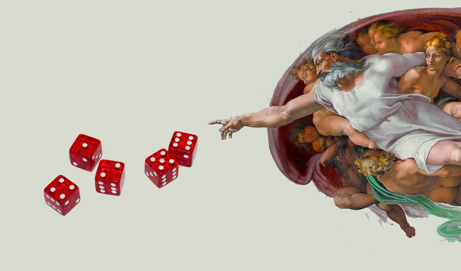
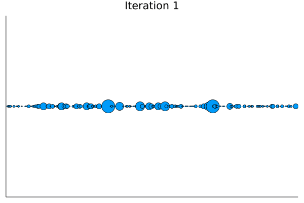
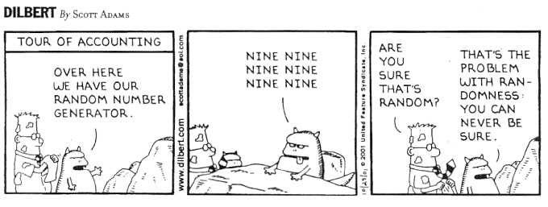

# Business Application: Quantum Random Circuits, certification and distribution sampling 

[source](https://www.insidescience.org/news/randomness-machine)

## 1. Quantum random circuits

A random quantum circuit is a random unitary operator (or gate) applied to a qubit system. Generally, this unitary gate 
can be built as the product of single- and multi-qubit unitary gates.  

Random circuits can be used to sample data from random distributions.
In particular, random circuits can be used to approximate the probability distribution P(x) and sample 
data from the approximated distribution. The closeness between the two distributions can be calculated by means of 
standard statistical metrics, such as the Kullback–Leibler (KL) divergence.

In 2018, Google proved that the sampling from quantum random circuits composed of 1- and 2-qubit gates 
outperforms the same task done on a classical computer ([Arute et al.](https://www.nature.com/articles/s41586-019-1666-5)). 
Thus, Quantum Random Circuits clearly provide an advantage with respect to classical computers in producing samples 
based on a random distribution. 

Besides the advantage in the sampling from random distribution, Quantum Random circuits also provide a
way to produce a certified random number generation ([Jacak et al.](https://www.nature.com/articles/s41598-019-56706-2)). 
In fact, quantum systems exhibit true randomness, however the verification of true randomness of the generated 
number (aka certification) is not always possible. For instance, given a string of random numbers generated by a 
Hadamard gate, there is no way for a user to verify that these numbers are actually coming from a quantum device and that
there is no hacker who is actually just sending bits chosen in advance.
However, quantum random circuits provide a way to certify the generated random numbers. In fact, in case of an actual
quantum random circuit, the generated random bitsrings have high associated probabilities and that the linear cross-entropy
fidelity, :

-1">

is high enough. The verified bitstrings can then be concatenated and hashed to obtain a certified true random bitstring.

In our analysis, we addressed several tasks to assess the properties of a quantum random circuit built starting
from two gates used to control in Ion Trap quantum computers: a single-qubit rotation gate and a two-qubit rotation
gate which is the source of entanglement among the qubits of the system.

[This notebook](../Week1_Trapped_Ions/solutions_python.ipynb) contains the performed analysis.
First, we implemented the rotation gates and sampled output from the quantum circuit to obtain a random distribution.
Next, we observed that by slightly perturbing the circuit with a single bit-flip in a random location, 
the probability distribution substantially changes, exhibiting the expected chaotic behavior. 
The chaotic behavior of the probability distribution can also be seen in the speckle pattern animation,
which shows how the probability distribution changes under small perturbations at each iteration.

We then proved that by increasing the depth of the circuit (proportional to the number of gates used in
the circuit), the distribution of the probabilities tends to the Porter-Thomas (exponential) 
distribution.

Finally, we plot the linear cross-entropy XEB (calculated starting from the probability distributions) 
as a function of a systematic error simulated with a fixed shift in the rotation angle of the two-qubit 
gate. 

####add conclusion on point 4???

We also provide a [python notebook](../Week1_Trapped_Ions/solutions_python.ipynb) for people who are more familiar
with the latter programming language. For this notebook the implementation is done in 
[Cirq](https://quantumai.google/cirq). 

## 2. Real-world problems which can be approached with Quantum Random Circuits

Both the efficient random distribution sampling and certification of random bitstrings can be applied to practical use 
cases and eventually improve the classical solutions. 

### 2.1 Certification

[source](https://www.random.org/analysis/)

Certification is in fact a key feature of security systems. In fact, all classical systems use pseudo-random number 
generators (PRNG) based on an input variable called seed. Consequently, if a hacker were to uncover the seed, it would 
compromise the validity and security of the PRNG. 
Having a verifiable true random number generation is therefore crucial to the security of large financial institutions 
as well as governments to protect transactions or information. 

However, in most cases PRNG is still good enough as it’s executed server-side. On the other hand, in the blockchain domain
such the issue of hacking the seed for random generation is amplified by the transparent nature of the blockchain. In this 
case, true randomness for blockchain transactions, e.g. smart contracts and digital signature, is essential and 
certification via quantum random circuits can provide a way to improve the security of these transactions. 

### 2.2 Sampling random distribution
The second application of quantum random circuit is the efficient sampling from random distributions.

Sampling from random distribution finds applications in the simulation domain as well as in machine learning.
In fact, sampling true randomness is essential for improving the quality of simulation when looking at complex financial
drivers (e.g. yield curve forecasting and scenario analysis) or simulating and testing objects under physical stress 
conditions (e.g. dynamic turbulence conditions for aircraft or drone modelling).

Further, random distribution sampling can be useful to address problems by mapping each gate of the quantum circuit to a 
specific parameter of the problem. For instance, by mapping the gates to different environments in a gaming landscape 
(e.g. desert, water or forest) one could dynamically sample different environments, with a different distribution of 
resources, to effectively improve the virtual reality of the game.
 
In any case, the application where we identified a substantial advantage is in the sampling from random distribution for 
Generative Adversarial Networks (GANs). In fact, 

###TO BE CONTINUED

## 3. Quantum Random Circuits: the way to ...WE HAVE TO DECIDE WHAT TO FOCUS ON

###TO DECIDE WHAT CUSTOMER WE ARE THINKING OF AND THE PRACTICAL APPLICATION

## 4. Business application pitch 

###PREPARE THE SCRIPT FOR THE VIDEO

