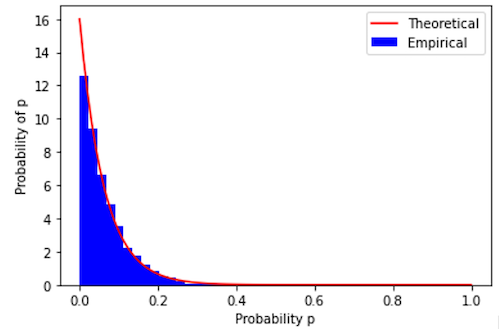

# Quantum Cohort Project Business Application

The aim of this project was to investigate the quantum supremacy result reported by Google in their paper “Quantum supremacy using a programmable superconducting processor”, and show how it might be implemented using a trapped ion device.


## Step 1: Explain the technical problem you solved in this exercise

The Google experiment involved a pseudo-random circuit constructed from an alternating sequence of one and two-qubit gates, which produced a random unitary transformation on a sequence of qubits. The output was then sampled many times in order to obtain a probability distribution for the particular circuit. As the number of qubits and the depth of the circuit increased, the distribution became increasingly difficult to simulate using the fastest classical computer, to the point where a sufficiently large circuit would take around 10,000 years to complete.

In our technical exercise, we first wrote a program to simulate the result of random quantum circuits. The code was implemented fully in python (see “Beyond classical computing with qsim”).

A simulation produced a “speckle” pattern, which occurs because of random interference between qubits. The speckle pattern would change with every realization.


This effect corresponds to and has the same nature as the speckle pattern of laser light reflecting from a rough surface, such as one shown in the figure below. Just like in random circuits, the rough surface randomizes the wave’s phase at each point, and so the observed field ends up having an irregular intensity, which changes chaotically with coordinate.


Speckle patterns are highly sensitive to small changes of input parameters. Despite this, their statistics is robust (Zel’dovich et al, 1985, 1995). 
Same applies to random circuits. This is demonstrated in the next step testing the convergence of the empirical probability distribution of the probability of randomly chosen bitstring appearing, to the Porter-Thomas distribution, defined as ```Pr(p)=Ne^(-Np)```.




## Step 2: Explain or provide examples of the types of real-world problems this solution can solve

While the Google experiment was designed for the purpose of demonstrating quantum supremacy, rather than for any real-world application, there are a number of areas where quantum random circuits do have commercial use. For example, many algorithms such as Quantum Generative Adversarial Networks rely on the ability to generate random bit strings with a certain desired probability distribution. Applications for QGANs are found in areas including finance (Zoufal, Lucchi & Woerner, 2019) and computational biology (Li, Topaloglu & Ghosh, 2021). 
Generally, NISQ technology can have application in any systems that exhibit quantum-chaotic behavior - any time when the system’s behavior can be described by a bitstring appearing with predesigned probability distribution. A useful application for random quantum circuits, which we will focus on here, is quantum encryption.

The military air force needs to equip their aircrafts with a sophisticated encrypted communication system. The system provides end-to-end encryption for electronic communication involving data, images and voice service between aircraft and military bases. Any company in the air force industry interested in developing hack proof encrypted communication systems, would benefit from the advantage of quantum computing to generate large-size and therefore hard-to-break random bit strings.  

NISQ brings the following advantages:
1.	It is so efficient that it allows you to alter encryption unexpectedly as the communication is happening.
2.	It allows the use of multiple channels, flip communication channels for the communicating parties.
3.	It allows you to encrypt randomly selected pieces of communication down to a very small size. Each time the encryption keys change.

One reason for focusing on military applications is that defence organisations need to look years or decades ahead when it comes to cybersecurity, so they are likely to be interested and motivated customers, and among the first adopters of quantum technology.


## Step 3: Identify at least one potential customer for this solution - ie: a business who has this problem and would consider paying to have this problem solved

Customers would include both private contractors such as Raytheon, Lockheed Martin, Thales, and so on; along with government bodies such as the United States Department of Defense, and the Canadian Department of National Defence.

## Step 4: Prepare a 90 second video explaining the value proposition of your innovation to this potential customer in non-technical language

Below is the 90 second video explaining the value proposition of our innovation to the potential customers;

[](https://youtu.be/qeRbIm-tWhg "Little red riding hood - Click to Watch!")

## References:

[1] Zel'dovich, B.Ya.; Mamaev, A.V.; Shkunov, V.V., Speckle-Wave Interactions in Application to Holography and Nonlinear Optics, CRC Press; 1st edition (February 1, 1995)

[2] Zel'dovich, B.Ya.; Pilipetsky, N.F.; Shkunov, V.V., Principles of Phase Conjugation, Springer; 1st edition (May 6, 1985)

[3] Li, Topaloglu & Ghosh (2021) Quantum Generative Models for Small Molecule Drug Discovery. https://arxiv.org/pdf/2101.03438.pdf

[4] PennyLane (n.d.) Beyond classical computing with qsim. https://pennylane.ai/qml/demos/qsim_beyond_classical.html

[5] Zoufal, C., Lucchi, A. & Woerner, S. Quantum Generative Adversarial Networks for learning and loading random distributions. npj Quantum Inf 5, 103 (2019).

[6] Preskill, J. (2018) Quantum Computing in the NISQ era and beyond. https://arxiv.org/pdf/1801.00862.pdf


