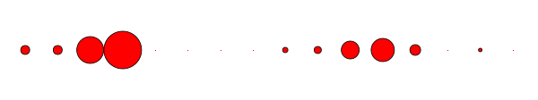
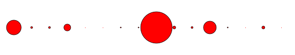
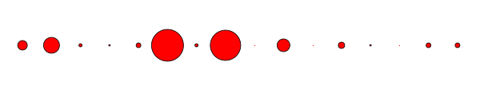
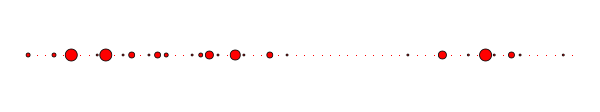
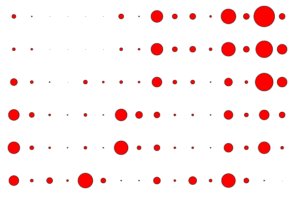
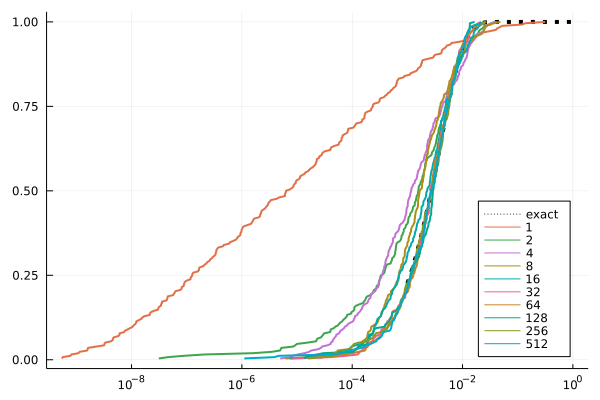

# Project 1: Quantum Advantage with Trapped Ions 

## Task 1:

The code used to solve this task can be found [here](run_random_circuitTASK1.jl)

Usage:
> julia  run_random_circuitTASK1.jl  num_qubits circuit_depth

The goal of this task is to evaluate the probability amplitudes in the computational basis of an output state represented by an MPS that has been generated with a random circuit for different depths and widhts. In order to do this we:

  * Generate and run a random quantum circuit with an specified depth and number of qubits *N*
  * Generate the computational basis 
  * Calculate the inner product of the output state with each of the basis vectors
  * Absolute square those coefficients
  * Plot and save scatter pattern (speckle)

Results:

**N=4, depth=4**

**N=4, depth=8**

**N=4, depth=12**

**N=5, depth=12**

**N=5, depth=12**

*Bonus*:

## Task 2:

The code used to solve this task can be found [here](run_random_circuitTASK2.jl)

Usage:
> julia  run_random_circuitTASK2.jl  num_qubits circuit_depth num_realisations

The goal of this task is to evaluate the effect of a single bit-flip error in different locations of a fixed random circuit. In order to do this and for each realization we:

  * Generate a random quantum circuit with an specified depth and number of qubits *N* (this will be fixed for all realisations)
  * Decompose this circuit into layers
  * Generate two random numbers that indicate the qubit number *l* (1≤*l*≤N) and the layer *k* (1≤*k*≤depth) where we will introduce the error
  * Recompose the circuit with the added bit-flip error introduced with an X gate
  * Plot and save scatter pattern (speckle)

Result:

**N=4, depth=5, rel=6**

## Task 3: 

The code used to solve this task can be found [here](run_random_circuitTASK3.jl)

Result:

## Task 4:
