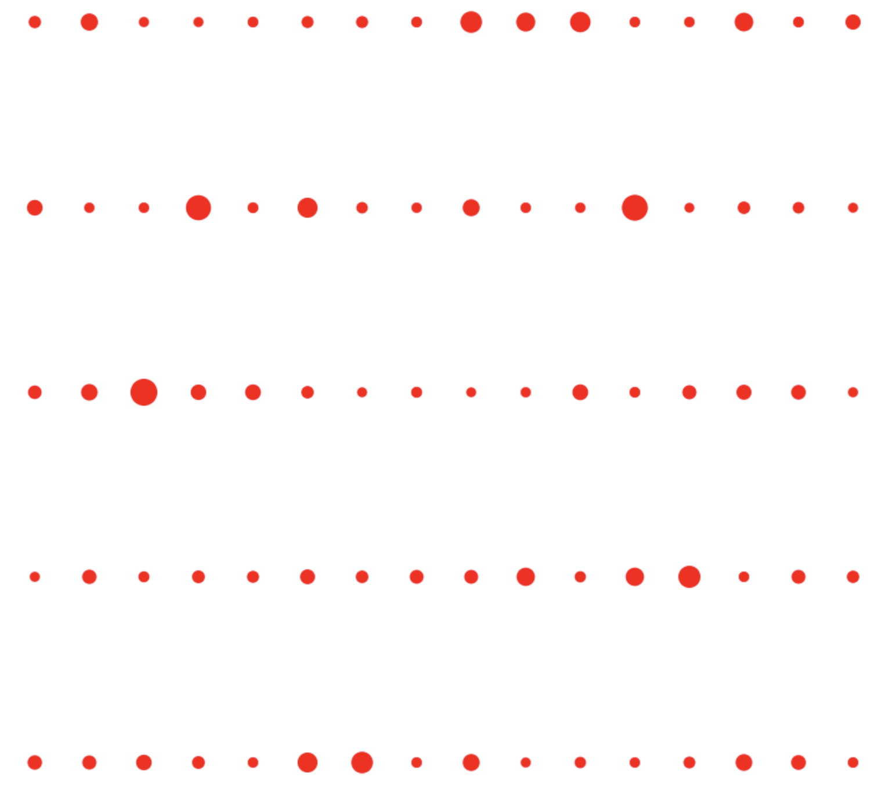

## Project 1: Quantum Advantage with Trapped Ions 

This project will guide you through the recent Google quantum supremacy result, and its possible implementation using near-term quantum computers built with trapped ions.

Open up [instructions.pdf](https://github.com/CDL-Quantum/CohortProject_2021/tree/main/Week1_Trapped_Ions/instructions.pdf) to begin learning about your tasks for this week!

## Tasks include:
* Simulating a random circuit with a Matrix Product State code, and producing a speckle pattern.
* Adding a single bit-flip error and exploring the change in the speckle pattern.
* Exploring convergence of the Porter-Thomas Distribution.
* Exploring the effect of 2-qubit gate errors.
* Describe a business that could be build around random circuits.  (See below Business Application)

## Summary of Results

### [Task 1](./Task1.ipynb): Speckle patterns of probabilities for random quantum circuits various circuit sizes

In task 1, we produce the probability distribution obtained by performing projective measurement in the Z basis on the random quantum circuits (as defined in the problem) with various quantum circuit depth and width (i.e. the number of qubits). To help solve this problem, we created some functions in [proj_measurement.jl](./proj_measurement.jl) to implement projective measurement in either X, Y, or Z basis. As an example, we plotted the "speckle patterns" for random quantum circuits with {width, depth} of {3, 10}, {3, 20}, {5, 10}, {5, 20}, and {6, 10} in Figure 1.

<figure class="image">
  
  <figcaption> <b>Fig.1</b> Speckle patterns displaying the probabilities of obtaining each outcomes from random circuit sampling for various quantum circuit width (i.e. the number of qubits) and depth. </figcaption>
</figure>

### [Task 2](./Task2.ipynb): Effect of a single-qubit bit-flip error on speckle patterns

In task 2, we examined how the probability distribution of the random circuit sampling changes with a single-qubit bit-flip error occuring at a random place on the quantum circuit. For example, we plot various speckle patterns obtained under the random bit-flip error for a quantum circuit consisting with 4 qubits and the circuit depth of 10 in Figure 2. We can clearly see that the pattern looks very different in each experiment although the same random circuit was executed. 

<figure class="image">
  
  <figcaption> <b>Fig.2</b> Speckle patterns of a fixed random circuit with 4 qubits and the circuit depth of 10 under the random bit-flip error. </figcaption>
</figure>

### [Task 3](./Task3.ipynb): Emperical cumulative distribution of random circuit sampling probabilities

In task 3, we examine whether the samping probability distribution of the random circuit converges to the Porter–Thomas distribution, characteristic of quantum chao, as the circuit depth increases. Reproducing such probability distribution classically is conjectured to be exponentially difficult as the number of qubits increases. We demonstrate the convergence of the random circuit sampling probability distribution to the Porter-Thomas distribution by plotting the empirical cumulative distribution for a quantum circuit with 8 qubits with several quantum circuit depth. The quantum circuit depths are 1, 2, 5, 10, 50 and 100. Figure 3 clearly shows that the empirical cumulative distribution converges to that of the exponential distribution (i.e. Porter-Thomas) as expected.

<figure class="image">
  
  <figcaption> <b>Fig.3</b> Cumulative distribution function of the exponential distribution (dashed) and the probabilities in the random circuit sampling (solid) with increasing circuit depth. </figcaption>
</figure>

### [Task 4](./Task4.ipynb): Effect of gate error on the cross entropy benchmarking fidelity

In task 4, we invesitg the effect of systematic error (i.e. systematic error in two-qubit gates) on the cross entropy benchmarking (XEB) fidelity. Our study shows that as the error rate increases, the XEP fidelity quickly decays to zero. In Figure 4, we plot the XEB fidelity as a function of the varying degree of the two-qubit gate parameter (which corresponds to the amount of error), and we plot several curves for different quantum circuit depth. Of course, increasing the quantum circuit depth increases the amount of error, and hence the decay rate with respect to the degree of error in the two-qubit rotation.

<figure class="image">
  
  <figcaption> <b>Fig.4</b> Cross entropy benchmarking fidelity as a function of systematic error in two-qubit gates for random quantum circuits with various circuit depth. </figcaption>
</figure>
  
If the XEB fidelity is zero, the probability distribution is uniform and hence it is easy to simulate classically. This means that the quantum supremacy diminishes. Therefore it is extremely important to suppress noise as much as possible to keep XEB non-zero while increasing the quantum circuit size. 

## Business Application
An interesting application of random circuit sampling addressed in this cohort project is secure communication. The communication protocol can be used by any individuals, companies, governments, and militaries demanding high-level communication security. We provide more detailed description about the business application [here](./Business_Application_Team23.md)
