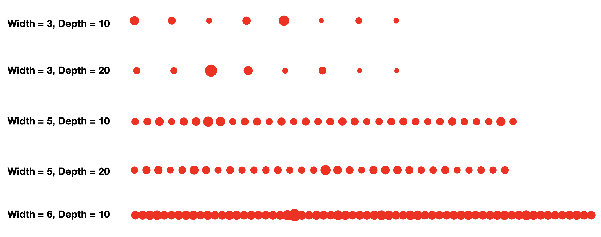
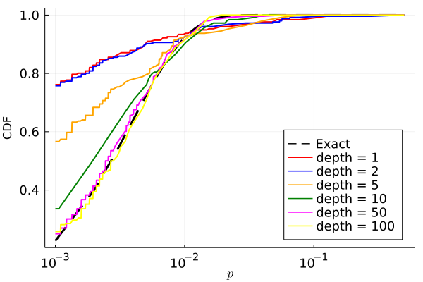
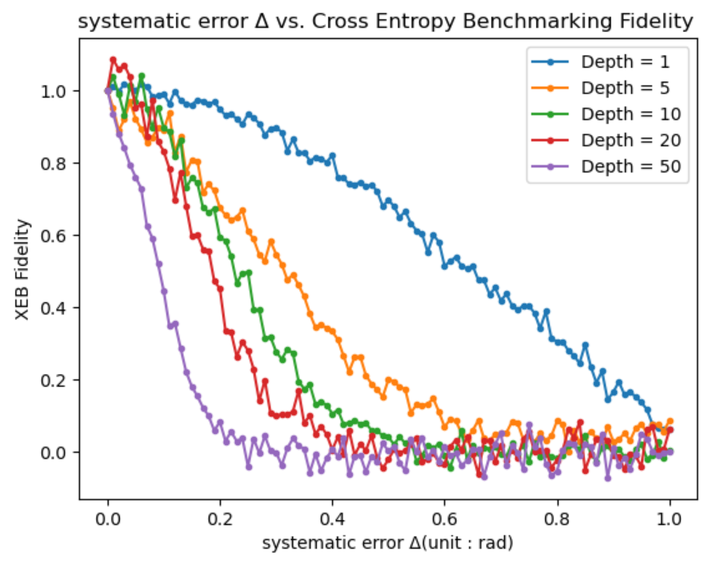

## Project 1: Quantum Advantage with Trapped Ions 

This project will guide you through the recent Google quantum supremacy result, and its possible implementation using near-term quantum computers built with trapped ions.

Open up [instructions.pdf](https://github.com/CDL-Quantum/CohortProject_2021/tree/main/Week1_Trapped_Ions/instructions.pdf) to begin learning about your tasks for this week!

## Tasks include:
* Simulating a random circuit with a Matrix Product State code, and producing a speckle pattern.
* Adding a single bit-flip error and exploring the change in the speckle pattern.
* Exploring convergence of the Porter-Thomas Distribution.
* Exploring the effect of 2-qubit gate errors.
* Describe a business that could be build around random circuits.  (See below Business Application)

## Summary of Results

### [Task 1](./Task1.ipynb): Speckle patterns of probabilities for various quantum circuit sizes

In task 1, we demonstrate the probability distribution obtained by performing projective measurement in the Z basis on the random quantum circuits (as defined in the problem) with varying quantum circuit depth and width (i.e. the number of qubits). To help solve this problem, we created some functions in [proj_measurement.jl](./proj_measurement.jl) that performs the projective measurement in the basis of choice among X, Y, and Z.

<figure class="image">
  
  <figcaption> <b>Fig.3</b> Speckle patterns displaying the probabilities of obtaining each outcomes from random circuit sampling for various quantum circuit width (i.e. the number of qubits) and depth. </figcaption>
</figure>

### [Task 3](./Task3.ipynb): Emperical Cumulative Distribution of Random Circuit Sampling Probabilities

<figure class="image">
  
  <figcaption> <b>Fig.3</b> Cumulative distribution function </figcaption>
</figure>

### [Task 4](./Task4.ipynb): Effect of gate error on the cross entropy benchmarking fidelity

<figure class="image">
  
  <figcaption> <b>Fig.4</b> Cross entropy benchmarking fidelity as a function of systematic error in the two-qubit gate. </figcaption>
</figure>

## Further Challenges:
* Animate your speckle pattern.
* Reproduce the Google cross entropy results.
* Implement this circuit on a real trapped ion computer!

## Business Application
An interesting application of random circuit sampling addressed in this cohort project is secure communication. The communication protocol can be used by any individuals, companies, governments, and militaries demanding high-level communication security. We provide more detailed description about the business application [here](./Business_Application_Team23.md)
