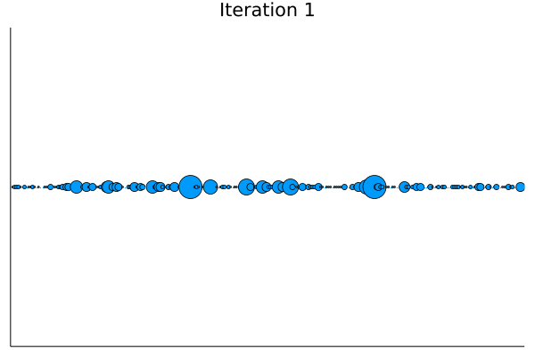
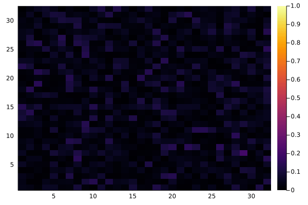

## Project 1: Quantum Advantage with Trapped Ions 

This project will guide you through the recent Google quantum supremacy result, and its possible implementation using near-term quantum computers built with trapped ions.

## Solutions

All solution in Julia can be found in [this notebook](./solution_julia.ipynb). We've also created an analogous [notebook](./solutions_python.ipynb) in python in for those who are more familiar the language. If you're interested in the full instructions for the tasks we completed, check out the [pdf](./instructions.pdf). 

### Task 1: Plot the probability of each bit string for various circuit widths and depths

We implemented the rotation gates and sampled the outputs from the quantum circuit to obtain a random distribution of bit string probabilities. In the Julia implementation, we chose to test combinations of 4, 8, 12 qubits with varying depths of 1, 256 and 512 gates. We generated speckle patterns of each combination which is shown here in the following figure. *Note: these speckle patterns are normalized.*

## Bonus Task 1: Investegating Entaglement Entropy with MPS index

Later in task 4, we investigate the cross entropy between the true state psi, and a perturbed state. In the bonus for task 1 however, we studied a different kind of entropy- the Von Neumman (Entanglement) Entropy. We decided to see how the entanglement entropy varies as you look at different indices of the MPS (Matrix Product State) of PSI. We varied both the depth and the Number of qubits to see what would happen. Here are the plots for different depths:

It's clear that for small depth the entanglement entropy starts rather small and then falls off- while for increasing depth the initial entropy is larger and then falls off as we get to the 'end' of the MPS (the last index). This makes sense, as we increase the depth we are hitting more 'M' gates which further entangle our qubits- leading to a larger Von Neumann entropy for the state Psi. It is interesting that the largest entropy is captured towards the middle indices of the MPS. For varying number of qubits the plots look very similar:

### Task 2: Adding random bit flip errors

We modified the circuits in the notebooks to randomly generate bit flip errors. We demonstrate that this substantially changes the probability distributions by plotting the speckle patterns for 9 different iterations. This yields completely random distributions which is shown in the following animation:

We demonstrate the same animation in a single figure shown here:

We also show another set as a collection of line graphs:

And checkout out this heatmap displaying the random probabilities:

### Task 3: Convergence of the Emprical CDF of P(x) (probability distribution for each state PSI can take)

In tasks 1 and 2 we display the probability distribution (in the form of the line histogram or speckle patterns) for the probabilities of each of the 2^N states that PSI can take. The true distribution of these probabilities is given by the Porter-Thomas distribution (an exponential distribution). For Task 3, we plotting the probabilities distribitions for the Psi states we sampled v.s increasing depth. The tend towards the true distribution as the depth increasing- however you can see that the largest differences occur for small probabilities. 

### Task 4: Studying the Linear Fidelity

## Bonus Task 4: Using different definitions of Fidelity & Cross Entropy

### Bonus: Implement the circuit on a real trapped ion computer

We implemented the random circuit on the IonQ trapped ion computer by connecting to their API. We built a sweet NodeJs repository to be able to so with simple commands via the command line. Checkout the repo's [README](./ionq-implementation/README.md) for more information. 

We could choose to implement the circuit on their quantum machine or a simulator. So we did both. Unfortunately, the results from the quantum machine was not very precise and only gave us up to 3 decimal places in precision (we are on the free plan), so the plots may be a little crude. 

Here are the probability distributions for an 8 qubit system on a 512 deep circuit on the trapped ion machine:

Next we tried to replicate the analysis in task 3 by showing that the cumulative distribution function of p would tend to the Porter-Thomas (exponential) distribution. Recall though, that the low precision of the free tier yielded very choppy graphs:

Compared to the true Porter-Thomas (exponential) distribution: 

Due to the coarseness of the predictions, we tried the simulator with a higher precision of 9 decimal places. To replicate the work in task 3, we first tried a circuit of depth 1 as shown here: 

And by increasing the depth we achieved a very similar CDF to the Porter-Thomas distribution: 

Which can be compared to the true Porter-Thomas distribution shown here:

## Business Application

For more details refer to the [Business Application found here](./Business_Application.md)

## References
