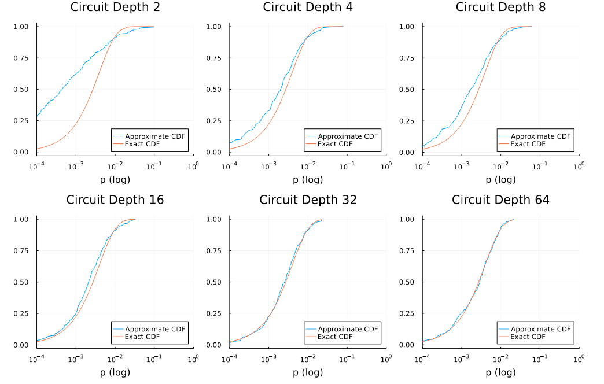

## Project 1: Quantum Advantage with Trapped Ions 

This project will guide you through the recent Google quantum supremacy result, and its possible implementation using near-term quantum computers built with trapped ions.

## Solutions

<<<<<<< HEAD
## Tasks include:
* Simulating a random circuit with a Matrix Product State code, and producing a speckle pattern.
* Adding a single bit-flip error and exploring the change in the speckle pattern.
* Exploring convergence of the Porter-Thomas Distribution.
* Exploring the effect of 2-qubit gate errors.
* Describe a business that could be build around random circuits.  (See below Business Application)

## Summary of Results

### [Task 1](./Task1.ipynb): Speckle patterns of probabilities for random quantum circuits various circuit sizes

In task 1, we produce the probability distribution obtained by performing projective measurement in the Z basis on the random quantum circuits (as defined in the problem) with various quantum circuit depth and width (i.e. the number of qubits). To help solve this problem, we created some functions in [proj_measurement.jl](./proj_measurement.jl) to implement projective measurement in either X, Y, or Z basis. As an example, we plotted the "speckle patterns" for random quantum circuits with {width, depth} of {3, 10}, {3, 20}, {5, 10}, {5, 20}, and {6, 10} in Figure 1.

<figure class="image">
  
  <figcaption> <b>Fig.1</b> Speckle patterns displaying the probabilities of obtaining each outcomes from random circuit sampling for various quantum circuit width (i.e. the number of qubits) and depth. </figcaption>
</figure>

### [Task 2](./Task2.ipynb): Effect of a single-qubit bit-flip error on speckle patterns

In task 2, we examine how the probability distribution of the random circuit sampling changes with a single-qubit bit-flip error occuring at a random place on the quantum circuit. For example, we plot various speckle patterns obtained under the random bit-flip error for a quantum circuit consisting with 4 qubits and the circuit depth of 10 in Figure 2. We can clearly see that the pattern looks very different in each experiment although the same random circuit was executed. 

<figure class="image">
  
  <figcaption> <b>Fig.2</b> Speckle patterns of a fixed random circuit with 4 qubits and the circuit depth of 10 under the random bit-flip error. </figcaption>
</figure>

### [Task 3](./Task3.ipynb): Emperical cumulative distribution of random circuit sampling probabilities

In task 3, we examine whether the samping probability distribution of the random circuit converges to the Porter–Thomas distribution, characteristic of quantum chao, as the circuit depth increases. Reproducing such probability distribution classically is conjectured to be exponentially difficult as the number of qubits increases. We demonstrate the convergence of the random circuit sampling probability distribution to the Porter-Thomas distribution by plotting the empirical cumulative distribution for a quantum circuit with 8 qubits with several quantum circuit depth. The quantum circuit depths are 1, 2, 5, 10, 50 and 100. Figure 3 clearly shows that the empirical cumulative distribution converges to that of the exponential distribution (i.e. Porter-Thomas) as expected.

<figure class="image">
  
  <figcaption> <b>Fig.3</b> Cumulative distribution function of the exponential distribution (dashed) and the probabilities in the random circuit sampling (solid) with increasing circuit depth. </figcaption>
</figure>

### [Task 4](./Task4.ipynb): Effect of gate error on the cross entropy benchmarking fidelity

In task 4, we investigate the effect of systematic error (i.e. systematic error in two-qubit gates) on the cross entropy benchmarking (XEB) fidelity. Our study shows that as the error rate increases, the XEP fidelity quickly decays to zero. In Figure 4, we plot the XEB fidelity as a function of the varying degree of the two-qubit gate parameter (which corresponds to the amount of error), and we plot several curves for different quantum circuit depth. Of course, increasing the quantum circuit depth increases the amount of error, and hence the decay rate with respect to the degree of error in the two-qubit rotation.

<figure class="image">
  
  <figcaption> <b>Fig.4</b> Cross entropy benchmarking fidelity as a function of systematic error in two-qubit gates for random quantum circuits with various circuit depth. </figcaption>
</figure>
  
If the XEB fidelity is zero, the probability distribution is uniform and hence it is easy to simulate classically. This means that the quantum supremacy diminishes. Therefore it is extremely important to suppress noise as much as possible to keep XEB non-zero while increasing the quantum circuit size. 

## Business Application
An interesting application of random circuit sampling addressed in this cohort project is secure communication. The communication protocol can be used by any individuals, companies, governments, and militaries demanding high-level communication security. We provide more detailed description about the business application [here](./Business_Application_Team23.md)
=======
All solution in Julia can be found in this [Julia notebook](./solution_julia.ipynb). We've also created an analogous [Python notebook](./solutions_python.ipynb)  using Google's quantum computing language- Cirq, for those who are more familiar with python. If you're interested in the full instructions for the tasks we completed, check out the [pdf](./instructions.pdf). 

### Task 1: Plot the probability of each bit string for various circuit widths and depths

We implemented the rotation gates and sampled the outputs from the quantum circuit to obtain a random distribution of bit string probabilities. In the [Julia implementation](./solution_julia.ipynb), we chose to test combinations of 4, 8, 12 qubits with varying depths of 1, 256 and 512 gates. A cool way to visualize the probabilities is in a speckle pattern where large probabilities correspond to larger circles, and smaller probabilities are small circles . We generated speckle patterns of each combination which is shown here in the following figure. *Note: the size of the circles are normalized to an arbitrary constant to make the circles big enough to see. Whats most important is the relative size of the circles.*

## Bonus Task 1: Investigating Entaglement Entropy with MPS index

Later in task 4, we investigate the cross entropy between the true state psi, and a perturbed state. In the bonus for task 1 however, we studied a different kind of entropy- the Von Neumman (Entanglement) Entropy. We decided to see how the entanglement entropy varies as you look at different indices of the MPS (Matrix Product State) of PSI. We varied both the depth and the Number of qubits to see what would happen. Here are the plots for different depths:

It's clear that for small depth the entanglement entropy starts rather small and then falls off- while for increasing depth the initial entropy is larger and then falls off as we get to the 'end' of the MPS (the last index). This makes sense, as we increase the depth we are hitting more 'M' gates which further entangle our qubits- leading to a larger Von Neumann entropy for the state Psi. It is interesting that the largest entropy is captured towards the middle indices of the MPS. For varying number of qubits the plots look very similar, the interested reader can refer to the [Julia notebook](./solution_julia.ipynb) to see them. We also looked at how bond dimension (the max rank of the MPS) increased with the depth of the circuit. We did this for a large number of qubits since the bond dimension does not change much for smaller MPS's. *Note: title should say N=15.*

### Task 2: Adding random bit flip errors

We modified the circuits in the notebooks to randomly generate bit flip errors. We demonstrate that this substantially changes the probability distributions by plotting the speckle patterns for 9 different iterations. This yields completely random distributions which is shown in the following animation:

We demonstrate the same animation in a single figure shown here:

We also show another set as a collection of line graphs (x-axis is the index of the bit string, y-axis is the probability of observing it):

And checkout out this heatmap displaying the random probabilities:

### Task 3: Convergence of the Emprical CDF of P(x) (probability distribution for each state PSI can take)

In tasks 1 and 2 we display the probability distribution (in the form of the line histogram or speckle patterns) for the probabilities of each of the 2^N states that PSI can take. The true distribution of these probabilities is given by the Porter-Thomas distribution (an exponential distribution). For Task 3, we plot the probability distributions for the Psi states we sampled v.s increasing circuit depth. They tend towards the true distribution as the depth increases- however you can see that the largest differences occur for small probabilities. 

### Task 4: Studying the Linear Fidelity

As mentioned in the bonus task for task 1, for our final task we studied the how the linear fidelity (or cross entropy) changed as we made small perturbations to theta (the angle destribing the transformations for the 'M' gate). We confirmed that the linear fidelity is equal to 1 when there is no perturbation, and as the perturbation increases the linear fidelity approaches zero. Here we used 8 qubits with a circuit depth of 50. 

## Bonus Task 4: Using different definitions of Fidelity & Cross Entropy

In [2], the authors use a different definition for the cross entropy. We decided to try to replicate these formulas to see how they would look with the data we had. Close to 0 perturbation the cross entropy is 1 and then grows as we increse the perturbation. The data is also alot more random, compared to the linear fidelity plot showed earlier. It is interesting to see that the linear fidelity and the cross entropy exhibit the opposite behaviour- the linear fidelity shrinks towards zero as we increase the perturbation, while the cross entropy grows to be greater than 1 as the perturbation increases. 

### Bonus: Implement the circuit on a real trapped ion computer

We implemented the random circuit on the IonQ trapped ion computer by connecting to their API. We built a sweet NodeJs repository to be able to so with simple commands via the command line. Checkout the repo's [README](./ionq-implementation/README.md) for more information. 

We had the ability to use their simulator or their real trapped ion computer. So we did both. Unfortunately, the results from the quantum computer was not very precise and only gave us up to 3 decimal places in precision (because we are on a basic plan), so the plots may be a little crude. 

Here are the probability distributions for an 8 qubit system on a 512 deep circuit on the trapped ion machine:

Next we tried to replicate the analysis in task 3 by showing that the cumulative distribution function of p would tend to the Porter-Thomas (exponential) distribution. Recall though, that the low precision of the basic tier yielded very choppy graphs:

Compared to the true Porter-Thomas (exponential) distribution: 

We can see that the CDF tends to follow the Porter-Thomas distribution approximately well, but its tough to say for sure due to the low resolution.

Hence we did the same experiment on the simulator since we could get much higher precision (~9 decimal places). To replicate the work in task 3, we first tried a shallow circuit of depth 1: 

Notice, due to the shallow depth of the circuit, this distribution does not tightly follow the true Porter-Thomas distribution which is shown here: 

However, when increasing the depth (just like in task 3), the cdf tends to the true Porter-Thomas distribution. Here we show the same circuit but at a much deeper depth ~750:

## Business Application

For more details refer to the [Business Application found here](./Business_Application.md)

## References

[1]  Frank  Arute,  Kunal  Arya,  Ryan  Babbush,  Dave  Bacon,  Joseph  C.  Bardin,  Rami  Barends,Rupak  Biswas,  Sergio  Boixo,  Fernando  G.  S.  L.  Brandao,  David  A.  Buell,  Brian  Burkett,Yu  Chen,  Zijun  Chen,  Ben  Chiaro,  Roberto  Collins,  William  Courtney,  Andrew  Dunsworth,Edward Farhi, Brooks Foxen, Austin Fowler, Craig Gidney, Marissa Giustina, Rob Graff, KeithGuerin, Steve Habegger, Matthew P. Harrigan, Michael J. Hartmann, Alan Ho, Markus Hoff-mann,  Trent  Huang,  Travis  S.  Humble,  Sergei  V.  Isakov,  Evan  Jeffrey,  Zhang  Jiang,  DvirKafri,  Kostyantyn  Kechedzhi,  Julian  Kelly,  Paul  V.  Klimov,  Sergey  Knysh,  Alexander  Ko-rotkov,  Fedor  Kostritsa,  David  Landhuis,  Mike  Lindmark,  Erik  Lucero,  Dmitry  Lyakh,  Sal-vatore  Mandra,  Jarrod  R.  McClean,  Matthew  McEwen,  Anthony  Megrant,  Xiao  Mi,  KristelMichielsen, Masoud Mohseni, Josh Mutus, Ofer Naaman, Matthew Neeley, Charles Neill, Mur-phy  Yuezhen  Niu,  Eric  Ostby,  Andre  Petukhov,  John  C.  Platt,  Chris  Quintana,  Eleanor  G.Rieffel, Pedram Roushan, Nicholas C. Rubin, Daniel Sank, Kevin J. Satzinger, Vadim Smelyan-skiy, Kevin J. Sung, Matthew D. Trevithick, Amit Vainsencher, Benjamin Villalonga, TheodoreWhite, Z. Jamie Yao, Ping Yeh, Adam Zalcman, Hartmut Neven, and John M. Martinis. Quan-tum supremacy using a programmable superconducting processor.Nature, 574(7779):505–510,2019.doi:10.1038/s41586-019-1666-5.

[2]  C.  Neill,  P.  Roushan,  K.  Kechedzhi,  S.  Boixo,  S.  V.  Isakov,  V.  Smelyanskiy,  A.  Megrant,B.  Chiaro,  A.  Dunsworth,  K.  Arya,  R.  Barends,  B.  Burkett,  Y.  Chen,  Z.  Chen,  A.  Fowler,B. Foxen, M. Giustina, R. Graff, E. Jeffrey, T. Huang, J. Kelly, P. Klimov, E. Lucero, J. Mu-tus,  M.  Neeley,  C.  Quintana,  D.  Sank,  A.  Vainsencher,  J.  Wenner,  T.  C.  White,  H.  Neven,and J. M. Martinis.  A blueprint for demonstrating quantum supremacy with superconductingqubits.Science, 360(6385):195–199, 2018.doi:10.1126/science.aao4309.

[3]  Sergio Boixo, Sergei V. Isakov, Vadim N. Smelyanskiy, Ryan Babbush, Nan Ding, Zhang Jiang,Michael J. Bremner, John M. Martinis, and Hartmut Neven. Characterizing quantum supremacyin near-term devices.Nat. Phys., 14(6):595–600, 2018.doi:10.1038/s41567-018-0124-x.

>>>>>>> d9306be792ea6f70cbbd6af76ec7e7feae90ba5a
