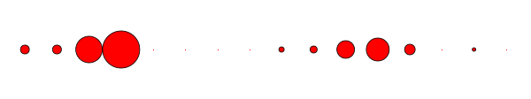
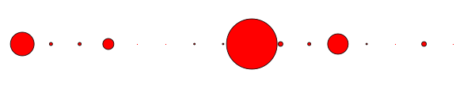
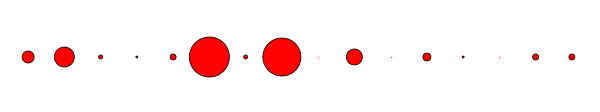
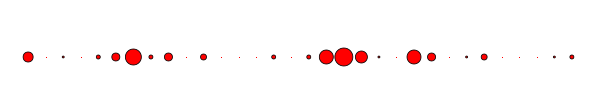
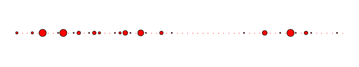
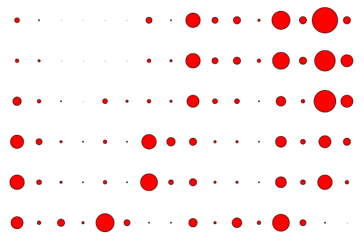
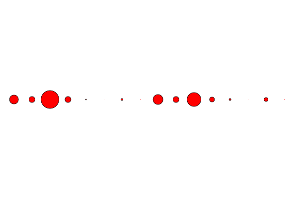
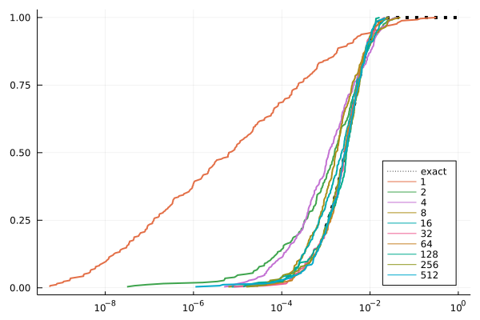
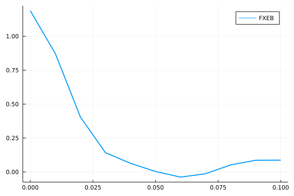

# Project 1: Quantum Advantage with Trapped Ions 

## Task 1:

The code used to solve this task can be found [here](../src/run_random_circuitTASK1.jl)

Usage:
> julia  run_random_circuitTASK1.jl  num_qubits circuit_depth

The goal of this task is to evaluate the probability amplitudes in the computational basis of an output state represented by an MPS that has been generated with a random circuit for different depths and widhts. In order to do this we:

  * Generate and run a random quantum circuit with an specified depth and number of qubits *N*
  * Generate the computational basis 
  * Calculate the inner product of the output state with each of the basis vectors
  * Absolute square those coefficients
  * Plot and save scatter pattern (speckle)

Results:

**N=4, depth=4**

**N=4, depth=8**

**N=4, depth=12**

**N=5, depth=12**

**N=5, depth=12**

*Bonus*:

## Task 2:

The code used to solve this task can be found [here](../src/run_random_circuitTASK2.jl)

Usage:
> julia  run_random_circuitTASK2.jl  num_qubits circuit_depth num_realisations

The goal of this task is to evaluate the effect of a single bit-flip error in different locations of a fixed random circuit. In order to do this and for each realization we:

  * Generate a random quantum circuit with an specified depth and number of qubits *N* (this will be fixed for all realisations)
  * Decompose this circuit into layers
  * Generate two random numbers that indicate the qubit number *l* (1≤*l*≤N) and the layer *k* (1≤*k*≤depth) where we will introduce the error
  * Recompose the circuit with the added bit-flip error introduced with an X gate
  * Plot and save scatter pattern (speckle)

Result:

**N=4, depth=5, rel=6**

*Bonus task:*

We obtaing a gif animation on how the speckle pattern changes as the random location of the bit-flip error is changed:

 

## Task 3: 

Usage:
> julia  run_random_circuitTASK3.jl  num_qubits

The goal of this task is to show how the distribution of the probability amplitudes of the output state converge to the exact CDF distribution (dotted lines) as the random circuit is made deeper. In order to do this and for each depth we:

  * Generate a random quantum circuit of specified depth and number of qubits.
  * Calculate the ideal CDF distribution.
  * Calculate the ECDF probability distributions of the output state of the random circuit.
  * Plot and save. 

The code used to solve this task can be found [here](../src/run_random_circuitTASK3.jl)

Result:

## Task 4:

Usage:
> julia  run_random_circuitTASK4.jl  num_qubits circuit_depth

The code used to solve this task can be found [here](../src/run_random_circuitTASK4.jl)

The goal of this task is to obtain the cross-entropy benchmarking fidelity (FXEB) to observe how much the sampled probabilities of the random circuit deviate form the ideal Porter-Thomas distribution as we increase a systematic error present in the two-qubit gates. In order to do this and for each value of error we:

  * Generate a random quantum circuit with an specified depth, number of qubits *N* and error. 
  * Calculate the probability amplitudes of the random circuit with error.
  * Calculate the probability amplitudes of the same circuit but with no error.
  * For a given sample size, sample bitstring probabilities from the noisy circuit.
  * Average over the sample size the ideal probabilities of the sampled bistrings from the random circuit.
  * Calculate FXEB, plot against error and save.

Result:

