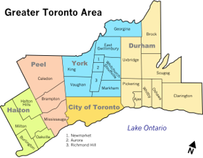
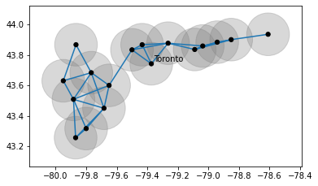
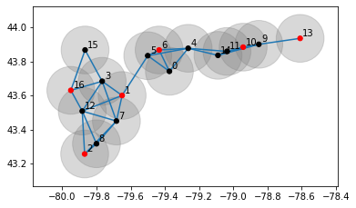
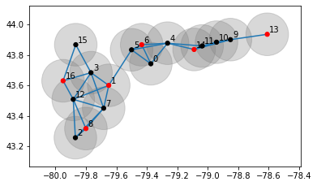
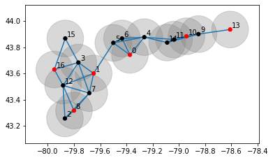

# Quantum Cohort Project Business Application

 

## 1. Applications of MIS solver in conjunction to TSP

Maximum independent set problem is defined to find a max set of

vertices that does not allow interferences between a pair of MIS

vertices. This nature of problem can be applied in the sense of

conflicts of commercial interests. Good examples can be found in

franchised retail network, where two franchised branches in the

neighbor may harm the revenues of both branches, while the

head quarter tends to maximize the number of branches densely.

 

In our business application, we can make use of a TSP (traveling

salesman problem) solver to choose one from the solutions for

MIS, to minimize the cost. 

 

 

## 2: An Example of Roadshow planning for R&B singer Tory Renez

 

Let's say Tory Renez is back in hometown, and plans a roadshow in the

vicinity of the Greater Toronto. The management of Tory intends to

have as many as possible fans seeing these roadshow events. In

planning, we consider the following conditions:

1. People are willing to travel to the towns in the vicinity.

2. Maximize the counts of concert events.

3. Make sure every concert event has net income.

 

In order to meet the third condition, each concert hall should share

a certain amount of population to have enough audience. Each concert

event will be broken even when more than

half of the concert hall sittings are sold. This requirement is

translated as a unit circle of interaction with neighboring cities.

This problem formulation reduces to a MIS problem.

 

## 3: A Specific Example of the Problem

 

Roadshow Event Planner: As with Tory Renez example, we can find the

following concert planning

- Composition of graph: The target towns are selected if the population

is greater than 50,000 in the Greater Toronto.

 

 

- A unit circle centered at the concert hall of each town

  is drawn on a population density hyper space.

  

 

- Run the quantum annealing MIS sover algorithm and

  find many solutions on the MIS problem.

 

 

  Here, the red marked vertices indicate the roadshow concert halls.

  

- Run TSP (traveling salesman problem) solver to find the shorted

roadshow path as the final planning.

 

 

## Value proposition of your innovation to this potential customer in non-technical language

 

Planning a roadshow for fans of a singer group is very similar to

planning franchise retail businesses such as Starbucks, Macdonald,

ExxonMobil, Savon Supermarket, Wallmart, Bestbuy, etc.

 

Optimized planning on these businesses can lead to substantial

improvement in the business outcomes, which can be seen a strong

value propositions applying MIS and TSP based planning.

 

**Please store your video externally to the repo, and provide a link e.g. to Google Drive**