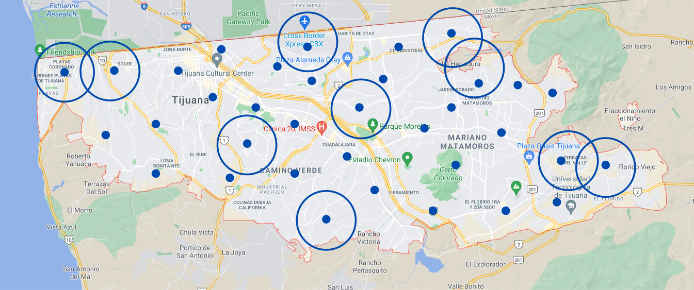
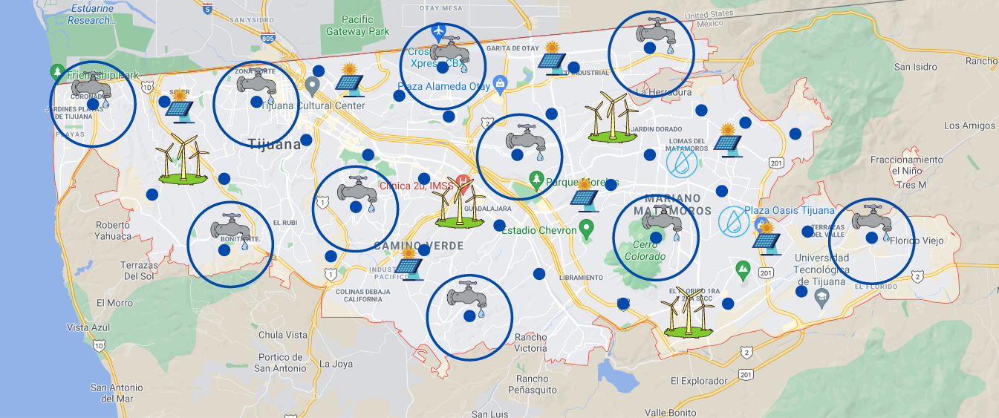
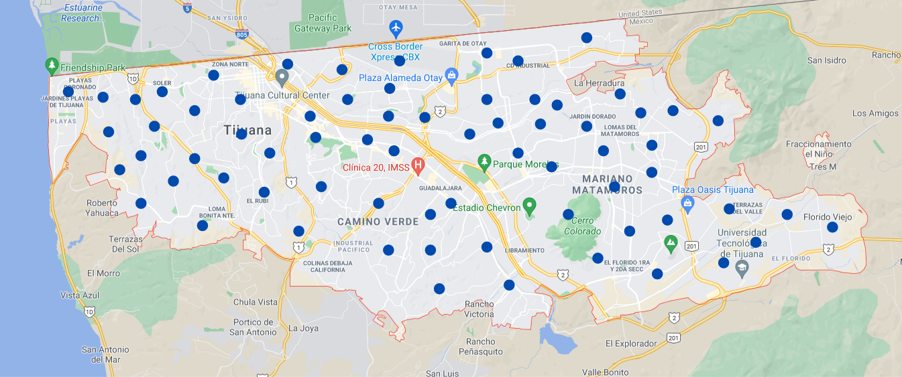

# Quantum Cohort Project Business Application

## Unit Disk Maximum Independent Set

Many real-world problems are extremely computationally intensive when posed in full generality.
The theoretical analysis of computational intensity usually takes the form of cost scaling analysis,
which is to say that researchers determine not the cost of solving any one *instance* of the problem
but rather how the cost grows as the difficulty of the problem grows.
The hardness of a problem grows as the efficiency of solving the problem shrinks.

The science of computational complexity is still a young one and problems are thus frequently separated
in terms of how hard they are relative to a better-understood class of problems. Hard problems are often encountered in real-life situations, and those faced with such problems cannot give up simply because the problem is hard. Instead, one often accepts a solution in the form of an algorithm that will *probably* give a *decent* answer. Such solutions may be "good enough" for a short time but are prone to disruption by newer, better algorithms that can solve the problem more efficiently.

Stakeholders should therefore routinely prepare for the advent of new approaches to old problems. Such approaches can demonstrate radically improved efficiency, which can lead to significantly lower operational costs and hence a risk of disruption to previously well-established operations.

In this document we analyse how such disruption might occur in resource management due to the deployment of a quantum computer based on the technology of Rydberg atom arrays -- a "Rydberg Quantum Computer" (RQC).
The technology of RQCs lend themselves naturally to the development of "good enough" algorithms for the Unit-Disk Maximum Independent Set (UD-MIS) problem, which is known to be hard. Roughly put, the UD-MIS
problem starts with a set of possibly overlapping circles and asks for the largest subset of non-overlapping
circles. As we explain below, this problem is related to questions of resource management,

## Use Case 2 : Water distribution for the city of the future

### Introduction 

Access to clean water is a human right, but water resources are becoming scarce, there's a global water crisis on the horizon [1,2]. People struggle to access the quantity and quality of water they need for drinking, cooking, bathing, handwashing and growing their food. The challenge of water distribution is projected to grow exponentially as the world's population increases and population densities in cities become higher. To overcome this challenge, we need scalable optimization procedures for water distribution. We expect that these optimization procedures should involve quantum computers. We propose to optimize the position of water distribution locations in a city to maximize their use and manage an equal distribution in the population. 

### Explanation of the problem in the city of Tijuana and the associated solution

A humanitarian crisis is coming to the city of Tijuana in Mexico [3]. Lack of water has become the norm in the city and is expected to worsen in the coming years. Right now, the solution is to cut the supply of water in specific neighborhoods for days, weeks, or months. [4]. The consequence is an unequal distribution of the water in the city, with the high-income population in control of the water and low-income neighborhoods without access to it. We have therefore developed a proposal for a pilot study in Tijuana. Specifically, we have explained how a Rydberg Quantum Computer (RQC) could assist the Tijuana government in its water distribution challenge. We have demonstrated how an RQC could help deliver better solutions faster than any current method. We hope this will help the city of Tijuana to save lives and livelihoods and help their citizens not only to survive but to thrive.

To solve this problem, we can detect possible distribution points with a given radius of range. This in itself represents a significant challenge with many intermediate steps. We are taking the big picture of the problem, seeking a solution to one of the many steps necessary to solve this water crisis. On the map, we can see a toy example of these points. Each circle is a zone with water. 

Figure 1.  Each circle is a zone with water 

An intersection of the circle means that that section of the city will have water for more days than the rest of the city.  The land value will increase. People want to live in places where there is more water, creating unequal distribution in favor of the high-income population. We want to avoid these cases. Access to water is a human right that doesn't depend on your income.

Figure 2. Maximum set of independent zones with water 

**Our solution is to find the maximum set of independent zones with water to enable equal water distribution. This is equivalent to finding the solution to the UD-MIS problem.** 

This solution will create zones without water that make it inhabitable for the population but perfect for solar cells, wind turbines, and waste management. We believe that extreme problems require extreme solutions. 

Figure 3. Problem with more distribution points is harder to solve. 

### Scheduling the distribution of water 

Now that we have the maximum set of independent zones with water in the city, we want to schedule water cuts given certain constraints. For example, prioritize zones for agriculture. This problem is equivalent to finding the solution to the nurse scheduling problem   

The nurse scheduling problem (NSP) arises when finding the optimal schedule for a set of available nurses over a fixed timetable of shifts. Solutions to NSP are required to respect hard constraints, such as days off and minimum availability, as well as soft constraints, such as minimum shift assignments, for each nurse [5]. 

In our case, the "shifts" are the days that certain zones will have water cuts. The NSP is an NP-hard problem. With the use of quantum annealing, we can find an approximate solution to this problem.

### Potential customers for the utilization of our solution approach:
1. **Creation of smart cities:** The promise of technology-enabled infrastructure for smarter, greener cities. For example, "By integrating smart water, lighting and parking management, Barcelona saved €75 million city funds and created 47,000 new jobs in the smart technology sector" [6]. The global water crisis will create the need for optimal water distribution in this type of new city.
3. **Government contracting:** Federal contract spending grew for the fourth year in a row to reach $597 billion in fiscal 2019, its highest level yet and a 6% increase over the previous year [7]
4. **Startups in climate:** Combine this solution to the portfolio of startups in the sector of climate. For example, one of the projects in  [Salo sciences](https://salo.ai/approach) is Landscape mapping, making visible the connections between climate, ecology and society. We can combine this mapping with our solution to find the natural points of disribution of water.  

## Pitch Video
https://www.youtube.com/watch?v=cWx5mAuG6dg   

### References

[1] https://www.worldwildlife.org/threats/water-scarcity

[2] https://www.nytimes.com/2019/07/11/business/fresh-water-shortage-invest.html

[3] https://www.sandiegouniontribune.com/news/border-baja-california/story/2019-12-09/baja-californiawater-supplies-remain-at-critical-levels

[4] https://www.sandiegouniontribune.com/news/border-baja-california/story/2019-11-07/tijuana-will-have-water-outages-every-four-days-for-the-next-two-months

[5] Ikeda, K., Nakamura, Y. & Humble, T.S. Application of Quantum Annealing to Nurse Scheduling Problem. Sci Rep 9, 12837 (2019). https://doi.org/10.1038/s41598-019-49172-3

[6] https://www.forbes.com/sites/jamesellsmoor/2019/05/19/smart-cities-the-future-of-urban-development/?sh=4a652bc32f90

[7] https://www.govexec.com/management/2020/06/federal-contract-spending-reaches-its-highest-level-ever-fiscal-2019-marking-4-straight-years-growth/166484/
