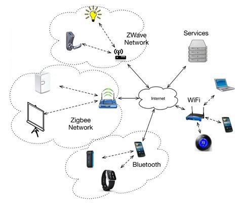
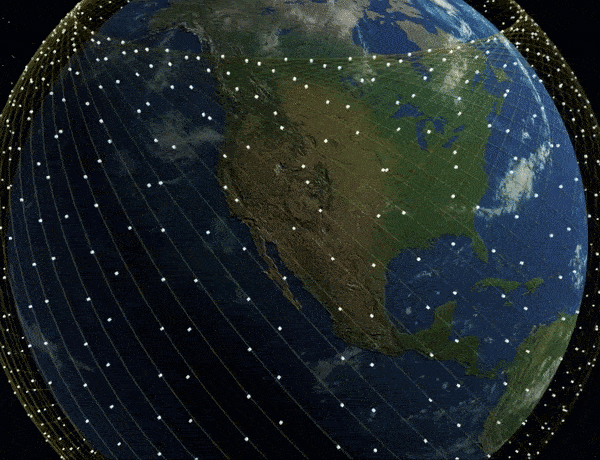
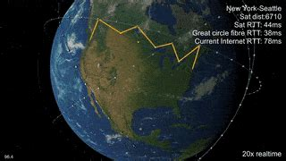

# Q-Grid

Here at QGrid we address the problem of getting information to its destination efficiently.  We provide computing solutions for dynamic routing protocals in largescale networks in the IT sector.

# Sourcing Efficient Information Routing Solutions

We live in a world of networks.  From global satelite internet systems to local mesh networks like Amazon Sidewalk.  The size of thes markets is(..insert here, maybe more elaboration on size of different market sizes around this).
Increased bandwith and technologies enhancing the IOT such as lower energy blue tooth and Z-Wave radio transmission enable new ways of connecting, as well as new challenges in determining transmission routing. We leverage state of the art classical and quantum methods to provide efficient routing for network providers to reduce bandwidth cost of routing, and increase latency.

## Our Routing Protocals

Our solutions based on MIS algorithms provide for shorter routing paths reducing required transmission bandwith leading to reduced network operators costs.

## Additional Applications

Expanding from the mainstream communciation network providers.  There is also additional application of our technology for rapidly changing local mesh networks, and satelite braodband internet providers.

Examples: 
- Mesh Networks
- Satelite Networks
  - [Starlink](https://www.starlink.com/)
  - [Project Kuiper from Amazon](https://www.aboutamazon.com/news/company-news/amazon-receives-fcc-approval-for-project-kuiper-satellite-constellation)
- Aid distribution

# Our Team 

**Matthew Bishara**: I have a background in physics, and currently work in the electric energy sector on computing solutions to optimization problems.

**Brandom Hiles** I have a background in physics, and currently working in the software engineering field mainly working in the API/Database layer.

**William Ngana** 

**Silvia Tzenkova**

**Stephen Zhu** 

# Video proposal

## Post and link to google drive or other service

**Please store your video externally to the repo, and provide a link e.g. to Google Drive**
