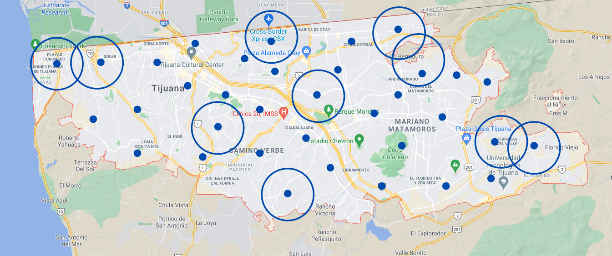
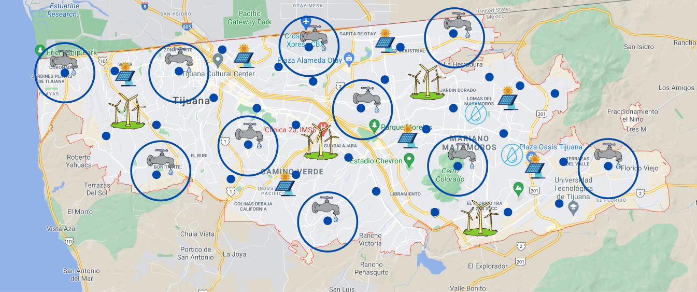
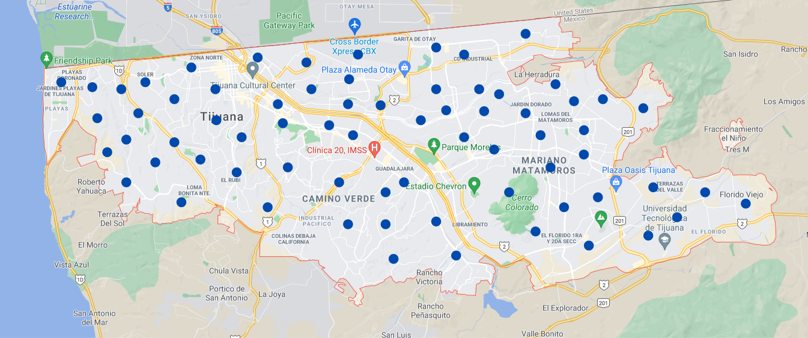

# Quantum Cohort Project Business Application

## Unit Disk Maximum Independent Set

Many real-world problems are extremely computationally intensive when posed in full generality.
The theoretical analysis of computational intensity usually takes the form of cost scaling analysis,
which is to say that researchers determine not the cost of solving any one *instance* of the problem
but rather how the cost grows as the difficulty of the problem grows.
The hardness of a problem grows as the efficiency of solving the problem shrinks.

The science of computational complexity is still a young one and problems are thus frequently separated
in terms of how hard they are relative to a better-understood class of problems. Hard problems are often encountered in real-life situations, and those faced with such problems cannot give up simply because the problem is hard. Instead, one often accepts a solution in the form of an algorithm that will *probably* give a *decent* answer. Such solutions may be "good enough" for a short time but are prone to disruption by newer, better algorithms that can solve the problem more efficiently.

Stakeholders should therefore routinely prepare for the advent of new approaches to old problems. Such approaches can demonstrate radically improved efficiency, which can lead to significantly lower operational costs and hence a risk of disruption to previously well-established operations.

In this document we analyse how such disruption might occur in resource management due to the deployment of a quantum computer based on the technology of Rydberg atom arrays -- a "Rydberg Quantum Computer" (RQC).
The technology of RQCs lend themselves naturally to the development of "good enough" algorithms for the Unit-Disk Maximum Independent Set (UD-MIS) problem, which is known to be hard. Roughly put, the UD-MIS
problem starts with a set of possibly overlapping circles and asks for the largest subset of non-overlapping
circles. As we explain below, this problem is related to questions of resource management,

## Use Case 1 : 5G and connected cars

### explanation of the problem and the associated solution

### size of the market and potential customers
TODO Felipe 

## Use Case 2 : Resources Management

### Introduction 

Access to clean water is a human right, but water resources are becoming scarce, there's a global water crisis on the horizon [1,2]. People struggle to access the quantity and quality of water they need for drinking, cooking, bathing, handwashing and growing their food. We propose to optimize the position of water distribution locations in a city to maximize their use and manage an equal distribution in the population. 

### Explanation of the problem in the city of Tijuana and the associated solution
A humanitarian crisis is coming to the city of Tijuana in Mexico [3]. Lack of water has become the norm in the city and is expected to worsen in the coming year . Right now, the response of the government has been to cut the supply of water in specific neighborhoods for days, weeks, or months [4]. The consequence is an unequal distribution of the water in the city.

We propose detecting possible distribution points with a given radius of range for a division of the water cuts more efficiently. On the map, we can see a toy example of these points. Each circle is a zone with water. 

Figure 1.  Each circle is a zone with water 

An intersection of the circle means that that section of the city will have water for more days than the rest of the city.  The land value will increase. People want to live in places where there is more water, creating unequal distribution in favor of the high-income population. We want to avoid these cases. Access to water is a human right that doesn't depend on your income.

Figure 2. Maximum set of independent zones with water 

**The proposal is to find the maximum set of independent zones with water to enable equal water distribution. This is equivalent to finding the solution to the UD-MIS problem.** 

This solution will create zones without water that make it inhabitable for the population but perfect for solar cells, wind turbines, and waste management. 

Figure 3. Problem with more distribution points is harder to solve. 

### Scheduling the distribution of water 

Now that we have the maximum set of independent zones with water in the city, we want to schedule water cuts given certain constraints. For example, prioritize zones for agriculture. This problem is equivalent to finding the solution to the nurse scheduling problem   

The nurse scheduling problem (NSP) arises when finding the optimal schedule for a set of available nurses over a fixed timetable of shifts. Solutions to NSP are required to respect hard constraints, such as days off and minimum availability, as well as soft constraints, such as minimum shift assignments, for each nurse. Examples of NSP are often cast as linear or quadratic programming problems, depending on the nature of the constraints, but they may also be formulated in terms of unconstrained optimization and solved using search methods, including tabu search (The paragraph was copied from [5]) .

### size of the market and potential customers
TODO Victor and Yurval 

## Pitch Video
* 90 second video explaining the value proposition of your innovation to this potential customer in non-technical language.
TODO Victor and Yurval 

### References

[1] https://www.worldwildlife.org/threats/water-scarcity

[2] https://www.nytimes.com/2019/07/11/business/fresh-water-shortage-invest.html

[3] https://www.sandiegouniontribune.com/news/border-baja-california/story/2019-12-09/baja-californiawater-supplies-remain-at-critical-levels

[4] https://www.sandiegouniontribune.com/news/border-baja-california/story/2019-11-07/tijuana-will-have-water-outages-every-four-days-for-the-next-two-months

[5] Ikeda, K., Nakamura, Y. & Humble, T.S. Application of Quantum Annealing to Nurse Scheduling Problem. Sci Rep 9, 12837 (2019). https://doi.org/10.1038/s41598-019-49172-3
