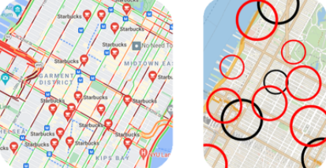
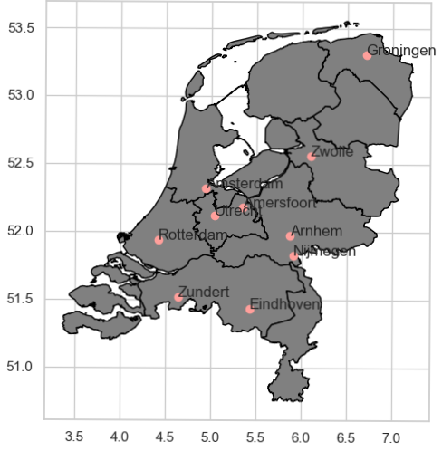

# Quantum Cohort Project Business Application

# Quantum Strategy

Quantum Strategy is a team of physicists, software engineers, and data scientists who help companies make improvements 
through technology particularly specialized in optimization algorithms and quantum computation. We empower the business 
and government by providing optimized solutions via calculating heavy and difficult problems with modern computers and 
quantum computers such as D-wave.

Our company focuses on a very simple problem. Can a salesman travel without too much headache? Often time salesman needs 
to decide where to go to make the most profit. Seems very small problem, but it is the problem that many business and 
organization need to solve to make scalable business and make optimum decisions. Where to build next Starbucks to 
optimize the benefits in Newyork? how many cell phone towers do we need to cover in the United States? and where to 
locate a tornado shelter to save more people in the city in Oklahoma. Unfortunately, this problem is proven to be an 
NP-hard problem, and many scientists are still trying to optimize it nowadays.

However, with recent innovations in quantum physics, a quantum computer can be calculated much faster than what the best 
super-computer can calculate. By taking advantage of that innovation, we are confident we can empower the company by the 
optimal and successful decision which can save millions of dollars.

# Our Solution:  

Our company is interested in solution via using neutral atom called Ryberg atom. From modeling the quantum system, we can provide solutions from military decisions of locating troops to city planning. For demonstration purposes, we show two examples of how our algorithm can be helpful to your business. 

## Eliminate Franchises

(Picture: Starbucks locations in Manhattan, NY) We all have seen the rise and fall of Subway restaurants as they expand their franchises aggressively. This is the common mistake that many businesses often fall into. Having too many franchises in a certain location can often cause negative revenue if the location and traffic are not optimized. This will not only reduce the company's revenue but reduce the local franchise owner's failure rate and influence the product quality. To avoid such failure, we provide optimization with factors such as human traffic, population density, and land prices by changing the potential of each atom (which is shown in the figure with a different circle radius). This information can be helpful to decide the elimination of franchises and planning for a new area to optimize the revenue and minimize the risk. The company can use the knowledge to make the decision which can save the company's time and money. 

## Next Franchise

(Picture: Starbucks locations in Oklahoma, TX)  Besides optimizing multiple locations of the franchise, our solution can be very effective if we want to open up a new franchise for a given location. For example, unlike Starbucks in Manhattan, Oklahoma does not have many Starbucks. Therefore, there are many possible places that local owners can start the business. To optimize the best profit in Oklahoma, Starbucks can optimize the possible location. This can be simply done by constraining our hamiltonian with a given location, and we can optimize the point of interest. This will help the company to detect the rich location faster than other competitors in the field. 

# Other applications and customers

Besides marketing and trend research, at Quantum Strategy we offer quantum-based solutions to 
a variety of optimization problems in business. In the following, we show an overview of the 
use cases and possible customers.

- **Surveillance systems**: determine the optimal placement of surveillance cameras to maximize the
coverage areas while minimizing the costs of the systems. Possible customers/partners are large 
companies providing surveillance products and services:
  - Hikvision UK Ltd
  - Bosch Security Systems, Inc.
  - Dahua Technology 

- **Seating plans during Covid**: during the pandemic, social distancing is necessary to reduce contagion risk. 
  We provide a quantum-based solution to optimally distribute a group of people for event planning (e.g.
  concert, theater or cinema) or transportation (seating plan for flights or trains). Possible customers
  are event organizers as well as airline and railways companies, e.g.:
  - Bassett Events, Inc. or Eventbrite NL B.V. (for event organization)
  - Delta Air lines, Lufthansa Group or Deutsche Bahn (for transportation services) 
    

- **Regional development planning**: a development plan sets out a local authority's policies 
  and proposals for land use in their area. This includes the allocation of facilities as police stations,
  hospitals or post offices. We propose a quantum based solution to determine the optimal distribution of 
  facilities across a given region or an entire country. As an example we provide an implementation
  of our algorithm to find the optimal distribution of medical facilities across the Netherlands.
  [This file](./Week2_Rydberg_Atoms/Dutch medical facilities.py) includes the code used to perform this analysis.

## Dutch medical facilities distribution during Covid pandemic
Optimal distribution of medical facilities across a country is a problem that with given simplifications (e.g. uniform
density of population) can be exactly mapped to a graph problem and solved by means of quantum annealing.
For instance, given a set of cities where it is possible to build a hospital, the goal is to find the maximum
independent set of cities under the constraint that the cities are at least e.g. 50km apart.

We assume that the Dutch government wishes to determine a distribution of Covid-ready 
hospital facilities across the country, given a set of cities. 

The goal is to find the optimal distribution such that the coverage is ensured (easiness for
people to reach the location) while minimizing costs (avoid that locations are too close to 
each other, e.g. 50 km).

We solve this problem by determining the maximum independent set of hospitals which optimally
covers the region. The solution is shown in the following graph:

The Covid-ready hospitals shall be placed in the 'red' locations, while the blue locations
are redundant. This is also shown in the following map, in which the red cities correspond to 
the Covid-hospitals, while the blue dots are the redundant ones:

# Our Team

**Elijah Cavan** graduated from UWaterloo with a Bsc. Mathematics Physics and from Wilfrid Laurier with an MSc. Mathematics. My research mainly stems in cosmology and N-body systems.

**Giuseppe Colucci** PhD in physics, works in the Banking industry for 7 years, expert in financial modelling, strategic hedging and optimization techniques.  

**Oscar Fanelli** "Born" as software engineer 13 years ago, later on switched to a managerial path, founded and grew a start-up as CTO, now working as Head of Engineering, focusing on product, processes and people.

**Jose H. Leon-Janampa** I like to research and work on topics that bring some benefit to people. I have a scientific mind but with knowledge of business and finance. I am a theoretical physicist that works in finance for more than 20 years, always trying to apply cutting edge technology to the business.

**Saesun Kim** I am a Ph.D. student at experimental quantum optics. As well as my experimental expertise, I am also a Qiskit advocate and co-lead of Qiskit localization.

# Video

**Link to Business Proposal Video: **

