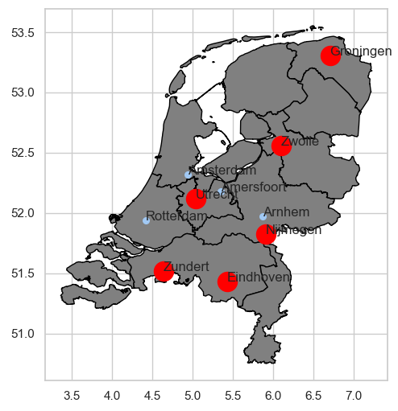

# Business Application: Spatial Optimizations and Rydberg Atoms

# Quantum Strategy

Quantum Strategy builds tailored quantum-ready solutions for companies and governments, focusing on difficult problems 
that require spatial optimization. 

We focus on a simple question: can a salesman travel without headaches? A salesman needs 
to decide where to go, to make the most profit. While this may seem an easy problem, many 
organizations struggle to solve hard challenges that can be compared to the traveling salesman problem: where to build the next Starbucks to 
optimize profits in New York? How many cell phone towers need to be built in Africa to provide maximum coverage 
while minimizing costs? How to organize seats on a plane to ensure social distancing during the COVID-19 pandemic? 

Those kinds of problems are proven to be "[NP-hard](https://en.wikipedia.org/wiki/NP-hardness)", and our computers have a hard time solving them!

However, recent discoveries revealed that quantum computers are much more efficient in tackling those challenges, even 
compared to the best super-computer ever built. 
Our team of physicists, software engineers, and data scientists write algorithms that exploit the power of quantum computers, 
to help you make critical decisions to save money.

# Our Solution  

Instead of writing code that runs on a classical computer, we exploit physical properties of certain neutral atoms, called Rydberg atoms.
The process is simple:
- We analyze your needs
- We model the quantum system to reflect your needs
- We look at how the quantum system naturally evolves to find the best solution to your problem
  
Our algorithms have a huge spectrum of applications, from military decisions (where to locate troops?) to zoning regulations (where to build hospitals?). 
We present here two use cases to demonstrate how our algorithms can deliver value to your business. 

## Redundant franchises

 

*(some Starbucks locations in Manhattan, NY)*

Many of us have seen the rise and fall of Subway restaurants as they expand their franchises aggressively.
Many businesses often fall into this mistake: having too many franchises in a certain area may lead to suboptimal profits 
if traffic is not optimized, or the population is not dense enough in that area. 
This not only reduces the company's profit, but also increases the overall franchise failure rate, and influences the perceived quality of the product sold. 

To avoid such failure, our optimization algorithms take into consideration factors such as human traffic, population density, 
land prices, and many more, by mapping Starbucks locations onto a quantum system made by Rydberg atoms. 

In the figure above, circles represent the coverage of a Starbucks store. For demonstration purpose, we aribtary change the size of circle to represent the consideration factors. Black circles represents Starbucks which have suboptimal profits, thus could be closed to save money.

*Disclaimer: this example leverages a subset of Starbucks stores currently located in New York.* 

## A new franchise

*(Picture: Starbucks locations in Oklahoma, TX)*

Instead of closing down franchises to optimize profits, what about where to open the next one?
Let's assume that Oklahoma does not have many Starbucks. Therefore, there are many possible places that local owners 
can use to open the business, but what's the place that generates the maximum profit? 

This problem can be also solvable if we add some constraint in our algorithm. 
Simply by adding non-optimzing location, we can provide stategy of next 10 new location for your company.

# Applications and Customers

Besides marketing and trend research, at Quantum Strategy we offer quantum-based solutions to 
a variety of optimization problems.

- **Algorithms for chess** See [this link](https://en.wikipedia.org/wiki/Knight%27s_tour) which discusses 'the Knight's tour'; a generalized Hamiltonian path problem in graph theory. 

- **Recommender Systems** See for example [this link](https://hal.archives-ouvertes.fr/hal-00971351/document) in which we can optimize reccomender systems using social media analysis. 

- **Surveillance systems**: determine the optimal placement of surveillance cameras to maximize the
coverage areas while minimizing the costs of the systems. Possible customers/partners are large 
companies providing surveillance products and services:
  - Hikvision UK Ltd
  - Bosch Security Systems, Inc.
  - Dahua Technology 

- **Seating allocation during the COVID-19 pandemic**: during the pandemic, social distancing is necessary to reduce the risk of infection. 
  We optimally distribute seats of a group of people during events (e.g.
  in theaters and cinema) or while traveling (e.g. on flights and trains). Possible customers
  are event organizers, as well as airline and railways companies:
  - Bassett Events, Inc. or Eventbrite NL B.V. (for event organization)
  - Delta Airlines, Lufthansa Group or Deutsche Bahn (for transportation services) 
    

- **City development planning**: optimizing zoning rules in order to ensure maximum benefits for inhabitants at minimum costs for the government. 
  This includes the allocation of facilities as police stations, hospitals, or post offices. 
  We propose a quantum-based solution to determine the optimal distribution of 
  facilities across a given region, city, or an entire country. As an example, we provide an implementation
  of our algorithm to find the optimal distribution of medical facilities across the Netherlands. See this file: <dl>/Week2_Rydberg_Atoms/Dutch medical facilities.py </dl> for the code (having trouble linked it).
  Possible customers:
  - Ministero dei Trasporti Italiano
  - Municipality of Amsterdam

## A technical deep-dive: distribution of Dutch medical facilities during the COVID-19 pandemic
Optimal distribution of medical facilities across a country is a problem that with given simplifications (e.g. uniform
density of population) can be exactly mapped to a graph problem and solved by means of quantum annealing.
For instance, given a set of cities where it is possible to build a hospital, the goal is to find the maximum
independent set of cities under the constraint that the cities are at least e.g. 50km apart.

We assume that the Dutch government wishes to determine a distribution 
hospital facilities ready to treat patients affected by COVID-19 across the country, given a set of cities. 

The goal is to find the optimal distribution such that the coverage is ensured (easiness for
people to reach the location) while minimizing costs (avoid that locations are too close to 
each other, e.g. 50 km).

We solve this problem by determining the maximum independent set of hospitals that optimally
cover the region. The solution is shown in the following graph:

The COVID-ready hospitals shall be placed in the 'red' locations, while the blue locations
are redundant. This is also shown in the following map, in which the red cities correspond to 
the COVID-hospitals, while the blue dots are the redundant ones:

# Our Team

**Elijah Cavan** graduated from UWaterloo with a Bsc. Mathematics Physics and from Wilfrid Laurier with an MSc. Mathematics. My research mainly stems in cosmology and N-body systems.

**Giuseppe Colucci** PhD in physics, works in the Banking industry for 7 years, expert in financial modelling, strategic hedging and optimization techniques.  

**Oscar Fanelli** Italian pizza-lover, "born" as software engineer 13 years ago, founded and grew a start-up as CTO, now working as Head of Engineering, focusing on product, processes and people management.

**Jose H. Leon-Janampa** I like to research and work on topics that bring some benefit to people. I have a scientific mind but with knowledge of business and finance. I am a theoretical physicist that works in finance for more than 20 years, always trying to apply cutting edge technology to the business.

**Saesun Kim** I am a Ph.D. student at experimental quantum optics. As well as my experimental expertise, I am also a Qiskit advocate and co-lead of Qiskit localization.

# Video

**Link to Business Proposal Video: **

