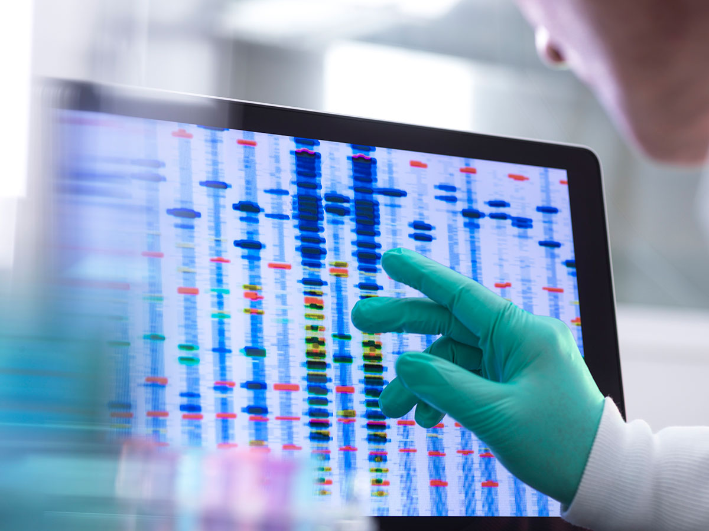

# Business Application: Quantum Annealing and Protein Redundancy 

## Introduction to Qamino

Qamino specializes in finding non-redundant protein sequences using quantum technology. Non-redundant protein sequences are absolutely vital for drug manufacturers to effectively find and produce drugs and reduce their R&D cost. We are able to model the problem of distinguishing protein sequences as a unit-disk maximum independent set (UD-MIS) problem based on their similarity with other proteins. We can find a global minimum to the hamiltonian more effectively and efficiently than classical methods.
Targeting specific chosen protein to evaluate ligand affinity can be done by selecting and analyzing representative sets of protein structure. Structural knowledge on the exact interactions of drugs with their target protein has been applied mainly to predict potency changes of chemically modified lead compounds in protein structure-based drug design industry [[1]](https://www.ncbi.nlm.nih.gov/pmc/articles/PMC4236214/)[[2]](https://www.frontiersin.org/articles/10.3389/fphar.2018.00923/full).

  
  <a href="https://portlandpress.com/biochemsoctrans/issue/46/5/">Source</a>

## Preamble

The application of UD-MIS for choosing non redundant representative sets of protein from sequence data sets can be served in a variety of applications. For instance, selecting representative sets of protein structure which is one of the biology problems in the world. 

  
  <a href="https://www.wikiwand.com/en/Protein_structure/">Source</a>

Protein structure is the three-dimensional arrangement of atoms in an amino acid-chain molecule. It enables us to understand ligand protein binding and develop binding affinity techniques [[5]](https://portlandpress.com/biochemsoctrans/article-abstract/46/5/1367/67796/Protein-structure-and-computational-drug-discovery). Binding affinity is the strength of the binding interaction between a single biomolecule (e.g. protein or DNA) to its ligand/binding partner (e.g. drug or inhibitor) [[6]](https://www.malvernpanalytical.com/en/products/measurement-type/binding-affinity). 

  
  <a href="https://www.lecturio.com/magazine/biological-interaction/">Source</a>
 
 

## Business Pitch

Target-oriented drug design aims to find a high affinity ligand that would bind the target protein in order to block its disease-associated function catalytic activity or interaction with other molecules. It becomes possible to firstly predict how and where a particular small molecule might interact with a protein and then to identify putative ligands for a specific protein site [[8]](https://portlandpress.com/biochemsoctrans/article-abstract/46/5/1367/67796/Protein-structure-and-computational-drug-discovery?redirectedFrom=fulltext). Qamino helps its business partners to choose non redundant representative sets of protein to select and analyze protein structure.
In Qamino, the new quantum-aided optimization of protein candidates enables you to make a drug or by discovering target molecules much faster and with more accuracy. Our technology provides an advantage compared with the conventional protein detection methods that focus on similar and well documented candidates. It can shorten your drug development process effectively while it enables you to reduce the risk and cost of R&D. Our technology cut the time spent in discovery from 4.5 years to as little as one year and reduces discovery costs by 80 percent. 

## Drug Design Industry Overview

  
  <a href="https://physicsworld.com/a/intelligent-drug-discovery/">Source</a>
 
 

In recent years, the drug discovery technologies industry has seen remarkable developments and rapid progress. Biology, chemistry and computation provide an amalgamation that is reflective of the industry’s future.  In this industry, growth in the protein sequencing market is mainly driven by factors such as increasing focus on target-based drug development by pharmaceutical and biotechnology companies, advancements in clinical mass spectrometry and analytical techniques, and increasing public-private financial support for proteomic research [[10]](https://www.marketsandmarkets.com/Market-Reports/protein-sequencing-market-121629357.html).

Supply side of protein sequencing market is characterized by advancement in technology and technique. The demand side of this market is characterized by increasing use of proteomic research in drug design industry, patent expiry of major blockbuster drugs and increasing R&D expenditure of major pharmaceutical and biotechnology companies [[11]](https://www.marketsandmarkets.com/Market-Reports/protein-sequencing-market-121629357.html).

  
  <a href="https://www.ddw-online.com/target-discovery-and-drug-design-extracting-the-value-from-genomics-1421-200008/">Source</a>
 
 

The 10 largest pharmaceutical companies now pay nearly $80 billion a year to come up with fewer and fewer successful drugs. The reason is that drugs that are easiest to find and that safely and effectively treat common disorders have all been found; what is left is hunting for drugs that address problems with complex and elusive solutions and that would treat disorders affecting only tiny portions of the population and thus could return far less in revenue.  Because finding new, successful drugs has become so much harder, the average cost of bringing one to market nearly doubled between 2003 and 2013 to $2.6 billion. These same challenges have increased the lab-to-market timeline to 12 years, with 90 percent of drugs washing out in one of the phases of human trials. Many scientists in the field think that computer-aided techniques will ultimately improve drug development in several ways such as identifying more promising drug candidates and by speeding up the overall process [[13]](https://www.nature.com/articles/d41586-019-03846-0). 

Several biotechnology and pharmaceutical companies are making sizeable investments on utilizing protein sequencing in drug development. That’s why Every one of the major pharmaceutical companies has announced a partnership with at least one of the AI-based drug-discovery start-ups. They raised more than $1 billion in funding in 2018, and as of last September, they were on track to raise $1.5 billion in 2019 [[14]](https://www.nature.com/articles/d41586-019-03846-0).

According to the market research reports, protein sequencing industry garnered $5.39 in 2018 and it is estimated to reach $9.92 billion by 2026, growing at a compound annual growth rate (CAGR) of 7.8% from 2019 to 2026 [[15]](https://www.medgadget.com/2020/08/protein-sequencing-market-to-reach-9-92-billion-by-2026-allied-market-research.html). The global market for drug discovery should grow from $69.8 billion in 2020 to $110.4 billion by 2025 with a CAGR of 9.6% for the period of 2020-2025 [[16]](https://www.bccresearch.com/market-research/biotechnology/drug-discovery-technologies-report.html). Of all the regions, North America holds an enormous potential in the protein sequencing market. Several public and private organizations have committed large funds on proteomic research. Rising focus of players on structure-based drug design and the advent of technologically advanced analytical methods used in protein sequencing are bolstering the regional demand [[17]](https://www.biospace.com/article/protein-sequencing-market-increasing-focus-on-target-based-drug-development-activities-to-drive-the-market/).

  
  <a href="https://www.futurewiseresearch.com/healthcare-market-research/Protein-Sequencing-Market/3383" target="_blank">Source</a>
 
 
 

## Benchmarking

There are several conventional methods to select non-redundant representative subsets of protein sequence. Our technology has dramatically promoted sequencing technologies by offering low-cost and ultra-high-throughput sequencing. In addition to accuracy, computational complexity is an important issue. Next-generation sequencing technologies are able to demonstrate a good speedup derived from solving UD-MIS problem quantumly compared with conventional methods[[19]](https://www.ncbi.nlm.nih.gov/pmc/articles/PMC3251834/). Although the below figure show promising results, however, we attempt to develop better model using quantum computer to improve the metrics.  

  

*Computational Costs*: Our technologies to provide non-redundant representative subsets of protein sequence reduces computational complexity which result in a lower computational cost. It can cut the time spent in discovery from 4.5 years to as little as one year, reduces discovery costs by 80 percent and results in one-fifth the number of synthesized compounds as is normally needed to produce a single winning drug.

The “production” costs are accounted for [[20]](https://www.genome.gov/about-genomics/fact-sheets/DNA-Sequencing-Costs-Data):
- Labor, administration, management, utilities, reagents, and consumables
- Sequencing instruments and other large equipment (amortized over three years)
- Informatics activities directly related to sequence production (e.g., laboratory information management systems and initial data processing)
- Indirect Costs as they relate to the above items. 

## Competitors

Several top players are aimed at launching cutting-edge mass spectrometry platforms to gain unique competitive edge over their peers in the global protein sequencing market. Some prominent companies are also consolidating their overall presence by strengthening the sales of reagents and consumables. Top players operating in the market include Thermo Fisher Scientific, Charles River Laboratories, and Shimadzu Corporation [[21]](https://www.biospace.com/article/protein-sequencing-market-increasing-focus-on-target-based-drug-development-activities-to-drive-the-market/).

|Company name|Country|R&D budget↑|Profit-2020|
|----|----|----|----|
|Thermo Fisher Scientific|USA|$ 1.18 billion|$ 32.22 billion|
|Illumina, Inc|USA|$ 682.0 million|$ 3.24 billion|
|BGI Genomics|China|$ 26.2 million* |$ 634.0 million|

*Only the gene sequencing firm in Shenzhen,China.

## Mapping our competitive position

Mapping the competitive position of the company helps us to identify what we are charging for and what our customers are paying for. It shows us the primary benefit that our product offers and also our rival’s core competitiveness [[22]](http://fernfortuniversity.com/term-papers/swot/1433/164-thermo-fisher-scientific.php) . Creating such a map involves three steps: 

1. **Define the market **
    People’s need is not only to cure their disease, but to get a medicine or drug which is more effective while it has fewer side effects. That is why people are very concern about their medications. To address their needs, pharmaceutical companies need to invest more to improve effectiveness and safety of their drugs. To this end, they require reliable and accurate solution from drug discovery industry. This is where protein sequencing technology companies could play vital role to tackle the problem. 
2. **Determine the primary benefit **
    The primary benefits of our product would be the accuracy of the protein structure identification and shorten the drug discovery process. Our product reduces discovery costs by 80 percent. Moreover, highly skilled engineer and scientists guarantee the reliability and validity of the product. 
3. **Plot position **
    As it is mentioned before, there are some competitors in the market including Thermo Fisher Scientific. SWOT analysis shows that this company has several strengths such as successful track record of developing new products, Reliable suppliers, strong dealer community, strong brand portfolio and High level of customer satisfaction [[23]](http://fernfortuniversity.com/term-papers/swot/1433/164-thermo-fisher-scientific.php). On the other hand, there are some weaknesses such as, gaps in the product range sold by the company, days inventory is high compared to the other competitors and not very good at product demand forecasting [[24]](https://hbr.org/2007/11/mapping-your-competitive-position). It can be concluded that as a start-up company we might be threatened by the competitors’ strengths such as strong brand portfolio and strong dealer community. However, the company can benefit from several business opportunities. For instance, our highly skilled engineer and scientists could forecast demand using latest techniques. This leads customer satisfaction improvement, reduction in operating cost and higher operating profit. Moreover, accuracy of our solution leads stronger brand portfolio in long term. In conclusion, the first five years would be very critical for our company although its growth rate could be considerable during this period if the resources are allocated precisely and efficiently towards the drugs that address problems with complex and elusive solutions. 

## Potential Customers

|Company name|Country|R&D budget-2020↑|Profit-2020|
|----|----|----|----|
|Roche Holding AG|Switzerland|$ 14.14 billion|$ 32.7 billion|
|Pfizer|USA|$ 9.4 billion|$ 41.9 billion|
|Novartis International AG|Switzerland|$ 8.9 billion|$ 48.65 billion|
|AstraZeneca|UK|$ 6.0 billion|$ 26.6 billion|
|Merck & Co.|USA|$ 2.7 billion|$ 43.0 billion|

## Presentation 
## The value proposition of our innovation to the potential customers:
[Click to view](https://drive.google.com/file/d/1hfTtel2v4LhboNnb1T615xISGz0q-tJT/view)

## References
1. https://www.ncbi.nlm.nih.gov/pmc/articles/PMC4236214/
2. [Frontiers | Bridging Molecular Docking to Molecular Dynamics in Exploring Ligand-Protein Recognition Process: An Overview | Pharmacology (https://www.frontiersin.org/articles/10.3389/fphar.2018.00923/full)
3. [Protein structure and computational drug discovery ](https://portlandpress.com/biochemsoctrans/article-abstract/46/5/1367/67796/Protein-structure-and-computational-drug-discovery)
4. [Two Protein Structure Image]https://www.wikiwand.com/en/Protein_structure/
5. [Biochemical Society Transactions | Portland Press | Image] https://portlandpress.com/biochemsoctrans/article-abstract/46/5/1367/67796/Protein-structure-and-computational-drug-discovery?redirectedFrom=fulltext
6. [Binding Affinity | Dissociation Constant | Malvern Panalytical]https://www.malvernpanalytical.com/en/products/measurement-type/binding-affinity
7. [Protein Interaction Image](https://www.lecturio.com/magazine/biological-interaction/)
8. https://portlandpress.com/biochemsoctrans/article-abstract/46/5/1367/67796/Protein-structure-and-computational-drug-discovery?redirectedFrom=fulltext
9. https://physicsworld.com/a/intelligent-drug-discovery/
10. https://portlandpress.com/biochemsoctrans/article-abstract/46/5/1367/67796/Protein-structure-and-computational-drug-discovery?redirectedFrom=fulltext
11. https://www.marketsandmarkets.com/Market-Reports/protein-sequencing-market-121629357.html
12. https://www.ddw-online.com/target-discovery-and-drug-design-extracting-the-value-from-genomics-1421-200008/
13. https://www.nature.com/articles/d41586-019-03846-0
14. https://www.nature.com/articles/d41586-019-03846-0
15. https://www.medgadget.com/2020/08/protein-sequencing-market-to-reach-9-92-billion-by-2026-allied-market-research.html
16. https://www.bccresearch.com/market-research/biotechnology/drug-discovery-technologies-report.html
17. https://www.biospace.com/article/protein-sequencing-market-increasing-focus-on-target-based-drug-development-activities-to-drive-the-market
18. https://www.futurewiseresearch.com/healthcare-market-research/Protein-Sequencing-Market/3383
19. https://www.ncbi.nlm.nih.gov/pmc/articles/PMC3251834/
20. https://www.genome.gov/about-genomics/fact-sheets/DNA-Sequencing-Costs-Data
21. https://www.biospace.com/article/protein-sequencing-market-increasing-focus-on-target-based-drug-development-activities-to-drive-the-market
22. http://fernfortuniversity.com/term-papers/swot/1433/164-thermo-fisher-scientific.php
23. http://fernfortuniversity.com/term-papers/swot/1433/164-thermo-fisher-scientific.php
24. https://hbr.org/2007/11/mapping-your-competitive-position
