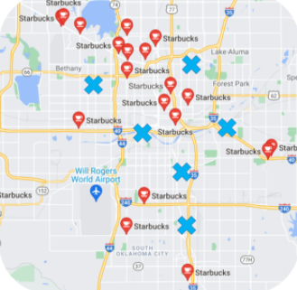

# Quantum Cohort Project Business Application

# Quantum Strategy

Quantum Strategy is a team of physicists, software engineers, and data scientists who help companies make improvements through technology particularly specialized in optimization algorithms and quantum computation. We empower the business and government by providing optimized solutions via calculating heavy and difficult problems with modern computers and quantum computers such as D-wave.

Our company focuses on a very simple problem. Can a salesman travel without too much headache? Often time salesman needs to decide where to go to make the most profit. Seems very small problem, but it is the problem that many business and organization need to solve to make scalable business and make optimum decisions. Where to build next Starbucks to optimize the benefits in Newyork? how many cell phone towers do we need to cover in the United States? and where to locate a tornado shelter to save more people in the city in Oklahoma. Unfortunately, this problem is proven to be an NP-hard problem, and many scientists are still trying to optimize it nowadays.

However, with recent innovations in quantum physics, a quantum computer can be calculated much faster than what the best super-computer can calculate. By taking advantage of that innovation, we are confident we can empower the company by the optimal and successful decision which can save millions of dollars.

# Our Solution 

Our company is interested in solution via using nutueral atom called Ryberg atom. From modeling the quantum system, we can provide solutions from military decisions of locating troops to city planning. For demonstration purposes, we show two examples of how our algorithm can be helpful to your business. 

# Eliminate Franchises

(Picture: Starbucks locations in Manhattan, NY) We all have seen the rise and fall of Subway restaurants as they expand their franchises aggressively. This is the common mistake that many businesses often fall into. Having too many franchises in a certain location can often cause negative revenue if the location and traffic are not optimized. This will not only reduce the company's revenue but reduce the local franchise owner's failure rate and influence the product quality. To avoid such failure, we provide optimization with factors such as human traffic, population density, and land prices by changing the potential of each atom (which is shown in the figure with a different circle radius). This information can be helpful to decide the elimination of franchises and planning for a new area to optimize the revenue and minimize the risk. The company can use the knowledge to make the decision which can save the company's time and money. 

# Next Franchise

(Picture: Starbucks locations in Oklahoma, TX)  Besides optimizing multiple locations of the franchise, our solution can be very effective if we want to open up a new franchise for a given location. For example, unlike Starbucks in Manhattan, Oklahoma does not have many Starbucks. Therefore, there are many possible places that local owners can start the business. To optimize the best profit in Oklahoma, Starbucks can optimize the possible location. This can be simply done by constraining our hamiltonian with a given location, and we can optimize the point of interest. This will help the company to detect the rich location faster than other competitors in the field. 

# Our Team

 **Elijah Cavan** graduated from UWaterloo with a Bsc. Mathematics Physics and from Wilfrid Laurier with an MSc. Mathematics. My research mainly stems in cosmology and N-body systems.

**Giuseppe Colucci** Originally from Bari, I moved to Frankfurt ~10y ago for my PhD in Quantum Field Theory. I then moved to Rotterdam, where I lived now for more than 7y, to start working for UL as a software engineer for security of transactions.

**Oscar Fanelli** "Born" as software engineer 13 years ago, later on switched to a managerial path, founded and grew a start-up as CTO, now working as Head of Engineering, focusing on product, processes and people.

**Jose H. Leon-Janampa** I like to research and work on topics that bring some benefit to people. I have a scientific mind but with knowledge of business and finance. I am a theoretical physicist that works in finance for more than 20 years, always trying to apply cutting edge technology to the business.

**Saesun Kim** I am a Ph.D. student at experimental quantum optics. As well as my experimental expertise, I am also a Qiskit advocate and co-lead of Qiskit localization.

# Video

**Link to Business Proposal Video: **

