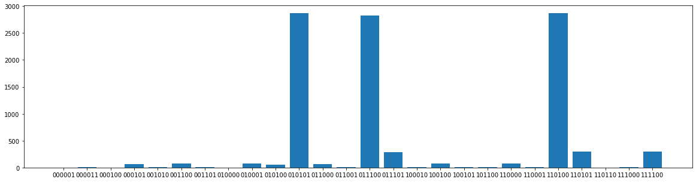
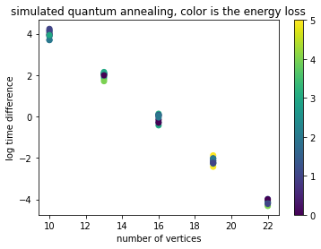
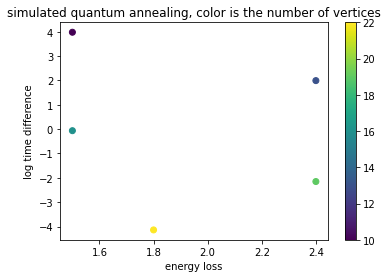

# Project 2: Optimization problems \& Rydberg atom arrays

This project guided us through using the foundations of quantum hardware to demonstrate a quantum advantage in real-world problems. Team 3 was composed of the following members : Alice Barthe, Felipe Ferreira de Freitas, Victor Onofre and Yuval Sanders.

For each of the sections below, a notebook is associated. The task and challenges were solved based on the following file  [instructions.pdf](./instructions.pdf).

# Tasks 

## Task 1
associated [notebook](./Task1.ipynb)

### Solving the UD-MIS problem with simulated classical annealing
We solved the unit-disk maximum independent set (UD-MIS) problem using classical simulated annealing, for the Toy Graph proposed in the instructions.

On the above plot, one optimal solution is presented. Each circle is centered on the coordinates of the vertex, with a unit diameter. The vertices which are connected by an edge are the ones for which the two circles intersect, meaning that the distance between the centers is less than the unit. Circles in gray in the background are non occupied vertices, while blue circles in the foreground are occupied vertices. The result is compliant with the constraint of non overlap, and solving the problem with brute force confirms that three towers is indeed the optimal solution. 

### Increasing the complexity : uniform Unit Disk graph distribution
For the above Toy Graph, the brute force solver goes faster than the classical annealing. To start demonstrating an advantage of simulated classic annealing, we solved the problem for a random problem. The random graphs are parametrized by two values : the number of vertices **N** and the density **d**. The vertices coordinates are uniformly sampled in a square of side length **c**. The size of the square is chosen such as its surface equals the number of vertices divided by the density **d = N /c^2**. Therefore, the two coordinates are sampled over **0** to **c = sqrt(N/d)**

The two implementations start to be equivalent in terms of runtime roughly around **N = 20** for density **d = 1**. This is of course dependent on the hardware. Several optimal solutions are presented below :

### Exploring Different Annealing Schedules

We tried to find a better annealing schedule to arrive to solutions to the problem quicker. A variety of annealing schedules were tested, using learning rate schedules from pytorch, which contains an amazing collection of schedules routines ready to be use.

#### The Baseline

associated [notebook](./Task1Felipe.ipynb)

The baseline is the proposed annealing schedule

^{(\frac{t}{N})})

To benchmark the annealing schedule we can check the value of the energy at the end of each iteration and see how many iterations we have to reach the ground state energy, in the baseline considered.

<table><tr>
    <td><figcaption> Energy history using the proposed annealing schedule </figcaption></td> 
    <td><figcaption> Occupation states history using the proposed annealing schedule </figcaption></td>
    </tr>
</table>

It takes several iterations but eventually around the iteration 70 it got to one ground state. We can also see how the occupations change throughout the iterations, we sample 4 different iterations to plot the graphs with the occupation states (right figure).

**For details on all the annealing schedules tested, please refer to the following [file](./annealingSchedules.md).**

From all tested annealing schedules, the two that stand out are Multiplicative annealing and the Exponential annealing, we can check again their performance with a bigger number of vertices:

#### Larger Graphs 

associated [notebook](./benchmark_classic.ipynb)

Multiplicative annealing results for 25 vertices graph:
<table><tr>
    <td><figcaption> Energy history using the Multiplicative annealing schedule </figcaption></td> 
    <td><figcaption> Occupation states history using the Multiplicative annealing schedule </figcaption></td>
    </tr>
</table>

Exponential annealing results for 25 vertices graph:
<table><tr>
    <td><figcaption> Energy history using the Exponential annealing schedule </figcaption></td> 
    <td><figcaption> Occupation states history using the Exponential annealing schedule </figcaption></td>
    </tr>
</table>

<table><tr>
    <td><figcaption>  Benchmark for Multiplicative and exponential annealing schedules </figcaption></td>
    </tr>
</table>

We can conclude that for this task the multiplicative and exponential annealing schedules provide the fastest convergence, with in some cases the exponential annealing providing the fastest results

## Task 2
associated [notebook](./Task2.ipynb)
    
We solved the same Toy Graph problem, but using quantum annealing with the Yao library implementation. Plotting the frequency of occurrence of each bit string, we find that the solver has identified three optimal solutions :

While two solutions are indeed optimal solutions to the MIS problem, and therefore ground states. It seems that the quantum annealing solver yields one noncompliant solution to the non overlap constraint. It is still to be determined where the source of that error might come from.

## Task 3
associated [notebook](./Task3.ipynb)

### Original Problem

The City of Gotham is looking at putting in new cell phone towers. Some possible locations of the cell phone towers have been identified. To avoid overheads, Gotham should only purchase the required number of cell phone towers such that 
1. the cell phone tower signal ranges do not overlap
2. as much of Gotham City can be within cell signal range

This problem can be mapped to a UD-MIS problem. In that framework, each potential location corresponds to a vertex and can hold a tower, which corresponds to being activated or not. Constraint 1 translates into the disk constraint, which define the edges of the graph. Constraint 2 corresponds to the fact that a maximum of tower shall be installed, which translates into optimisation of the cardinality of independent set.

We solve the problem with the simulated classical annealing and the brute force solver. The problem is not complex enough for the simulated annealing to beat the brute force implementation in runtime (3s vs 0.2s) Moreover the brute force solver outputs a set of possible options :

### Reformulation of the Problem

However, one can argue that the constraint of no overlap is suboptimal. Let's take the toy case where there are only two potential sites at a distance of 0.9999. The optimal a human would intuitively choose would be to put a tower on both sites, but instead the UD-MIS would reject it as the two sites are formally intersecting. A new way of reformulating the problem would be to maximize the area covered while minimizing the overlap. In order to do that, the edges of the graph corresponding to the problem could be weighted by the overlap surface. In fact if we take the exact formula of the overlap between two circle (normalised to 1 being the surface of unit circle) where **dij** is the distance between the **i**th and **j**th centers.

**wij = 2 pi ( arcos(d) - d \sqrt(1-dij)^2}**

It turns out that the value : sum of activated tower - sum of the weights over the edges is exactly equal to the surface covered by at least one tower. In that new framework this is the quantity to maximize, for a given number of towers, that becomes the cost.

By brute force solving, we plot where all solutions stand in the space overlap vs cost. The red line shows the optimal solution for each number of towers :

And below we display the optimal solution for each number of tower, the overlap value is displayed in the title.

## Further Challenge : Implementation on Dwave and benchmarking

The implementation of a single graph for quantum annealing on dwave for both simulated and on real hardware can be found on the following [notebook](./Dwave.ipynb), while the benchmarking notebook can be found in the following [notebook](./Dwave_benchmark.ipynb) .

The MIS problem was implemented to run on D-wave libraries, including D-Wave simulation and D-Wave hardware. The two were compared against the brute force solver in terms of runtime and energy loss (e.g., the difference between the optimal number of towers found by the brute force algorithm and the number of towers found by the implementation to be benchmarked). The space of performance was explored as a function of the number of vertices on a sample of random graphs following the distribution of random unit disk graph of density 1 (see above for definition of uniform unit disk graph distribution).

While the MIS problem was solved for the graphs on D-Wave hardware, the lack of budget on Dwave forbid us to run the benchmark on the hardware. However the section on hardware can just be uncommented to be benchmarked. The below plots only benchmarks the quantum annealing simulator.

The below plots shows the log time difference as a function of the number of vertices, the color is the energy loss. It is a scatter plot for all samples.

The below plots shows the average log time difference as a function of the average energy loss, the color is the number of vertices. It is averaged over all samples.

We see an exponential decrease of the time gain against brute force with the number of vertices, while the average energy loss stays between 1 and 2. The value in themselves are of little significance since they depend on the hardware used, but the trend when the size of th eproblem increases is interesting. **Overall Quantum Annealing shows an exponential advantage for quickly finding good suboptimal solutions.**

# Business Application
For more details refer to the [Business Application found here](./Business_Application.md)
