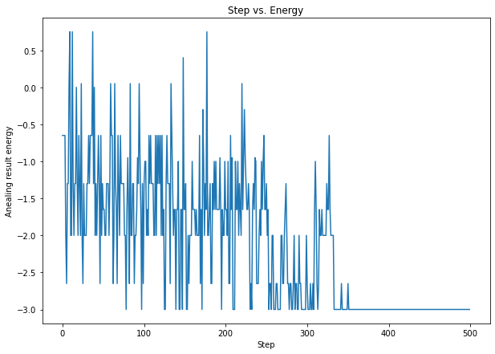

## Project 2: Optimization problems \& Rydberg atom arrays

This project will guide you through using the foundations of quantum hardware to demonstrate a quantum advantage in real-world problems.

Open up [instructions.pdf](https://github.com/CDL-Quantum/CohortProject_2021/tree/main/Week2_Rydberg_Atoms/instructions.pdf) to begin learning about your tasks for this week!

## Tasks include:
* Simulating a random circuit with a Matrix Product State code, and producing a speckle pattern.
* Adding a single bit-flip error and exploring the change in the speckle pattern.
* Exploring convergence of the Porter-Thomas Distribution.
* Exploring the effect of 2-qubit gate errors.
* Describe a business that could be build around random circuits.  (See below Business Application)

## Summary of Results

### [Task 1](./Task1.ipynb): Speckle patterns of probabilities for various quantum circuit sizes

In task 1, we produce the probability distribution obtained by performing projective measurement in the Z basis on the random quantum circuits (as defined in the problem) with various quantum circuit depth and width (i.e. the number of qubits). To help solve this problem, we created some functions in [proj_measurement.jl](./proj_measurement.jl) to implement projective measurement in either X, Y, or Z basis. As an example, we plotted the "speckle patterns" for random quantum circuits with {width, depth} of {3, 10}, {3, 20}, {5, 10}, {5, 20}, and {6, 10} in Figure 1.

<figure class="image">
  
  <figcaption> <b>Fig.1</b>  </figcaption>
</figure>

### [Task 2](./Task2.ipynb): Effect of a single-qubit bit-flip error on speckle patterns

In task 2, we examined how the probability distribution of the random circuit sampling changes with a single-qubit bit-flip error occuring at a random place on the quantum circuit. For example, we plot various speckle patterns obtained under the random bit-flip error for a quantum circuit consisting with 4 qubits and the circuit depth of 10 in Figure 2. We can clearly see that the pattern looks very different in each experiment although the same random circuit was executed. 

<figure class="image">
  
  <figcaption> <b>Fig.2</b>  </figcaption>
</figure>

### [Task 3](./Task3.ipynb): Emperical Cumulative Distribution of Random Circuit Sampling Probabilities

In task 3, we examine whether the samping probability distribution of the random circuit converges to the Porter–Thomas distribution, characteristic of quantum chao, as the circuit depth increases. Reproducing such probability distribution classically is conjectured to be exponentially difficult as the number of qubits increases. We demonstrate the convergence of the random circuit sampling probability distribution to the Porter-Thomas distribution by plotting the empirical cumulative distribution for a quantum circuit with 8 qubits with several quantum circuit depth. The quantum circuit depths are 1, 2, 5, 10, 50 and 100. Figure 3 clearly shows that the empirical cumulative distribution converges to that of the exponential distribution (i.e. Porter-Thomas) as expected.

<figure class="image">
  
  <figcaption> <b>Fig.3</b> Cumulative distribution function of the exponential distribution (dashed) and the probabilities in the random circuit sampling (solid) with increasing circuit depth. </figcaption>
</figure>

<figure class="image">
  
  <figcaption> <b>Fig.3</b> Cumulative distribution function of the exponential distribution (dashed) and the probabilities in the random circuit sampling (solid) with increasing circuit depth. </figcaption>
</figure>

## Business Application
An interesting application of the UD-MIS probelm addressed in this cohort project is protein folding. The protein folding problem is of significant importance in various industrial problems ranging from. We provide more detailed description about the business application [here](./Business_Application_Team11.md)
