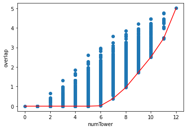
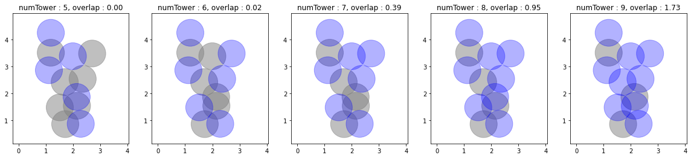

## Project 2: Optimization problems \& Rydberg atom arrays

This project will guide you through using the foundations of quantum hardware to demonstrate a quantum advantage in real-world problems.

## Code and Notebooks
For each of the sections below a notebook with the same name is associated. The task and challenges were taken from the following  [instructions.pdf](./instructions.pdf).

## Tasks 

### Task 1
associated [notebook](./Task1.ipynb)

We solved the unit-disk maximum independent set (UD-MIS) problem using classical simulated annealing, for the proposed Toy Graph.

On the above plot, each circle is centered on the coordinates of the vertex, with a unit diameter. The vertices which are connected by an edge are the ones for which the two circles intersect, meaning that the distance between the centers is less than the unit. Circles in gray in the background are non occupied vertices, while blue circles in the foreground are occupied vertices. The result is compliant with the constraint of non overlap, and solving the problem with brute force confirms that it is indeed an optimal solution. 

For the above Toy Graph, the brute force solver goes faster than the classical annealing. To start demonstrating an advantage of simulated classic annealing, we solved the problem for a random problem. The random graphs are parametrized by two values : the number of vertices **N** and the density **d**. The vertices coordinates are uniformly sampled in a square of side length **c**. The size of the square is chosen such as its surface equals the number of vertices divided by the density **d = N /c^2**. Therefore, the two coordinates are sampled over **0** to **c = \sqrt{N/d}**

The two implementations start to be equivalent in term of runtime around **N = 20** for density **d = 1**. Several solutions are optimal

We tried to find a better annealing schedule to arrive at solutions to the problem quicker.

For the annealing schedules codes please check the [notebook](./Task 1 Felipe.ipynb) where we test a variety of anneling schedules, to make things more easy we use the learning rate schedule from pytorch, which contains an amazing collection of schedules routines ready to be use.

#### The baseline

Our baseline will be the proposed anneling schedule

^{(\frac{t}{N})})

To benchmark the annealing schedule we can check the value of the energy at the end of each iteration and see how many iterations we have to reach the ground state energy, in the baseline we have

<table><tr>
    <td><figcaption> Energy history using the proposed annealing schedule </figcaption></td> 
    <td><figcaption> Occupation states history using the proposed annealing schedule </figcaption></td>
    </tr>
</table>

It takes a bit of iterations but eventually around the iteration 70 it got to the ground state. We can also see how the occupations change throughout the iterations, we sample 4 different iterations to plot the graphs with the occupation states (right figure).

#### Frange cycle

The range cycle dynamically change the proposed values for the temperature in a way that resembles a saw tooth, we got the following results from this schedule:

<table><tr>
    <td><figcaption> Energy history using the frange cycle annealing schedule </figcaption></td> 
    <td><figcaption> Occupation states history using the frange cycle annealing schedule </figcaption></td>
    </tr>
</table>

Although the frange cycle can be interesting it does not reach the ground state in the desirable timeframe. 

#### LAMBDA annealing

In this annealing scheme we have:

with k runing over the number of iterations and Lambda as the decay constant.

We got the following results from this schedule:

<table><tr>
    <td><figcaption> Energy history using the LAMBDA annealing schedule </figcaption></td> 
    <td><figcaption> Occupation states history using the LAMBDA annealing schedule </figcaption></td>
    </tr>
</table>

Quite good, we reach the ground state around iteration 17, can we do better?

#### Multiplicative annealing

We can use Multiplicative annealing:

with k runing over the number of iterations and Gamma as the decay constant.

with the following results:

<table><tr>
    <td><figcaption> Energy history using the Multiplicative annealing schedule </figcaption></td> 
    <td><figcaption> Occupation states history using the Multiplicative annealing schedule </figcaption></td>
    </tr>
</table>

Thats quite fast!!!, we reach the ground state at iteration 3.

#### Step annealing

This schedule decays the temperature by gamma every step_size iteration. 

we got the following results from this schedule:

<table><tr>
    <td><figcaption> Energy history using the Step annealing schedule </figcaption></td> 
    <td><figcaption> Occupation states history using the Step annealing schedule </figcaption></td>
    </tr>
</table>

#### MultiStep annealing

This schedule is similar to the Step annealing, however the temperature decays everytime when the iteration reach some milestone

and we have:

<table><tr>
    <td><figcaption> Energy history using the MultiStep annealing schedule </figcaption></td> 
    <td><figcaption> Occupation states history using the MultiStep annealing schedule </figcaption></td>
    </tr>
</table>

that aint a good one, lets check another schedule

#### Exponential annealing

In this schedule the temperature decays by a factor (gamma) every iteration (k). 

and we have:

<table><tr>
    <td><figcaption> Energy history using the Exponential annealing schedule </figcaption></td> 
    <td><figcaption> Occupation states history using the Exponential annealing schedule </figcaption></td>
    </tr>
</table>

thats really fast, however I think this must be because the temperature decays too fast.

#### CosineAnnealing

This schedule works by setin the temperatures using a cosine annealing, where $T_{max}$ is set to the initial temperature and $T_{cur}$ is the number of iterations since the last restart.

we got:

<table><tr>
    <td><figcaption> Energy history using the Exponential annealing schedule </figcaption></td> 
    <td><figcaption> Occupation states history using the Exponential annealing schedule </figcaption></td>
    </tr>
</table>

Quite unstable, lets move on to the next schedule.

#### Cyclic annealing

In this schedule the temperatures are set according to cyclical learning rate policy (CLR). The policy cycles the tempearture rate between two boundaries with a constant frequency, as detailed in the paper [Cyclical Learning Rates for Training Neural Networks](https://arxiv.org/abs/1506.01186). The distance between the two boundaries can be scaled on a per-iteration or per-cycle basis.

##### "triangular": A basic triangular cycle without amplitude scaling.
<table><tr>
    <td><figcaption> Energy history using the Cyclic triangular annealing schedule </figcaption></td> 
    <td><figcaption> Occupation states history using the Cyclic triangular annealing schedule </figcaption></td>
    </tr>
</table>

##### "triangular 2": A basic triangular cycle that scales initial amplitude by half each cycle.
<table><tr>
    <td><figcaption> Energy history using the Cyclic triangular 2 annealing schedule </figcaption></td> 
    <td><figcaption> Occupation states history using the Cyclic triangular 2 annealing schedule </figcaption></td>
    </tr>
</table>

##### "exp_range": A cycle that scales initial amplitude by $\text{gamma}^{\text{cycle iterations}}$ iterations at each cycle iteration.
<table><tr>
    <td><figcaption> Energy history using the Cyclic exp_range annealing schedule </figcaption></td> 
    <td><figcaption> Occupation states history using the Cyclic exp_range annealing schedule </figcaption></td>
    </tr>
</table>

The best out from the three displayed is the Cyclic exp_range, although is not quite as good the previous contenders.

#### OneCycle 

This schedule sets the temperature according to the 1cycle policy. The 1cycle policy anneals the temperature from an initial value to some maximum temperature and then from that maximum temperature to some minimum value much lower than the initial temperature. This policy was initially described in the paper [Super-Convergence: Very Fast Training of Neural Networks Using Large Learning Rates](https://arxiv.org/abs/1708.07120).

##### "OneCycle - cos"
<table><tr>
    <td><figcaption> Energy history using the OneCycle annealing schedule </figcaption></td> 
    <td><figcaption> Occupation states history using the OneCycle annealing schedule </figcaption></td>
    </tr>
</table>

##### "OneCycle - linear"
<table><tr>
    <td><figcaption> Energy history using the OneCycle linear annealing schedule </figcaption></td> 
    <td><figcaption> Occupation states history using the OneCycle linear annealing schedule </figcaption></td>
    </tr>
</table>

Interesting effects but not quite good as we want.

From all tested annealing schedules, the two the stand out are Multiplicative annealing and the Exponential annealing, we can check again their performance with a bigger number of vertices:

Multiplicative annealing results for 25 vertices graph:
<table><tr>
    <td><figcaption> Energy history using the Multiplicative annealing schedule </figcaption></td> 
    <td><figcaption> Occupation states history using the Multiplicative annealing schedule </figcaption></td>
    </tr>
</table>

Exponential annealing results for 25 vertices graph:
<table><tr>
    <td><figcaption> Energy history using the Exponential annealing schedule </figcaption></td> 
    <td><figcaption> Occupation states history using the Exponential annealing schedule </figcaption></td>
    </tr>
</table>

### Task 2
associated [notebook](./Task2.ipynb)
We solved the same Toy Graph problem, but using quantum annealing with the Yao library implementation. Plotting the frequency of occurrence of each bit string, we find that the solver has identified thre optimal solutions :

However, it seems that the quantum annealing solver yields an error, with an noncompliant solution proposed as optimal

### Task 3
associated [notebook](./Task3.ipynb)

### original problem

The City of Gotham is looking at putting in new cell phone towers. Some possible locations of the cell phone towers have been identified. To avoid overheads, Gotham should only purchase the required number of cell phone towers such that 
1. the cell phone tower signal ranges do not overlap
2. as much of Gotham City can be within cell signal range

This problem can be mapped to a UD-MIS problem. In that case each potential location corresponds to a vertex and can hold a tower, which corresponds to being activated or not. Constraint 1 translates into the disk constraint, which define the edges of the graph. Constraint 2 corresponds to the fact that a maximum of tower shall be installed, which translates into optimisation of the cardinality of independent set.

We solve the problem with the simulated classical annealing and the brute force solver. The problem is not complex enough for the simulated annealing to beat the brute force implementation in runtime (3s vs 0.2s) Moreover the brute force solver outputs a set of possible options :

### reformulation of the problem

However, one can argue that the constraint of no overlap is suboptimal. Let's take the toy case where there are only two potential sites at a distance of 0.9999. The optimal a human would intuitively choose would be to put a tower on both sites, but instead the the UD-MIS would reject it as the two sites are formally intersecting. A new way of reformulating the problem would be to maximize the area covered while minimizing the overlap. In order to do that, the edges of the graph corresponding to the problem could be weighted by the overlap surface. In fact if we take the exact formula of the overlap between two circle (normalised to 1 being the surface of unit circle) where **dij** is the disance between the **i**th and **j**th centers.

**wij = 2 pi ( arcos(d) - d \sqrt(1-dij)^2}**

It turns out that the value : sum of activated tower - sum of the weights over the edges is exactly equal to the surface covered by at least one tower. In that new framework this is the quantity to maximize, for a given number of towers, that becomes the cost.

By brute force we plot where all solutions stand in the space total overlap vs cost. The red line shows the optimal solution for each number of towers :

And below we display the optimal solution for each number of tower, the overlap value can be seen in the title

## Further Challenges:

* Solving the problem with real quantum hardware.

### Implementation on Dwave
associated [notebook](./Dwave.ipynb)

**TODO Alice**

### Implementation on IonQ

**TODO Victor**

### mapping the Nurse Scheduling Problem to UD-MIS
Demonstrating how other problems can be mapped to UD-MIS and solving said problems.

**TODO Victor**

### benchmarking the Nurse Scheduling Problem

**TODO Felipe**
Comparing the methods used to solve the UD-MIS problem.
Benchmarking other quantum and classical optimization methods to solve your UD-MIS problems.

## Business Application
For more details refer to the [Business Application found here](./Business_Application.md)
