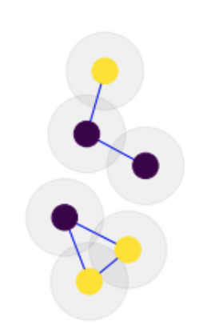
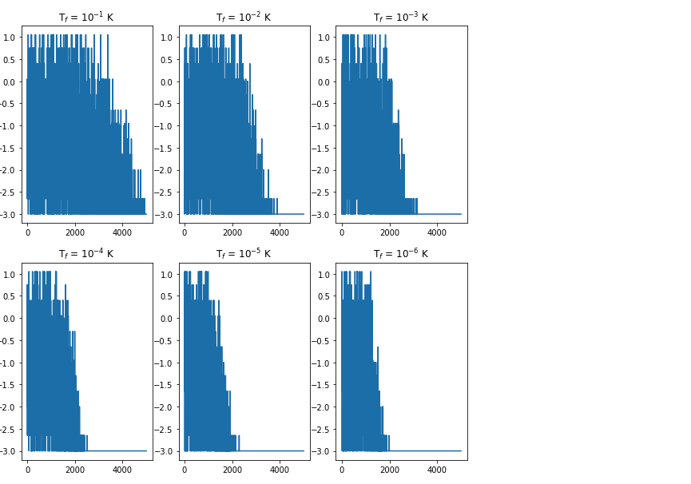

## Project 2: Optimization problems \& Rydberg atom arrays

This project will guide you through using the foundations of quantum hardware to demonstrate a quantum advantage in real-world problems.

Open up [instructions.pdf](https://github.com/CDL-Quantum/CohortProject_2021/tree/main/Week2_Rydberg_Atoms/instructions.pdf) to begin learning about your tasks for this week!

**Please edit this markdown file directly with links to your completed tasks and challenges.**

## Solutions

## Tasks include:
### Task 1: Simulating the unit-disk maximum independent set (UD-MIS) problem using classical simulated annealing.
In this task we tried several different schedules as suggested in citation [1] to see their effect on the convergence of UD-MIS under simulated annealing. Below are two graphs, graph before simulated annealing is ran (Right) and graph after simulated annealing is ran (Left), note that the maximum independent sets are seen in red color.

 

We were able to find the ground state energy, which converged at an energy of -3. As we decreased the temperature, we found that the monte carlo algorithm converged faster as expected, and below is a graph demonstrating that result:

### Task 2: Simulating the same problem but using quantum annealing.
We constructed an arbitrary N vertex graph, Hamiltonion for our system based off UD-MIS problem and ran a simulated annealing algorithm on it to find the lowest energy state.   In the [Task 2 Notebook](./Task_2.ipynb) in Julia we tested variations of the annealing time division and shots to sample solution to the problem and graph them.  We then compared the "best" or lowest energy returned with the most commonly returned solution.  Here only nodes within a unit distance are drawn with connected edges since they are the only ones that can overlap.

The most common sampled state had an energy of -2.65

The sampled state with lowest energy has an energy of -5.0

* Comparing the classical and quantum methods.
### Task 3: Solving a real-world problem involving cell phone tower placement in Gotham City.

## Further Challenges:
### Method Comparision Between Classical Simulated Annealing vs. Quantum Annealing in the UDMIS Problem

### Benchmarking Criteria: Classical vs. Quantum Optimization for UD-MIS

### Other Real World Example UD-MIS can solve:

### Converting code to real quantum hardward

## Business Application
For each week, your team is asked to complete a Business Application. Questions you will be asked are:

* Explain to a layperson the technical problem you solved in this exercise.
* Explain or provide examples of the types of real-world problems this solution can solve.
* Identify at least one potential customer for this solution - ie: a business who has this problem and would consider paying to have this problem solved.
* Prepare a 90 second video explaining the value proposition of your innovation to this potential customer in non-technical language.

For more details refer to the [Business Application found here](./Business_Application.md)
