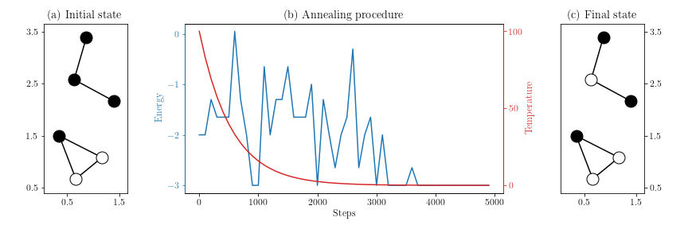
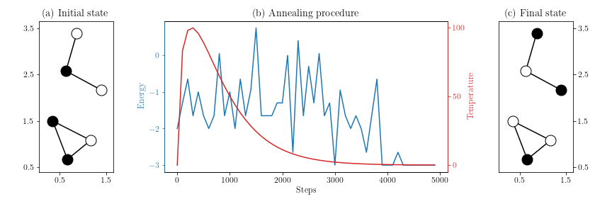
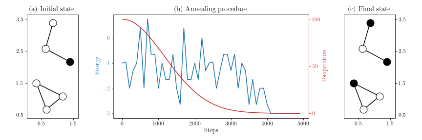
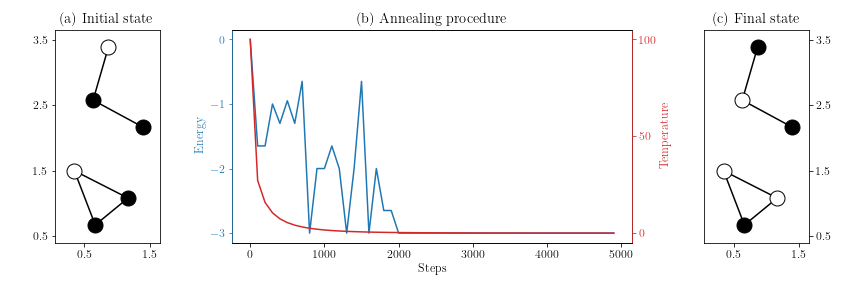
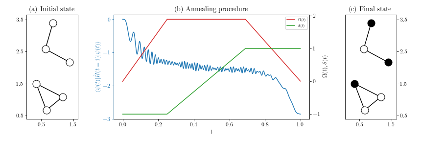
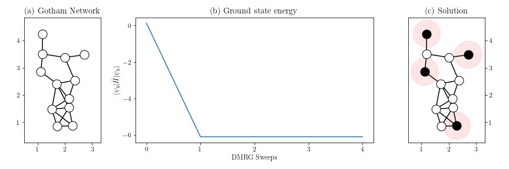
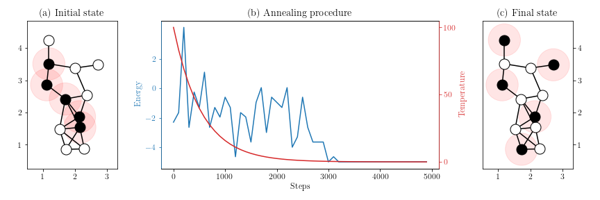

## Project 2: Optimization problems \& Rydberg atom arrays

This project will guide you through using the foundations of quantum hardware to demonstrate a quantum advantage in real-world problems.

Open up [instructions.pdf](instructions/instructions.pdf) to begin learning about your tasks for this week!

## Task 1: Simulated classical annealing

The code for this task is provided in the [1_classical_annealing.ipynb](notebooks/1_classical_annealing.ipynb) notebook. 
To start, we simply run the code provided to see the output of the default annealing schedule:

On the left, we show the initial configuration of the graph (randomized occupancies).
Occupied sites are denoted by filled in circles, and interacting sites share an edge.
In the middle, we plot the energy (blue) and temperature (red) of the system as a function of the steps in the Monte Carlo algorithm.
On the right, we show the final configuration of the graph, which should be the ground state of the Hamiltonian.

There are two subgraphs in this specific problem, and each has three vertices.
However, the lower partition is notable for having an all-to-all connection.
The Hamiltonian energetically prohibits having adjacent sites occupied.
This leads to a frustrated system: the lowest energy configuration of the lower partition has only one of these three sites occupied, but there is no term to favour one site being occupied over another.
The graph does not have a unique solution, which can be verified by comparing this output to the ones below.

Now we look for alternative annealing schedules to reduce the time to find the ground state.
First, we look at a schedule that starts at zero temperature, before reaching a similar maximum and then cooling down.
Unfortunately, this ends up being worse than the default schedule:

Next, we look at a schedule cools down the system more gently. 
Again, this performs worse than the default schedule:

Finally, we give up and just use a similar schedule to the default, but with more aggressive cooling.
The result is unoriginal, but effective:

The exact form for these schedules may be found the corresponding notebook.

## Task 2: Simulated quantum annealing

The code for this task has been re-written in python, and is provided in the [2_quantum_annealing.ipynb](notebooks/2_quantum_annealing.ipynb) notebook.

We obtain the following:

On the left, we show the initial configuration of the system (all sites unoccupied).
In the middle, we plot three quantities as a function of the annealing parameter *t*.
We plot the energy (blue) of the *time-dependant* quantum state for the *final* (i.e. target) Hamiltonian, and we plot the two annealing parameters, *Ω* (red) and *δ* (green), as a function of *t*.
One the right, we show the highest probability output configuration.

As we can see, when we measure the quantum system, the highest probability outcome is a valid correct ground state.

## Task 3: A real problem (Gotham City)

Mr. Wayne's problem maps to a UD-MIS problem rather trivially. 
He has a set of static locations for potential towers and wants to maximise coverage (i.e. number of towers), while having no tower coverage overlap.
In these examples, we have seen how the ground state of our Rydberg atom Hamiltonian finds solutions to graphs such that number of occupied sites is maximised, but sites that share an edge cannot both be occupied.
Using the tower locations, we can build a graph where towers that have overlapping coverage will share an edge.
Solving the Hamiltonian will give us the optimal configuration to Mr. Wayne's problem. 

For this task, we will be constructing an DMRG-based solution to the UD-MIS problem. 
This we will effectively be another classical approach, but using tools from tensor networks and condensed matter physics.
Technical details can be found in the [3_dmrg_classical_annealing.ipynb](notebooks/3_dmrg_classical_annealing.ipynb) notebook.
We obtain the following solution:

Interestingly, a more straightforward classical annealing approach yields a different solution:

Clearly something is wrong with the DMRG code! 
See the corresponding notebook for discussion on the applicability of DMRG to this solution.
The solution provided by Monte Carlo simulation is *not* unique, which can be verified by running the code in the notebook a couple times.

Nonetheless, the (correct) solution to Mr. Waynes problem still leaves much of Gotham without coverage. 
It is recommended that he perhaps spend money to build additional towers in more strategic locations.
The current set of towers is very tightly packed, and many towers overlap with one another.

## Further Challenges:
* Comparing the methods used to solve the UD-MIS problem.
* Benchmarking other quantum and classical optimization methods to solve your UD-MIS problems.

## Business Application
For each week, your team is asked to complete a Business Application. Questions you will be asked are:

* Explain to a layperson the technical problem you solved in this exercise.
* Explain or provide examples of the types of real-world problems this solution can solve.
* Identify at least one potential customer for this solution - ie: a business who has this problem and would consider paying to have this problem solved.
* Prepare a 90 second video explaining the value proposition of your innovation to this potential customer in non-technical language.

For more details refer to the [Business Application found here](business_application/Business_Application.md)
