## Project 2: Optimization problems \& Rydberg atom arrays

This project will guide you through using the foundations of quantum hardware to demonstrate a quantum advantage in real-world problems.

Open up [instructions.pdf](https://github.com/CDL-Quantum/CohortProject_2021/tree/main/Week2_Rydberg_Atoms/instructions.pdf) to begin learning about your tasks for this week!

## Tasks include:
* Simulating the unit-disk maximum independent set (UD-MIS) problem using classical simulated annealing.
* Finding a better annealing schedule to arrive at solutions to the problem quicker.
* Simulating the same problem but using quantum annealing.
* Comparing the classical and quantum methods.
* Solving a real-world problem involving cell phone tower placement in Gotham City.

## Summary of Results

### [Task 1](./Task1.ipynb): Simulated Classical Annealing

In task 1, we try to solve the UD-MIS problem classically via simulated annealing. Simulated annealing repeats Monte Carlo simulations while decreasing temperautre, aiming to estimate the ground (zero-temperature) state. Note that the final result can be affected by the annealing schedule, i.e. temperature as a function of time. Here we first try the default annealing schedule provided in the problem. In Figs. 1.1 and 1.2, we show the energy of the state resulting from simulated annealing using the default annealing schedule as a function of the annealing steps and the temperature, respectively.

<figure class="image">
  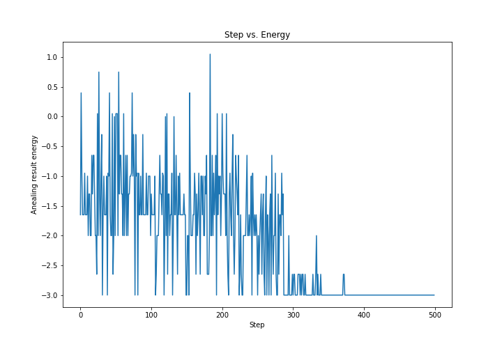
  <figcaption> <b>Fig.1.1</b>  Energy of the state resulting from simulated annealing using the default annealing schedule as a function of the number of steps.</figcaption>
</figure>

<figure class="image">
  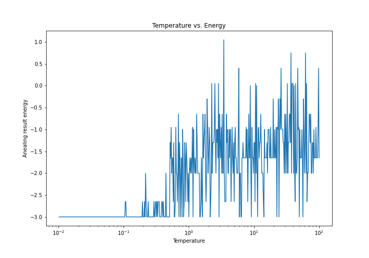
  <figcaption> <b>Fig.1.2</b>  Energy of the state resulting from simulated annealing using the default annealing schedule as a function of temperature.</figcaption>
</figure>
  
The above figures show that the energy converges to the minimum value at about T = 0.1 Kevin.
  
Now we test some other annealing schedules: (1) inverse, (2) inverse-log, and (3) exponentialinverse (see how they are defined [here](./Task1.ipynb). First let us plot and see how the annealing schedules look like.

<figure class="image">
  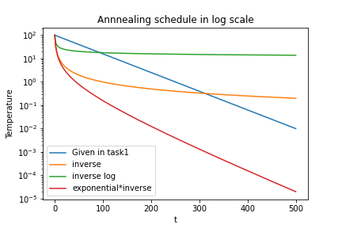
  <figcaption> <b>Fig.1.3</b>  Annealing schedules, i.e. the temperature as a function of time in the semi-log plot. The curve labelled as "Given in task 1" is the default schedule provided in the problem, and the rest are the new schedules tried in our solution.</figcaption>
</figure>
  
Now let us simulate annealing with the new annealing schedules shown in the above. Let us start with the inverse schedule. As in Figs. 1.1 and 1.2, we plot the energy as a function of the number of annealing steps and temperature, respectively.

<figure class="image">
  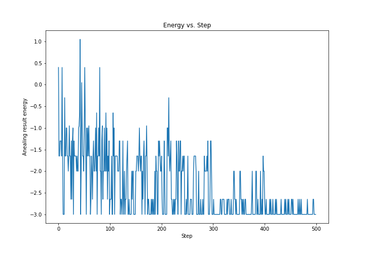
  <figcaption> <b>Fig.1.4</b>  Energy of the state resulting from simulated annealing using the inverse annealing schedule as a function of the number of steps.</figcaption>
</figure>

<figure class="image">
  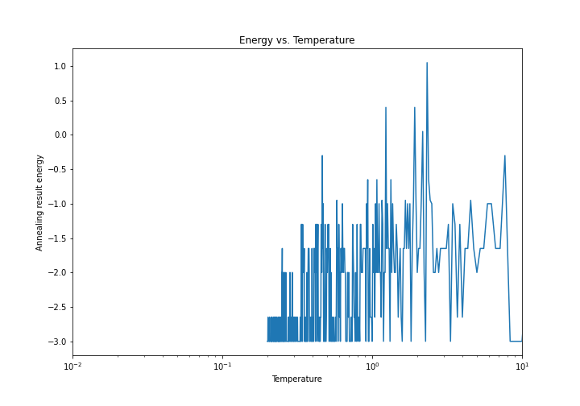
  <figcaption> <b>Fig.1.5</b>  Energy of the state resulting from simulated annealing using the inverse annealing schedule as a function of temperature.</figcaption>
</figure>
  
The above figures show that although the energy reachs the minimum value after about 300 time steps, there is noticeable fluctuation.
  
Next let us investigate the inverse-log schedule. We again plot the energy as a function of the number of annealing steps and temperature, respectively.

<figure class="image">
  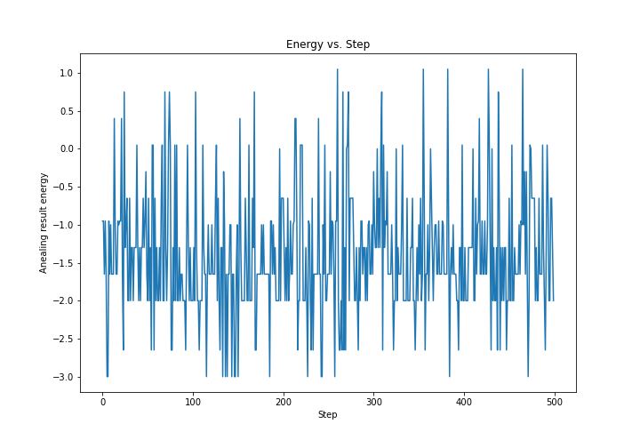
  <figcaption> <b>Fig.1.6</b>  Energy of the state resulting from simulated annealing using the inverse-log annealing schedule as a function of the number of steps.</figcaption>
</figure>

<figure class="image">
  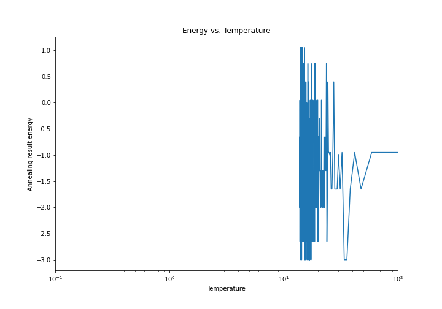
  <figcaption> <b>Fig.1.7</b>  Energy of the state resulting from simulated annealing using the inverse-log annealing schedule as a function of temperature.</figcaption>
</figure>
  
The above figures clearly show that the inverse-log schedule is not a good strategy as the energy does not decrease during the simulated annealing.
  
Finally, let us investigate the exponential*inverse schedule.

<figure class="image">
  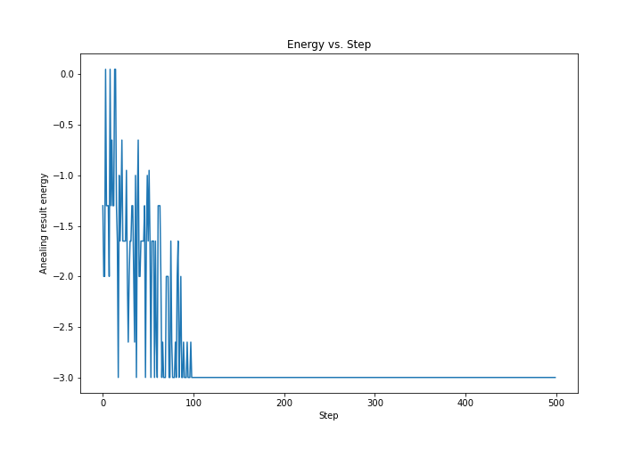
  <figcaption> <b>Fig.1.8</b>  Energy of the state resulting from simulated annealing using the exponential*inverse annealing schedule as a function of the number of steps.</figcaption>
</figure>

<figure class="image">
  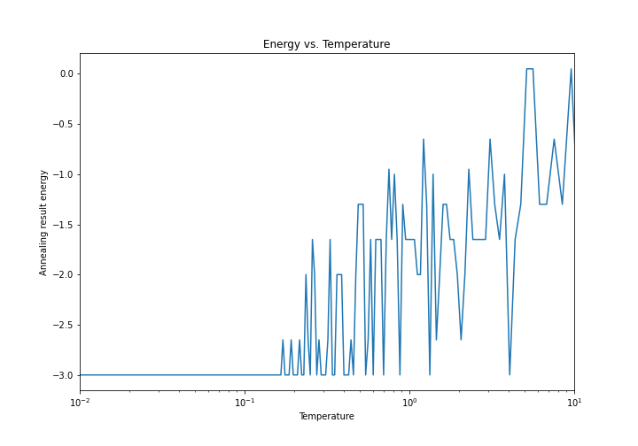
  <figcaption> <b>Fig.1.9</b>  Energy of the state resulting from simulated annealing using the exponential*inverse annealing schedule as a function of temperature.</figcaption>
</figure>
  
The above figures show that the exponential*inverse schedule is the best among all annealing schedules tried in this task as the energy quickly converges to the minimum value, and stably stays  in the ground state.

### [Task 2](./Task2.ipynb): Quantum Annealing

In task 2, we solve the UD-MIS problem via quantum annealing. Here we provide brief descriptions to our solution, while pointing to [Task 2](./Task2.ipynb) for more details. The solution to the UD-MIS problem corresponds to the bitstring obtained after quantum annealing with the highest probability when measured in the computational basis. Figure 2.1 shows the probability distribution of the measurement outcome.

<figure class="image">
  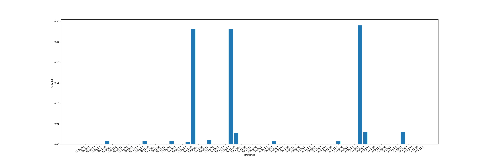
  <figcaption> <b>Fig.2.1</b>  Probability ot measuring the bitstrings in the computational basis after quantum annealing. The bitstring with the highest probability corresponds to the optimal answer.</figcaption>
</figure>
  
Note that the binary string of qubits are ordered such that the rightmost bit corresponds to the first vertex and the leftmost bit corresponds to the last (6th) vertex. One can see that the bistrings 010101, 001110, and 110100 have high probabilities. These corresponds to the vertices (1, 3, 5), (3, 4, 5), and (3, 5, 6), respectively. We can indeed these set of vertices are the optimal solutions to the UD-MIS problem from Fig. 2.2 in which all vertices are plotted with the edges only connected between vertices that are within the distance of 1 as required in the UD-MIS problem. We see that vertices 3 and 5 must be included in the solution to maximize the number of vertices in the connected set of vertices 2, 3, and 5. Then since only one vertex can be chosen among the vertices 1, 4, and 6, the three sets of vertices stated above are indeed the solutions to the UD-MIS problem.

<figure class="image">
  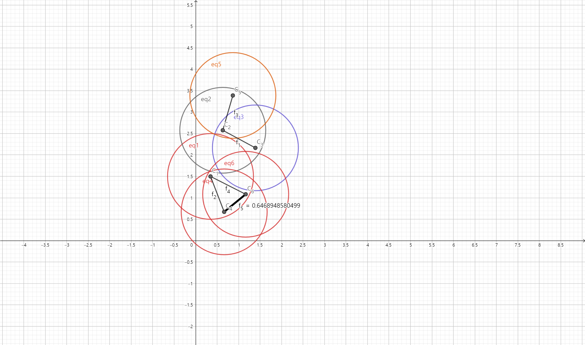
  <figcaption> <b>Fig.2.1</b>  The coordinates of vertices representing the UD-MIS problem. The edges are drawn only for two vertices that are within the unit distance to satisfy the constraint of the problem. </figcaption>
</figure>

### [Task 3](./Task3.ipynb): A Real Problem

In task 3, we solve a real-world application of the UD-MIS problem, namely the optimization problem of locating phone towers. Specific answers to the problems 1, 2, and 3 are given in [this](./Task3.ipynb) Jupyter notebook.
  
Here we only present and describe the final results. First, Fig. 3.1 shows all possible locations on which phone towers can be built their coverage of signal. The center of each circle corresponds to the coordiate of the location, and the area of the circle represents the range of areas that can receive the signal from the phone tower located at the center of the circle.

<figure class="image">
  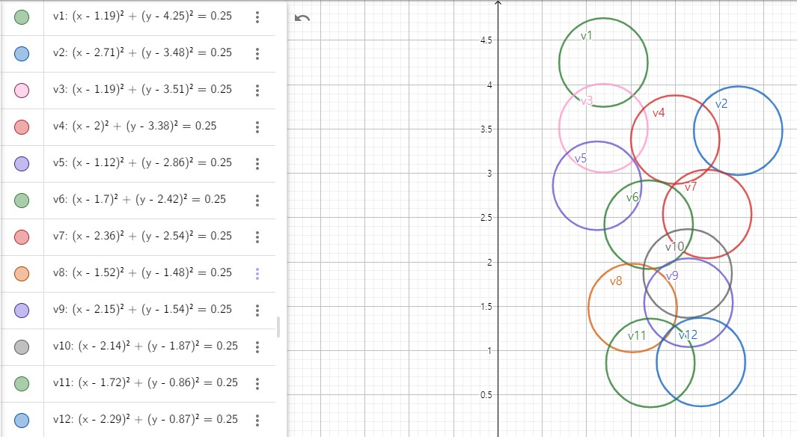
  <figcaption> <b>Fig.3.1</b> Locations in Gotham city on which phone towers can be built (center of each circle), and the area that can be covered by each phone tower. </figcaption>
</figure>
  
Finally, Fig. 3.2 depicts the optimal positions of the phone towers that are found by solving the problem via quantum annealing, and their signal coverage.

<figure class="image">
  
  <figcaption> <b>Fig.3.2</b> Locations of phone towers that can be build when Bruce wants to minimize the cost while maximizing the signal coverage. The area of each circle represents the area that can recieve the signal from the phone tower. </figcaption>
</figure>
  
If Bruce wants to absolutely minimize the money he spends, then Fig 3.2. is the solution. However, if Bruce is willing to spend some more, he should look into the solutions with the second lowest energy cost. If even more money can be spent, then he can use the solution with the third lowest energy cost, etc. 

## Business Application
An interesting application of the UD-MIS probelm addressed in this cohort project is protein folding. The protein folding problem is of significant importance in the pharmaceutical, medical, and healthcare industry. We provide more detailed description about the business application [here](./Business_Application_Team11.md)
