## Project 2: Optimization problems \& Rydberg atom arrays

Optimization of networks and routing is strongly linked with the NP-hard **Traveling Salesmen** problem and other path finding algorithms.  Here we explore some classical techniques to tackle these problems, as well as quantum and hybrid solutions.  Path finding has general applications not only for routing, but for the trajectory of multi-state systems over time.

Analysis of some of these methods can be framed as the **Unit Disk Max Independent Set problem (UD-MIS).**  In this project we study the UD-MIS and benchmark different methodologies for tackling this class of problems

## 1. Simulating the unit-disk maximum independent set (UD-MIS) problem using classical simulated annealing.

In this [Task 1 notebook](./Task_1.ipynb) we tried several different schedules as suggested in citation [1] to see their effect on the convergence of UD-MIS under simulated annealing. Below are two graphs, graph before simulated annealing is ran (Right) and graph after simulated annealing is ran (Left), note that the maximum independent sets are seen in yellow color.

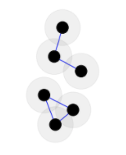

We use 4 different annealing schedules:

### Annealing Schedule Type 1: Original
Using the original annealing scheduled provided in the instructions, we are able to find the ground state at an energy around -3 after around 3600 iterations for final temperature of 0.1K. As we decreased the temperature, we found that the monte carlo algoirthm converged faster to the ground state (ie. around 0.000001K, it took around 1900), and all of this information can be extrapolated from the graphs below (top graph is energy vs. iterations, bottom graph is iterations vs. temperature).

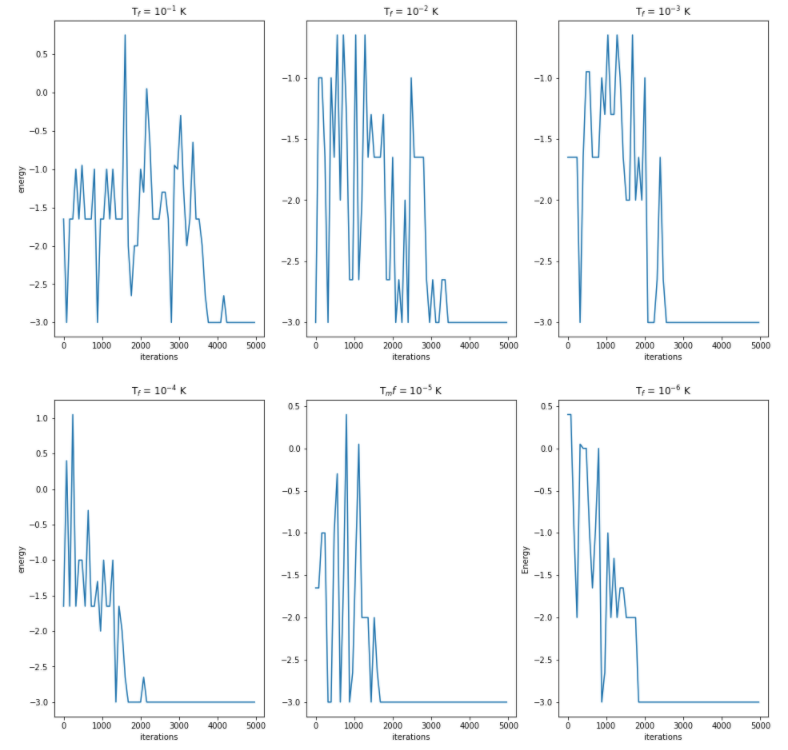
 
and here are the associated tempature curves:
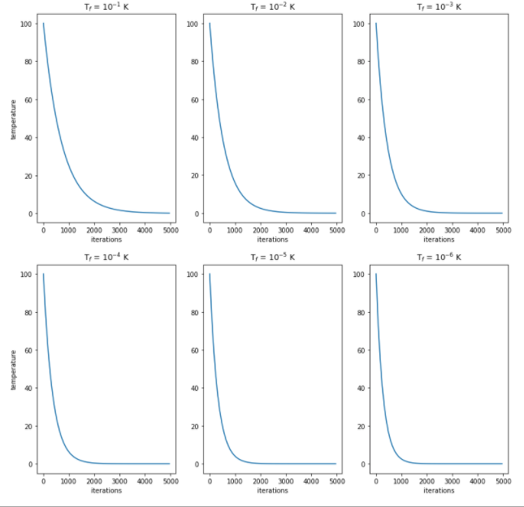

Notice: That temperature graph forms a nice smooth 1/iteration relation
### Annealing Schedule Type 2: Inverse
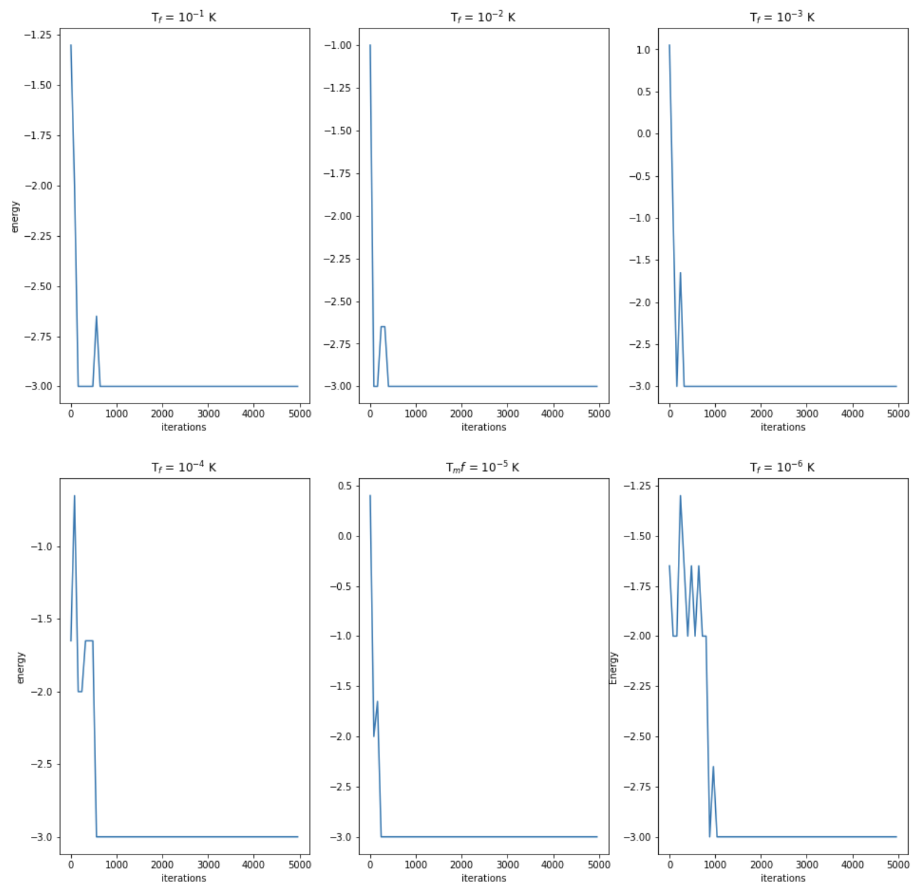
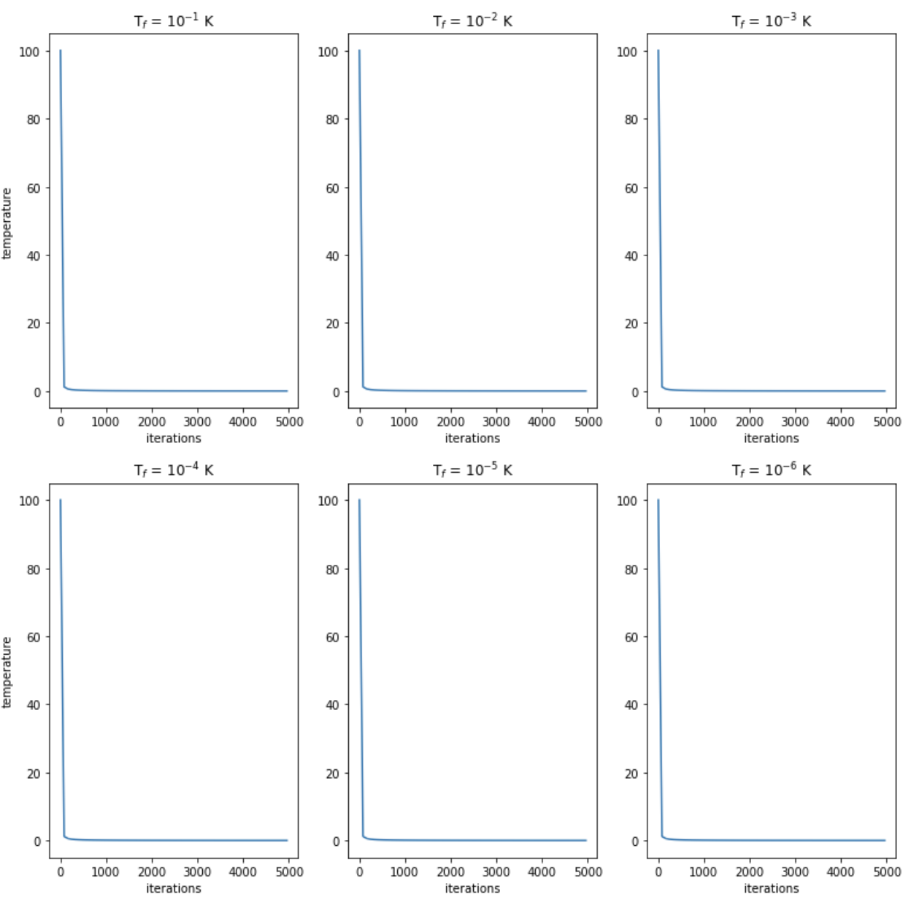

Note: This annealing schedule is superior to the original annealing schedule in terms of convergence relative to iterations (with the exception of Tf=10^-6)
### Annealing Schedule Type 3: Inverse Log
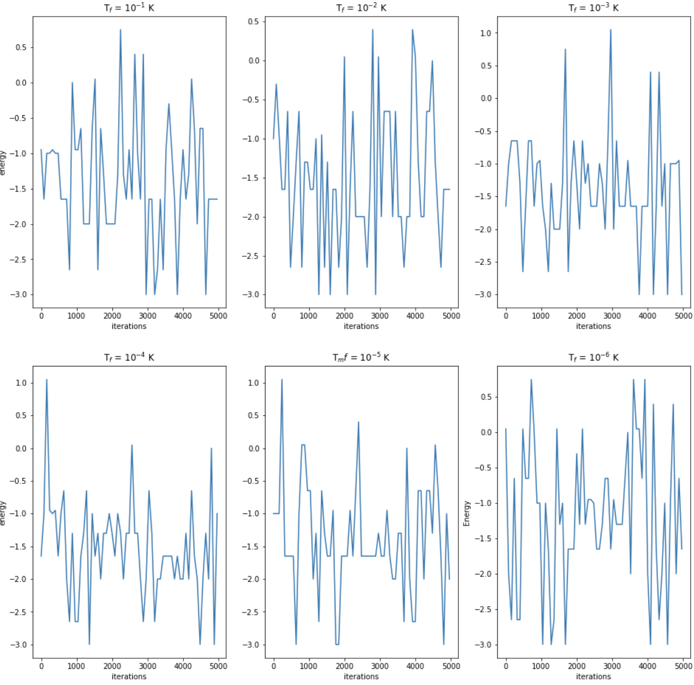
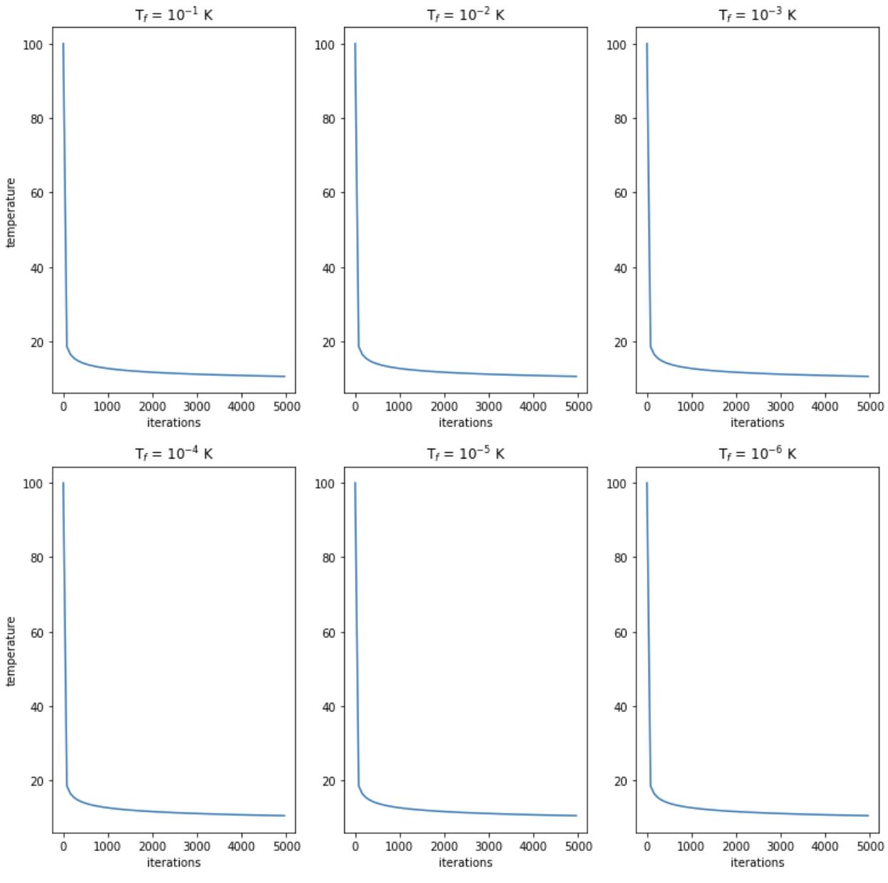

Note: For this annealing schedule, given the same number of iterations, it was NOT able to converge a solution and hence was a bad choice.

### Annealing Schedule Type 4: Exponential
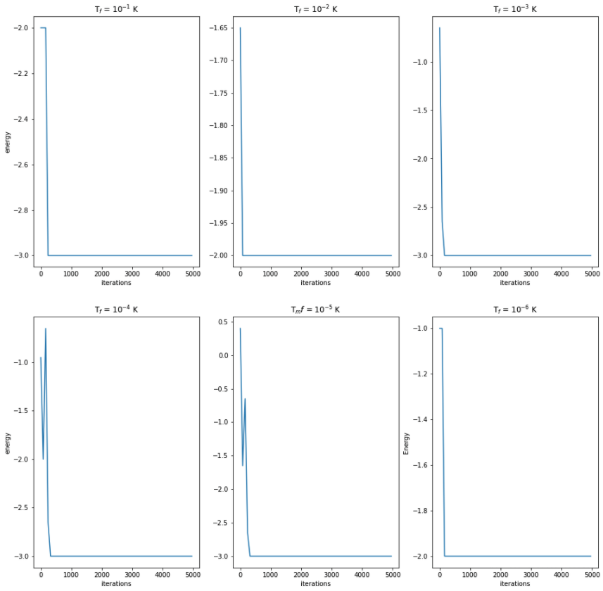

Note: These results were similiar to the inverse case.

## 2. Simulating the same problem but using quantum annealing.

We constructed an arbitrary N vertex graph, Hamiltonion for our system based off UD-MIS problem and ran a simulated annealing algorithm on it to find the lowest energy state.   In the [Task 2 Notebook](./Task_2.ipynb) in Julia we tested variations of the annealing time division and shots to sample solution to the problem and graph them.  We then compared the "best" or lowest energy returned with the most commonly returned solution.  Here only nodes within a unit distance are drawn with connected edges since they are the only ones that can overlap.

                       

The most common sampled state had an **energy of -2.65.**

  

The sampled state with lowest energy has an **energy of -5.0.**
  

## 3 Solving a real-world problem involving cell phone tower placement in Gotham City.

In this task we address a real world problem for Wayne Enterprises. The city of Gotham is looking to put in new cell towers. Given a list of possible locations we need to figure out a way to place the cell towers such that their signal ranges do not overlap.

As we see from the problem statement this can be mapped onto a UDMIS problem. That is if you look at each cell phone pole as a vertex in a graph G(V,E). The edges are repesented by the connection to the vertices
and because we want to be sure that there is no overlap all the conditions of the UDMIS problem are satisfied.

This task was solved in three different ways:
The first being with the method outlined in task 1 which can be found [here](./Task_3.ipynb)
The second was using simulated quantum annealing which can be found [here](./Task_3_Julia.ipynb)
Finally using the Hamiltonian a quantum circuit was constructed usung cirq which can be found [here](./Task3_Cirq.ipynb)

### 3.1 Tasks for problem 3

**1. Explain why this is a problem that can be easily mapped to the UD-MIS problem.**
As we see from the problem statement this can be mapped onto a UDMIS problem. That is if you look at each cell phone pole as a vertex in a graph G(V,E). The edges are repesented by the connection to the vertices
and because we want to be sure that there is no overlap all the conditions of the UDMIS problem are satisfied.

**2. Solve Gotham City's problem.**  Using the methods provided in Tasks 1 and 2. **Are there multiples solutions?**

Classical annealing:

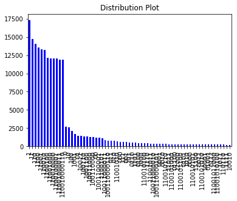
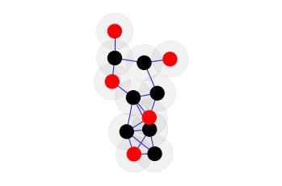

    
Quantum annealing:
    
QAOA:

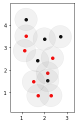

    
**3. Should Bruce pay for a few more cell phone towers to make sure that more of Gotham City has cell phone service?**

## 4. Further Challenges:

### 4.1 Method Comparision Between Classical Simulated Annealing vs. Quantum Annealing in the UDMIS Problem

In this [notebook](./D-Wave_qpu_and_simulated_annealing.ipynb) we compare the runtime of simulated annealing(D-Wave neal package),D-Wave QPU, and D-Wave hybrid solver on the UDMIS problem.

  
 

  

*Bonus Task: Solving MIS on Quantum Hardware.

### 4.2 Benchmarking Criteria: Classical vs. Quantum Optimization for UD-MIS
**Theoretical Background**: During this simulation, we utilized the simulated annealing algorithm to solve the UD-MIS problem. Let ni be the gap between the largest and second largest eigenvalues of a stochastic matrix Mi. Let n = minini. The run time of this alogirthm is proportional to O(1/n) [1][2], and it has been shown that quantum computers can increase the efficieincy by O(1/√n) [1][3]

In [this notebook](D-Wave_qpu_and_simulated_annealing) do a comparison of calculation times for various classical, quantum, and hybrid optimizers.

### 4.3 Other Real World Example UD-MIS can solve:

Application of the UD-MIS is strategically placing distribution centers.  This has an incredibly broad range of applications as you might need to distribute goods, services, or even information.  In the case of information distribution we discuss applications to routing protocals in the [business application section.](./Business_Application.md)
For another alternative real world application of MIS we look at goods delivery for drones.  One customer is Amazon as they have already begun exploration in this direction with [Amazon Air Prime.](https://www.amazon.com/Amazon-Prime-Air/b?node=8037720011)  Although, it doesn't need to be drone delivery.  There is a large proliferation of grocery delivery services that needs to solving the logistics problem distributing their goods as quickly and efficiently as possible.

Another new mysterious player on the market of "Societal Progress", [Blue Flower Inc,](https://batman.fandom.com/wiki/League_of_Shadows) is promising to bring the "5G Revolution" to Gotham with their new microwave communications device technology.  These transmitters require being placed near water mains to meet cooling constraints.  Optimal placing of their hardware is an important problem in maximizing delivery of their "Services" to their customer population. 
### 4.4 Solving UD-MIS on quantum hardware

We also apply state of the art quantum hardware from D-Wave to solve the problem of UD-MIS [here](./D-Wave_qpu_and_simulated_annealing.ipynb)

## Business Application

For more details refer to the [Business Application found here](./Business_Application.md)

## References:
1. [Quantum Algorithm Zoo](https://quantumalgorithmzoo.org/#MathJax-Element-271-Frame)
2. [Sanguthevar Rajasekaran, On the Convergence Time of Simulated Annealing](http://repository.upenn.edu/cgi/viewcontent.cgi?article=1373&context=cis_reports)
3. [Mario Szegedy, Spectra of Quantized Walks and a δϵ√ rule.](https://arxiv.org/abs/quant-ph/0401053)
