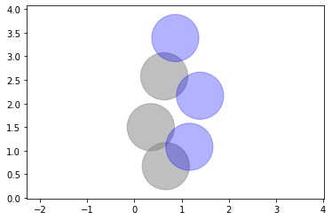
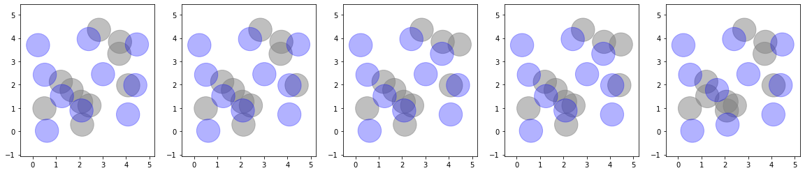
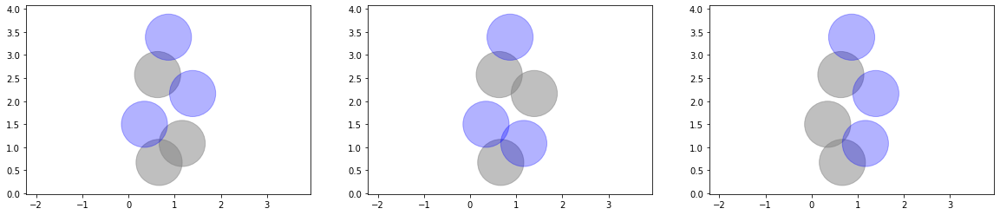
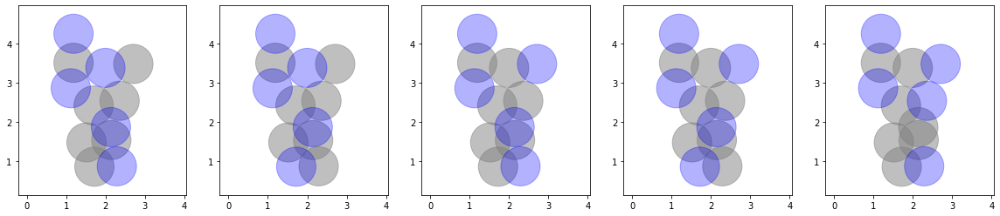

## Project 2: Optimization problems \& Rydberg atom arrays

This project will guide you through using the foundations of quantum hardware to demonstrate a quantum advantage in real-world problems.

## Code and Notebooks
For each of the sections below a notebook with the same name is associated. The task and challenges were taken from the following  [instructions.pdf](./instructions.pdf).

## Tasks 

### Task 1
associated [notebook](./Task1.ipynb)

We solved the unit-disk maximum independent set (UD-MIS) problem using classical simulated annealing, for the proposed Toy Graph.

On the above plot each circle is centered on the coordinates of the vertice, with a unit diameter. The vertices which are connected by an edge are the ones for which the two circles intersect, meaning that the distance between the centers is less than the unit. Circles in grey in the background are non occupied vertices, while blue circles on the foreground are occupied vertices. The result is compliant with the constraint of non overlap and solving the problem with brute force confirms that it is indeed an optimal solution. 

For the above Toy Graph the brute force solver goes faster than the classical annealing. To start demonstrating an advantage of simmulated annealing, we solved the problem for a random problem. The random graphs are parametrised by two values : the number of vertices $N$ and the density $d$. The vertices coordinates are uniformly sampled in a square of side length $c$. The size of the square is chosen such as its surface equals the number of vertices divided by the density $d = N /c^2$. Therefore the two coordinates are sampled over $0$ to $c = \sqrt{N/d}$

The two implementations start to be equivalent in term of runtime around $N=20$ for density $d=1$. Several solutions are optimal

We tried to find a better annealing schedule to arrive at solutions to the problem quicker.
**TODO Felipe**

### Task 2
associated [notebook](./Task2.ipynb)
We solved the same problem but using quantum annealing with the Yao library implementation. Plotting the frequency of occurence of each bit string we find that the solver has identified thre optimal solutions :

However it seems that the quantum annealing solver yields an error, with an uncompliant solution propsed as optimal

### Task 3
associated [notebook](./Task3.ipynb)
The City of Gotham is looking at putting in new cell phone towers. Some possible locations of the cell phone towershave been identified. To avoid overheads Gotham should only purchase the required number of cell phone towers such that 
1. the cell phone tower signal ranges do not overlap
2. as much of Gotham City can be within cell signal range
This problem can be mapped to a UD-MIS problem. In that case each potential location corresponds to a vertice and can hold a tower, which corresponds to being activated or not. Constraint 1 trasnlates into the disk constraint, which define the edges of the graph. Constraint 2 corresponds to the fact that a maximum of tower shall be installed which translates into optimisation of the cardinality of independent set.
We solve the problem with the simulated classical annealing and the brute force solver. The problem is not complex enough for the simulated annealing to beat the brute force implementation in runtime (3s vs 0.2s) Moreover the brute force solver outputs a set of possible options :

## Further Challenges:

* Solving the problem with real quantum hardware.

### Implementation on Dwave
associated [notebook](./Dwave.ipynb)
**TODO Alice**

### Implementation on IonQ
**TODO Victor **

### mapping the Nurse Scheduling Problem to UD-MIS
* Demonstrating how other problems can be mapped to UD-MIS and solving said problems.
**TODO Victor**

### benchmarking the Nurse Scheduling Problem
**TODO Felipe**
* Comparing the methods used to solve the UD-MIS problem.
* Benchmarking other quantum and classical optimization methods to solve your UD-MIS problems.

## Business Application
For more details refer to the [Business Application found here](./Business_Application.md)
