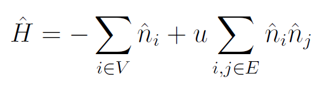

## Project 2: Optimization problems \& Rydberg atom arrays
Optimization is a crucial element used in solving problems across many different fields, 
from scientific to industrial applications, to generally boost performance and reduce risks.

Recent advances in both quantum hardware and algorithm development have made it possible to solve small problems on modern
quantum devices. In particular, quantum computing has potential to efficiently solve combinatorial optimization problems,
especially showing an advantage when dealing with NP-hard problems [1]. 

One of the quantum computing models which can solve combinatorial optimization problems
is the Adiabatic Quantum Optimization model (AQO). AQO refers to the use of the adiabatic 
theorem in quantum mechanics [2] to adiabatically (i.e. slowly) move towards the ground 
state of an interaction Hamiltonian onto which an optimization problem is mapped. 
As a result of the adiabatic theorem, the state of the system after the adiabatic evolution will be 
the ground state of the final Hamiltonian, i.e. the global minimum of the optimization problem mapped onto the 
final Hamiltonian.

In the following we address the solution of a well-known NP-hard problem, the Unit Disk Maximal Independent Set 
(UD-MIS). We first modified the provided Jupyter notebook for the solution of the problem with the classical 
simulated annealing. Further, we prepared two more notebooks: in the first we perform a quantum annealing 
simulation in Julia; the second provides a python implementation of quantum annealing which uses
the D-Wave Ocean SDK to compare the classical simulated annealing to the quantum simulator and finally 
perform the optimization on a real D-Wave quantum device.

## 1. The UD-MIS problem: 
In the MIS problem we consider a graph with a set of vertices, V, and a set of 
edges, E, G = (V,E), and we want to find out what is the maximal number of vertices 
which may be "colored" such that no two colored vertices are connected by an edge.

The UD-MIS is a special case of this problem in which we consider a graph in which
each vertex corresponds to the center of a unit circle and we connect these vertices
with an edge if and only if the corresponding circles intersect.

The problem of finding the MIS can be expressed as a quadratic unconstrained optimization problem,
which is also equivalent to an Ising hamiltonian

where the quadratic terms favours disjoint circles and the linear term makes sure
that we select as many circles as possible.

This problem can easily be mapped onto a Rydberg atom architecture as the hamiltonian
of this system is equivalent to the one shown in the UD-MIS problem.

In the following we present several solutions for the MIS problem, both from a
classical and a quantum standpoint.

### Classical simulated annealing
The simulated (thermal) annealing is a heuristic optimization procedure which spans the solution 
space of a generic optimization problem by simulating the physical process of heating a material 
and then slowly lowering the temperature to decrease defects, thus minimizing the system energy.
Each transition in spanning the solution space is called anneal.

###[ELI/SAESUN]: 
can you add the analysis you performed in this section? 

* Finding a better annealing schedule to arrive at solutions to the problem quicker.

### Quantum annealing
Quantum annealing has been introduced in the 80s as a variation of the simulated thermal annealing
for solving NP-hard optimization problems. The main difference is that besides the thermal
excitations used in simulated annealing to span the solution space, the quantum annealing 
incorporates quantum transitions (tunneling), making it more efficient in converging towards the 
ground state of the system. Later it was proposed to actually use a quantum system to
implement the quantum annealing algorithm. The company D-Wave Systems was the first to build a 
prototype QA processor and to start the commercialization of these devices, using then quantum annealing algorithms 
on quantum hardware.

Besides the D-Wave systems, different quantum architectures have been used to 
implement quantum annealing. Recent developments in the quantum hardware with trapped neutral atoms 
showed that the latter can be a useful tool to implement adiabatic quantum computation. 
In this architecture, ground state atoms are dressed by laser fields in a manner conditional on the 
Rydberg blockade mechanism, thereby providing the requisite entangling interactions

* Simulating the same problem but using quantum annealing.
* Comparing the classical and quantum methods.

## 2. Gotham city and Bruce Wayne's stinginess
* Solving a real-world problem involving cell phone tower placement in Gotham City.

### A solution on a real quantum device

## Further Challenges:
* Comparing the methods used to solve the UD-MIS problem.
* Benchmarking other quantum and classical optimization methods to solve your UD-MIS problems.
* Demonstrating how other problems can be mapped to UD-MIS and solving said problems.
* (DONE): Solving the problem with real quantum hardware.

## Business Applications
For more details refer to the [Business Application found here](./Business_Application.md)

## References

[1] Andrew Lucas, Ising formulations of many NP problems (2014)
[2] Albert  Messiah, Quantum  mechanics (1966)

