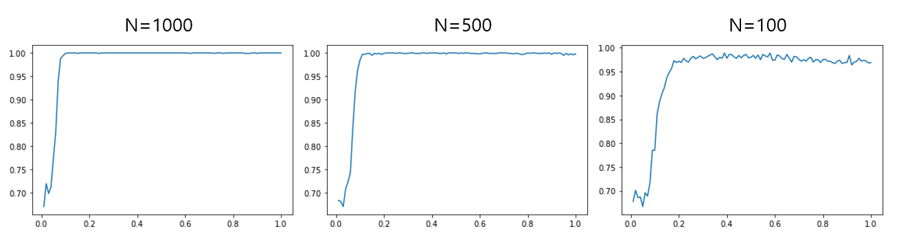

## Project 2: Optimization problems \& Rydberg atom arrays

-----

## _Qunova Computing, Inc._

-----

## The results of tasks

### Task 1: Simulated Classical Annealing

We used the code given in this exercise to solve the UD-MIS problem 
and examined the results using several classical annealing schedules.
We defined $T$ as follows:

$$T=t_i*\left(\frac{t_f}{t_i}\right)^{x^p}.$$

Here, $t_i=100$, $t_f=0.01$, $0 \le x \le 1$, and $p$ is nonnegative real number.
If $p=1$, $T$ is the given annealing schedule.
Below is the graph showing the change in temperature $T$ with respect to $p$.

We checked whether the given problem is solved 
in the case of $T=\frac{1}{64}, \frac{1}{16}, \frac{1}{4}, 1, 4, 16$.
We chose step size 1000.

In the graphs above, the red line indicates the change in energy for the step,
and the blue dots indicate whether the output value is a solution.
If the blue dot is 1, the output is a solution to the given problem.
As we can see, the number of steps decreases as the value of $p$ decreases, 
but when $p=\frac{1}{16}$ and $p=\frac{1}{64}$, the output is not the answer to the given problem.
Even in these cases, a solution may come out as an output, 
but it is not uncommon to see failures if it is tried many times.
We can test it with the code in [Task1_graph](https://github.com/QuNovaComputing/CohortProject_2021/blob/week2_qunovacomputing/Week2_Rydberg_Atoms/Task1_graph.ipynb).
We can also see that there are multiple solutions.

Among the annealing schedule functions used in Task1, 
we tried to find the optimal value of $p$ that gives the answer to the given problem 
with the lowest number of steps and high probability
in [Task1_optimal](https://github.com/QuNovaComputing/CohortProject_2021/blob/week2_qunovacomputing/Week2_Rydberg_Atoms/Task1_optimal.ipynb).

We chose the step size of 100, 500, and 100 and counted the number of successes out of 1000. 
As a result, roughly speaking, it can be confirmed that the solution is found with a high probability 
when p is larger than 0.2. 
The optimal value of p can vary depending on the problem, 
but in this exercise, it would be a wise choice to set p to about 0.2.

### Task 2: Quantum Annealing

We solved the UD-MIS problem by using the code given in Task 2.
Below are the results we obtained, and the detailed process can be found
in [Task2_results](https://github.com/QuNovaComputing/CohortProject_2021/blob/week2_qunovacomputing/Week2_Rydberg_Atoms/Task2.ipynb).

As we can see in the above result, the probabilities of corresponding results are higher than other results.
The result obtained when the code is executed 10000 times is as follows.

We can conclude that the UD-MIS problem can be solved with high probability by using the given quantum annealing code.

### Task 3: A Real Problem

We demonstrate the Gotham City cell phone tower problem into UD-MIS form.

P1. Explain why this is a problem that can be easily mapped to the UD-MIS problem.

Ans) If we consider each of the candidates for the normalized cell phone tower location as the vertices of a graph, 
we can draw edges connecting vertices if the signal range of the corresponding cell tower is overlapped. 
Then solving MIS problem on this graph is corresponding to the Bruce Wayne's problem. 
The constraint that signal ranges do not overlap means the vertices of the graph are not connected.

$$ n_i =n_j = 1 \Rightarrow (i, j) \notin E $$

The objective that maximizes the signal range is equal to maximizing the number of chosen vertices.

$$ \max_{S \in B} |S| $$

P2. Solve Gotham City's problem.

Ans) We have solved this problem by classical and quantum methods.

* Classical way

We used the method used in Task 1, and it was confirmed that the solution was found well when $p$ is 1 and 1/5.
We can test it with the code in [Task3_classical](https://github.com/QuNovaComputing/CohortProject_2021/blob/week2_qunovacomputing/Week2_Rydberg_Atoms/Task3_classical.ipynb)

* Quantum way

The solution obtained by the method used in Task 2 is as follows.
We expressed the eight most frequent ones.

For more details, we refer to [Task3_quantum](https://github.com/QuNovaComputing/CohortProject_2021/blob/week2_qunovacomputing/Week2_Rydberg_Atoms/Task3.ipynb).
In [Task3_quantum](https://github.com/QuNovaComputing/CohortProject_2021/blob/week2_qunovacomputing/Week2_Rydberg_Atoms/Task3.ipynb),
we also obtained several results as further researches 
by choosing different dt, which determines the discretization of the continuous change of hamiltonian.

P3. Should Bruce pay for a few more cell phone towers to make sure that more of Gotham City has cell phone service?

Ans) Yes/No. It depends on how much money to be paid per additional tower, and the revenue for each location. 
He should build towers unless the marginal cost exceeds the additional revenues.

## Additional Challenges:

* Additional Challenge 1

To answer the first and third questions, 
we used sets of cities near Cape Town, Tokyo, New York, and Toronto as the testbeds.

We can have UD-MIS problems based on the above graphs.
We solved the problems classically and quantumly.
As an answer to the Toronto problem, we got the following graph.

We can apply this problem to a real problem. 
For example, evasive facilities, such as a nuclear power plant, may not be built nearby due to government regulations. 
In this case, in order to build as many nuclear power plants as possible, the solution of the UD-MIS problem can be applied.

We also compared the results obtained with the quantum method with those obtained with the classical method.

When the quantum method is used, the size of the graph does not seem to be affected. 
However, when the classical method is used, the size of the graph appears to be significantly affected.
For more details, we refer to [TaskA1](https://github.com/QuNovaComputing/CohortProject_2021/blob/week2_qunovacomputing/Week2_Rydberg_Atoms/TaskA1.ipynb).

* Additional Challenge 2

We used to quantum approximate optimization algorithm (QAOA) to solve the UD-MIS problem in Task 1.
We can have the solutions with high probabilities.
However, it doesn't seem like QAOA gives better results in this example.
The detailed process can be found in [TaskA2](https://github.com/QuNovaComputing/CohortProject_2021/blob/week2_qunovacomputing/Week2_Rydberg_Atoms/TaskA2.ipynb).

## Business Application

For more details refer to the [Business Application found here](./Business_Application.md)
