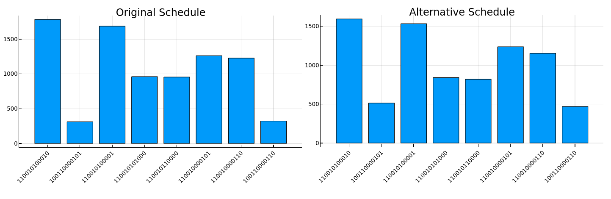

## Project 2: Optimization problems \& Rydberg atom arrays

In this project we solved the UD-MIS problem on a graph G of *V* vertices and *E* edges by finding the ground state of the Hamiltonian of a system of *V* Rydberg atoms placed in the vertices of G.

We used two different approaches to solve this problem:
1) Classical annealing
>We simulated the associated Hamiltonian at low temperature using classical Monte Carlo simulations. At a low enough temperature, we can achieve its ground state, i.e. the solution of our original problem. In our simulations, we tried different annealing schedules to achieve the desired solution.

2) Quantum annealing
>Starting in an easy-to-prepare ground state of a Hamiltonian *H(0)*, we evolved this state with a time-dependent Hamiltonian *H(t)* in such a way that the ground state of the final Hamiltonian *H(t*)* is the one we were looking for. We accomplished this by forcing *H(t*)* to be the UD-MIS Hamiltonian.

In non-technical language, we found the maximum number of occupied locations under certain constraints using classical and quantum techniques to compute the solutions.

Finally, we mapped the UD-MIS problem to a real-life one. We applied these techniques to choose in which places to install a set of cell phone towers in Gotham City since a set of possible locations is given.

You can find the full instructions for tasks we completed this week in [this pdf](./instructions.pdf).

## Solving Tasks 1 and 2 using Classical and Quantum Brute Force

The graph corresponding to the unit-disk maximum independent set (UD-MIS) for this problem is

Given its small size, we begin by solving the problem using classical and quantum brute-force using the following [Jupyter notebook](./Team_6/UD-MIS_Problem-Brute_force.ipynb). For the classical case, we computed all possible outcomes and evaluated the cost function. Then, the solutions are the configurations with the lower cost.   
For the quantum version, we built the Hamiltonian associated to the cost function and calculated its eigenvalues and eigenvectors. The solutions are encoded on the eigenvectors of the ground state eigenspace. In order to extract the solutions, we computed

,">

were *k* is the degeneracy index.

The quantum and classical sets of solutions are the same and, if one is looking for the least-overlapping-disks solution, the second one is the winner!  

### Task 1: Simulated classical Annealing

Using [ej1.py](./Team_6/ej1.py), we tested three annealing schedules and compared their computational costs of convergence.

In this case, the second annealing scheme yields the best results. 

### Task 2: Quantum Annealing
We proposed smoother time dependent controls and tested their performance using the following [Jupyter notebook](./Team_6/run_quantum_annealing.ipynb).

We ran 1000 samples for both sets of controls and constructed the histogram dropping out the configurations with less than samples/10 counts.

In this case, the number of samples chosen was enough to obtain all the solutions.

### Task 3: Solving Gotham City's problem

Once again, we begun by plotting the graph for Bruce Wayne's problem:

Given its size, we followed the same sequence to solve it. First, [the brute force solutions](./Team_6/UD-MIS_Problem-Brute_force.ipynb):

We tried the different schedules used for classical annealing to study [this problem](./Team_6/ej3.py) and the best results were obtained with the second scheme. 

For the quantum annealing, we tried running 10000 samples for each scheme (see [run_quantum_annealing.ipynb](./Team_6/Team_6/run_quantum_annealing.ipynb)), and the new controls for the annealing show an advantange with regard to the previous version. We constructed the histograms by dropping out the configurations with less than samples/40 counts. From the histograms, its clear that the smoothed versions of the controls increase the number of counts for the right configurations. 

From the obtained results, we can conclude that if applying brute force is not possible then it is easier to find the solutions using quantum annealing than classical Montecarlo simulations. For all cases, we found that it is crucial to evaluate the cost function in order to validate its performance.
