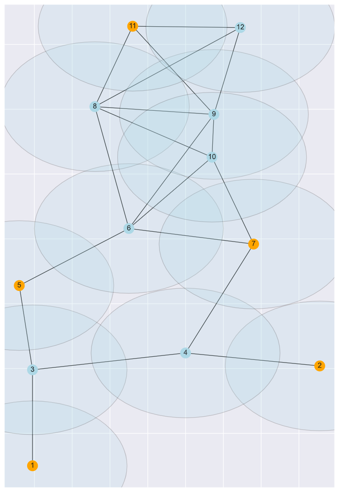
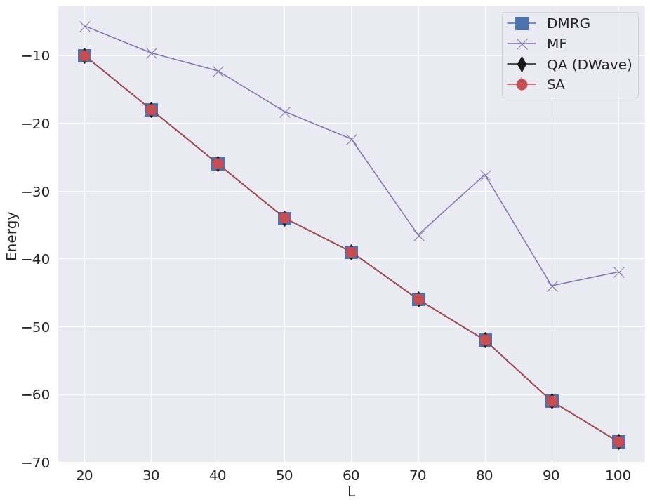

## Project 2: Optimization problems \& Rydberg atom arrays

This project will guide you through using the foundations of quantum hardware to demonstrate a quantum advantage in real-world problems.

## Solutions

### Task 1: UD-MIS problem using classical simulated annealing
We have implemented the simulated annealing method for finding Maximum Independent Set of a given graph with Unit-Disk constraint. Using the default scheduling with Ti=100 and Tf=.01, we could find the solution(s) at around 3400 Monte-Carlo simulation steps. Below is the plot showcasing the energy during the simulation steps:

We have then altered the simulation schedule by changing the paramters Ti and Tf. We have observed that reducing the values of both Ti and Tf has a positive impact on quick convergence to the solution. While reducing the value of Ti has the direct impact on the number of steps, we have noticed lower energy fluctuations with smaller Tf values. Through paramteric search techniques, we have identified that the values of Ti=1 and Tf=005 have far better performance converging to the solution in 1200 simulation steps.

Below are the output energy distribution for various values of Ti and Tf:

  

In order to validate the corretness of the output solutions, below is the distribution of solution occupations for the top three occurrences identified in the annealing results:

These solution occupations are depicted on the original graph. The vertices marked in orange correspond to the solution to the UD-MIS problem. As it can be seen from the graphs, all of them are valid and meet our constraint of Unit-Disk.

||

The code relevent to simulated annealing along with scheduling parameter search and plot generation can be found in the python notebook [Task1.ipynb](./Task1.ipynb)

### Task 2: UD-MIS problem using quantum annealing
We have applied quantum simulation techniques to find UD-MIS problem on the same graph used in the Task 1. We have used the Yao simulator for running the quantum simulations. The code corresponding to quantum simulations can be found in the Julia script [run_quantum_annealing.jl](./run_quantum_annealing.jl)

We have collected 10,000 samples from the quantum simulation and plotted top three solution occurrences below:

One interesting observation in the case of quantum simulation is that the distribution of all the valid solution are (nearly) uniform as compared to simulation annealing which tend to favour one solution most of the times.

The solution occupations obtained through quantum simulation are depicted on the original graph. The vertices marked in orange correspond to the solution to the UD-MIS problem. They all coincide with the results obtained through simulated annealing. 

  

All the code relevent to analysing simulation results and plot generation can be found in the python notebook [Task2_Analysis.ipynb](./Task2_Analysis.ipynb)

### Task 3: Gotham City Cell Tower Placement Problem
We have applied techniques described in Task 1 and Task 2 to a real world problem for identifying the optimal number of cell towers required to reach maximum number of subscribers in Gotham city.

Below are the plots describing the distribution of solution occurrences generated through both simulated annealing and quantum simulation:

 

The quantum simulation seems to explore multiple solutions with equal probability while simulated annealing favours one single solution.

Here is the depiction of solutions found by simulated annealing and quantum annealing methods:

   

   

While both methods found multiple valid solutions, their outputs are completely different for 50% of the output occupations.

## Further Challenges:

* Benchmarking Different Techniques

In the file Optional_Task1 we have setup several scripts to address the challenges posed. For benchmarking purposes
we first introduce a new quantum inspired method - the Density Matrix Renormalization Group algorithm that uses Matrix Product States (MPS) to tackle the UD-MIS Hamiltonian. The routines are located under simple_dmrg.py and flatnetwork.py. The latter also contains other functions that enable running calculations using a single-site mean-field theory as well as exact diagonalization or Full-CI.

For illustrative purposes we tackle the Gotham City Cell Tower problem and, as a bonus, compare against the exact diagonalization or Full-CI techniques. In both cases we find the lowest energy possible. Note that due to the possibility of degenerate states, the MPS and ground state are not identical (with varying probability amplitudes).

For the purposes of benchmarking we will use the functions included in flatnetwork.py. This module enables the creation of randomized graphs that have been flattened to a linear chain with long-range interactions. The linear-chain model is needed for DMRG. Though it is possible to convert a graph to a linear chain, we do not explore than avenue here due to time constraints. 
Additionally, these randomized graphs can be scaled up in a straightforward way and we can control the density of nearest neighbor vertices and long-range interactions.  

         

As we can see in the figure above all many-body methods like Simmulated Annealing (SA), Quantum Annealing (QA) and DMRG are able to obtain the lowest possible ground-state. The site-decoupled MF method we use here is particularly bad for these problems. There were many issues in the convergence showing oscillatory behavior. Nevertheless, we include it for some comparisons. 

         

The final comparison regarding effeciency is illustrated in the figure above. Note that comparing Quantum Annealing (QA) simulated on classical computers is not ideal and is known to be very expensive. Between SA and DMRG, the latter clearly outperforms the former requiring very modest resources. This is necessarily due to the low entanglement in these systems. The final solution did not take more than a bond dimesion (D) of 3 in most cases.  

* Demonstrating how other problems can be mapped to UD-MIS and solving said problems.

* Solving the problem with real quantum hardware.

Due to Mr. Wayne's extraordinary generosity (not to mention an intimidating night-time visitation by a certain masked vigilante), we have implemented a solution to the Gotham City Tower Problem on DWave's 5000Q Advantage System. We are able to find a solution in just 10 samples (as opposed to 10,000 samples on quantum simulator) and within 16 milliseconds of QPU time. Below we depict the energy profile of QPU for this experiment as well as the soluton output.

 

The code associated to this experiment with D-Wave QPU can be found in the python notebook [Task3_QA_DWave.ipynb](./Task3_QA_DWave.ipynb)

## Business Application
For each week, your team is asked to complete a Business Application. Questions you will be asked are:

* Explain to a layperson the technical problem you solved in this exercise.
* Explain or provide examples of the types of real-world problems this solution can solve.
* Identify at least one potential customer for this solution - ie: a business who has this problem and would consider paying to have this problem solved.
* Prepare a 90 second video explaining the value proposition of your innovation to this potential customer in non-technical language.

For more details refer to the [Business Application found here](./Business_Application.md)
