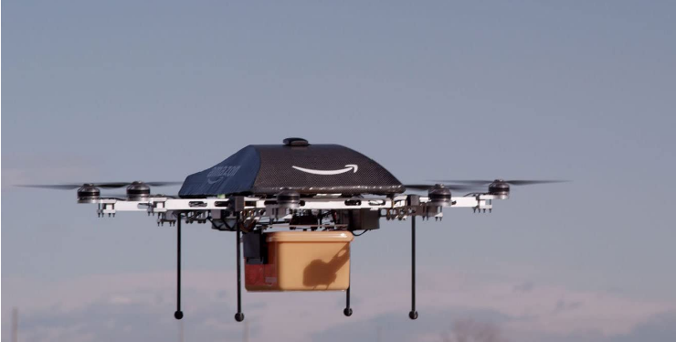

## Project 2: Optimization problems \& Rydberg atom arrays

Optimization of networks and routing is strongly linked with the NP-hard **Traveling Salesmen** problem and other path finding algorithms.  Here we explore some classical techniques to tackle these problems, as well as quantum and hybrid solutions.  Path finding has general applications not only for routing, but for the trajectory of multi-state systems over time.

Here we do an analysis of some of thiese methods framed as the UD-MIS problem, and benchmark different methodologies for tackling this class of problems

## Solutions

## Tasks include:
### Task 1: Simulating the unit-disk maximum independent set (UD-MIS) problem using classical simulated annealing.
In this [Task 1 notebook](./Task_1.ipynb) we tried several different schedules as suggested in citation [1] to see their effect on the convergence of UD-MIS under simulated annealing. Below are two graphs, graph before simulated annealing is ran (Right) and graph after simulated annealing is ran (Left), note that the maximum independent sets are seen in yellow color.

We were able to find the ground state energy, which converged at an energy of -3. As we decreased the temperature, we found that the monte carlo algorithm converged faster as expected, and below is a graph demonstrating that result:

### Task 2: Simulating the same problem but using quantum annealing.
We constructed an arbitrary N vertex graph, Hamiltonion for our system based off UD-MIS problem and ran a simulated annealing algorithm on it to find the lowest energy state.   In the [Task 2 Notebook](./Task_2.ipynb) in Julia we tested variations of the annealing time division and shots to sample solution to the problem and graph them.  We then compared the "best" or lowest energy returned with the most commonly returned solution.  Here only nodes within a unit distance are drawn with connected edges since they are the only ones that can overlap.

The most common sampled state had an energy of -2.65

The sampled state with lowest energy has an energy of -5.0

* Comparing the classical and quantums.
### Task 3: Solving a real-world problem involving cell phone tower placement in Gotham City.

## Further Challenges:
### Method Comparision Between Classical Simulated Annealing vs. Quantum Annealing in the UDMIS Problem
In this [notebook](./D-Wave_qpu_and_simulated_annealing.ipynb) we compare the runtime of simulated annealing(D-Wave neal package),D-Wave QPU, and D-Wave hybrid solver on the UDMIS problem.

*Bonus Task: Solving MIS on Quantum Hardware.

### Benchmarking Criteria: Classical vs. Quantum Optimization for UD-MIS
**Theoretical Background**: During this simulation, we utilized the simulated annealing algorithm to solve the UD-MIS problem. Let ni be the gap between the largest and second largest eigenvalues of a stochastic matrix Mi. Let n = minini. The run time of this alogirthm is proportional to O(1/n) [1][2], and it has been shown that quantum computers can increase the efficieincy by O(1/√n) [1][3]

In [this notebook](D-Wave_qpu_and_simulated_annealing) do a comparison of calculation times for various classical, quantum, and hybrid optimizers.

### Other Real World Example UD-MIS can solve:

Another realworld application of the UD-MIS is strategically placing distribution centers.  This has an incredibly broad range of applications as you might need to distribute goods, services, or even information.  In the case of information distribution we discuss applications to routing protocals in the [business application section.](./Business_Application.md)
For another alternative real world application of MIS we look at goods delivery for drones.  The obvious customer is Amazon as they have already begun exploration in this direction with [Amazon Air Prime.](https://www.amazon.com/Amazon-Prime-Air/b?node=8037720011)  Although, it doesn't need to be drone delivery.  There is a large proliferation of grocery delivery services, and the human need for sustenance does not seem like a bubble market.

## Business Application

For more details refer to the [Business Application found here](./Business_Application.md)

### References:
1. [Quantum Algorithm Zoo](https://quantumalgorithmzoo.org/#MathJax-Element-271-Frame)
2. [Sanguthevar Rajasekaran, On the Convergence Time of Simulated Annealing](http://repository.upenn.edu/cgi/viewcontent.cgi?article=1373&context=cis_reports)
3. [Mario Szegedy, Spectra of Quantized Walks and a δϵ√ rule.](https://arxiv.org/abs/quant-ph/0401053)
