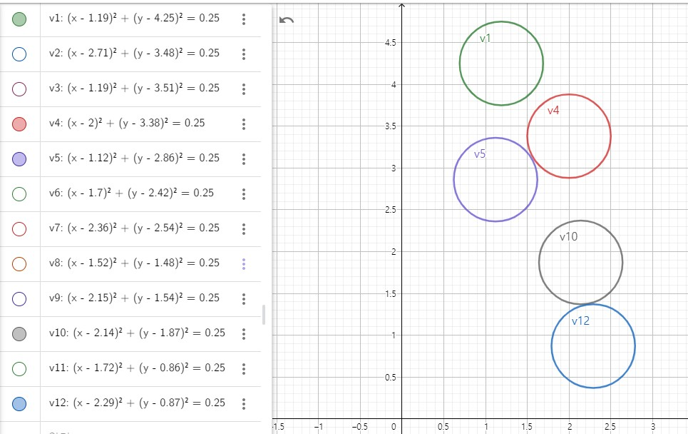

## Project 2: Optimization problems \& Rydberg atom arrays

This project will guide you through using the foundations of quantum hardware to demonstrate a quantum advantage in real-world problems.

Open up [instructions.pdf](https://github.com/CDL-Quantum/CohortProject_2021/tree/main/Week2_Rydberg_Atoms/instructions.pdf) to begin learning about your tasks for this week!

## Tasks include:
* Simulating the unit-disk maximum independent set (UD-MIS) problem using classical simulated annealing.
* Finding a better annealing schedule to arrive at solutions to the problem quicker.
* Simulating the same problem but using quantum annealing.
* Comparing the classical and quantum methods.
* Solving a real-world problem involving cell phone tower placement in Gotham City.

## Summary of Results

### [Task 1](./Task1.ipynb): Simulated Classical Annealing

In task 1, we try to solve the UD-MIS problem classically via simulated annealing. Simulated annealing repeats Monte Carlo simulations while decreasing temperautre, aiming to estimate the ground (zero-temperature) state. Note that the final result can be affected by the annealing schedule, i.e. temperature as a function of timetemperature. Here we first try the annealing schedule provided in the problem, and create some other annealing schedules, namely inverse, inverse-log, and exponential*inverse (see [Task 1](./Task1.ipynb) for how they are defined) to play around with and compare results. 

<figure class="image">
  
  <figcaption> <b>Fig.1</b>  </figcaption>
</figure>

### [Task 2](./Task2.ipynb): Effect of a single-qubit bit-flip error on speckle patterns

In task 2, we examined how the probability distribution of the random circuit sampling changes with a single-qubit bit-flip error occuring at a random place on the quantum circuit. For example, we plot various speckle patterns obtained under the random bit-flip error for a quantum circuit consisting with 4 qubits and the circuit depth of 10 in Figure 2. We can clearly see that the pattern looks very different in each experiment although the same random circuit was executed. 

<figure class="image">
  
  <figcaption> <b>Fig.2</b>  </figcaption>
</figure>

### [Task 3](./Task3.ipynb): Emperical Cumulative Distribution of Random Circuit Sampling Probabilities

In task 3, we examine whether the samping probability distribution of the random circuit converges to the Porter–Thomas distribution, characteristic of quantum chao, as the circuit depth increases. Reproducing such probability distribution classically is conjectured to be exponentially difficult as the number of qubits increases. We demonstrate the convergence of the random circuit sampling probability distribution to the Porter-Thomas distribution by plotting the empirical cumulative distribution for a quantum circuit with 8 qubits with several quantum circuit depth. The quantum circuit depths are 1, 2, 5, 10, 50 and 100. Figure 3 clearly shows that the empirical cumulative distribution converges to that of the exponential distribution (i.e. Porter-Thomas) as expected.

<figure class="image">
  
  <figcaption> <b>Fig.3</b> Cumulative distribution function of the exponential distribution (dashed) and the probabilities in the random circuit sampling (solid) with increasing circuit depth. </figcaption>
</figure>

<figure class="image">
  
  <figcaption> <b>Fig.3</b> Cumulative distribution function of the exponential distribution (dashed) and the probabilities in the random circuit sampling (solid) with increasing circuit depth. </figcaption>
</figure>

## Business Application
An interesting application of the UD-MIS probelm addressed in this cohort project is protein folding. The protein folding problem is of significant importance in the pharmaceutical, medical, and healthcare industry. We provide more detailed description about the business application [here](./Business_Application_Team11.md)
