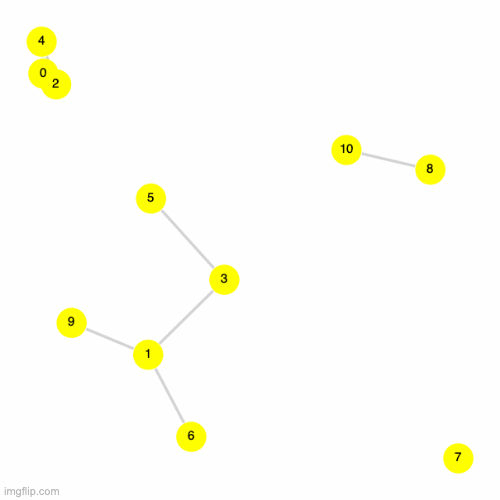
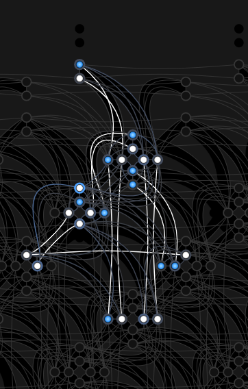
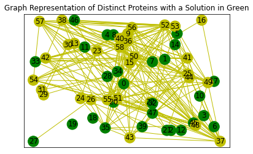

## Project 2: Optimization problems \& Rydberg atom arrays

Team 8 Alex Khan, Theo Cleland, Henry Makhanov, Ehsan Torabizadeh, Darshit Mehta

In this project we are going to demonstrate the amazing power of classical and quantum annealers. Throughout a series of tasks we will demonstrate the existing annealing techniques to solving a variety of problems. Crucially, we will show a solution to the unit-disk maximum independent set (UD-MIS) problem using both a simulated classical annealer with different schedules and a quantum annealer. For the third task, we have also solved the Gotham City Cell Tower problem using both classical annealer and quantum annealer. Finally, we have mapped a real-world protein redundancy problem to the UD-MIS problem and found very promising results that will serve as a founding block for our business proposal. 

### Table of Contents  
1. [Simulating the UD-MIS Problem Using Classical Simulated Annealing](#toc1)
2. [Finding a Better Annealing Schedule](#toc2)
3. [Simulating the Same Problem but Using Quantum Annealing](#toc3)
4. [Comparing the Classical and Quantum Methods](#toc4)
5. [Gotham City Problem](#toc5)
6. [Finding Non-Redundant Protein Sequences](#toc6)

### Resources
- [Notebook for task 1](./Task1.ipynb)
- [Notebook for task 2](./Task%202.ipynb)
- [Notebook for task 3 (Gotham city) + running on real quantum hardware](./Task%203,%20Additional-Challenges%20b,%20d-ak.ipynb)
- [Notebook for extra challenge: Finding the least redundant set of protein sequences](./real_world_protein_redundancy.ipynb)
- [Business Application](./Business_Application.md)
- [Business Video](https://drive.google.com/file/d/1hfTtel2v4LhboNnb1T615xISGz0q-tJT/view?usp=sharing)

This project will guide you through using the foundations of quantum hardware to demonstrate a quantum advantage in real-world problems.

## Simulating the UD-MIS Problem Using Classical Simulated Annealing

Please view [this notebook](./Task1.ipynb) for the code used to solve this section. 

We simulate the UD-MIS using classical simulated annealing for the following abstract graph (truncated to 2 decimal places). Edges are created whenever a node is closer than a unit distance of 1.

|Table Representation of Graph | Visual Representation of Graph|
| :--------------: | :---------: 
| <table>   <thead>   <tr> <th>X Coordinate</th>  <th>Y Coordinate</th>  </tr>   </thead>   <tbody>   <tr>  <td>0.35</td>  <td>1.50</td> </tr> <tr>  <td>0.63</td>  <td>2.58</td> </tr> <tr>  <td>1.39</td>  <td>2.16</td> </tr> <tr>  <td>0.66</td>  <td>0.67</td> </tr> <tr>  <td>0.87</td>  <td>3.39</td> </tr> <tr>  <td>1.16</td>  <td>1.08</td> </tr> </tbody> </table> | 

Next we simulate annealing to solve the ground state of the following Hamiltonian:

With the following annealing schedule: 

We find a ground state energy level of `-3` after about 4000 iterations. We plot in the following corresponding occupations in green which yield the ground state:

## Finding a Better Annealing Schedule

Please view [this notebook](./Task1.ipynb) for the code used to solve this section. 

We test 3 different annealing temperatures summarized by the following table (left) and visualized in the follow plot (right): 

| Table of Different Annealing Schedules | Plots of Each Annealing Schedule |
| :--------------: | :---------: 
| <table>   <thead>    <tr> <th>Annealing Schedule</th>  <th>Name</th>  </tr>    </thead>   <tbody>    <tr>  <td></td>  <td>exponential ~x (benchmark)</td> </tr>  <tr>  <td></td>  <td>exponential ~2x</td> </tr>  <tr>  <td></td>  <td>exponential ~4x</td> </tr>  </tbody> </table> |  |

To test the speed of convergence, we consider a "stable" solution one where the energy has not changed after 100 iterations. After simulating the annealing for each schedule, we plot the energy versus the number iterations in the following table:

We see clearly that the `exponential ~4x` schedule converges the fastest, and is more than 3x faster than the benchmark provided in the sample code. These results are further summarized in the following table:

| Annealing Schedule   | Iterations to Stable Solution | Time to Stable Solution (seconds) | 
| :------------- | :----------: | :----------: |
|  | 3676 | 0.61 |
|   | 2007 | 0.34 |
|   | 1044 | 0.17 |

## Simulating the Same Problem but Using Quantum Annealing

Please view [this notebook](./Task%202.ipynb) for the code used to solve this section. 

We simulate the UD-MIS using simulated quantum annealing for the following abstract graph (truncated to 2 decimal places). Edges are created whenever a node is closer than a unit distance of 1.This graph will look a bit different from the one used in the previous section because we are using a different programming language ([Julia](https://julialang.org/)) and because we use a different plotting package([GraphPlots.jl](https://juliagraphs.org/GraphPlot.jl/)). 

|Table Representation of Graph | Visual Representation of Graph|
| :--------------: | :---------: 
| <table>   <thead>   <tr> <th>X Coordinate</th>  <th>Y Coordinate</th>  </tr>   </thead>   <tbody>   <tr>  <td>0.35</td>  <td>1.50</td> </tr> <tr>  <td>0.63</td>  <td>2.58</td> </tr> <tr>  <td>1.39</td>  <td>2.16</td> </tr> <tr>  <td>0.66</td>  <td>0.67</td> </tr> <tr>  <td>0.87</td>  <td>3.39</td> </tr> <tr>  <td>1.16</td>  <td>1.08</td> </tr> </tbody> </table> | 

In the instructions we were tasked with applying quantum annealing to solve the UD-MIS problem. Our approach will be different from the classical annealing as we will be considering a time-dependent Hamiltonian:

Mathematically and algorithmically, Quantum Annealing looks like the following

where  is the time-evolution operator

We can see the top five solutions and their frequency on the following graph. Additonally you can look at the [file with all the available solutions](./task2_data.dat)

We can see that simulated quantum annealing found several suitable solutions. Most notably, the top 3 solutions are very close to each other. We have made the corresponding frequency distribution and graph that maps the top 5 solutions:
|Solutions | Solutions on the Graph|
| :--------------: | :---------: 
| <table>   <thead>   <tr> <th>Solution</th>  <th>Frequency</th>  </tr>   </thead>   <tbody> <tr>  <td>010101</td>  <td>28581</td> </tr> <tr>  <td>011100</td>  <td>28457</td> </tr> <tr>  <td>110100</td>  <td>28204</td> </tr> <tr>  <td>111100</td>  <td>3052</td> </tr> <tr>  <td>011101</td>  <td>2953</td> </tr>  </tbody> </table> | 

Additionally we have run the simulated quantum annealer on a more complicated graph with 11 nodes, where top 5 solutions are much more evenly distributed. We suspect it was due to inherently different structure of the graphs.
|Solutions | Solutions on the Graph|
| :--------------: | :---------: 
| <table>   <thead>   <tr> <th>Solution</th>  <th>Frequency</th>  </tr>   </thead>   <tbody>   <tr>  <td>01111001100</td>  <td>6827</td> </tr> <tr>  <td>11011011000</td>  <td>6774</td> </tr> <tr>  <td>01111011000</td>  <td>6713</td> </tr> <tr>  <td>11011001100</td>  <td>6709</td> </tr> <tr>  <td>11011001001</td>  <td>6682</td> </tr></tbody> </table> | 

Simulated quantum annealing presents a promising option for solving the UD-MIS problem, but perhaps it would be more interesting how will the real quantum hardware perform.

## Comparing the Classical and Quantum Methods

TODO

## Gotham City Problem

This work was generated from [this notebook](./Task%203,%20Additional-Challenges%20b,%20d-ak.ipynb). The goal was to map the UD-MIS problem to a real world problem relating to finding optimal placements for cell phone towers in the city of Gotham.

We are given the follow nodes representing the position of cell phone towers:

|Table Representation of Graph | Visual Representation of Graph|
| :--------------: | :---------: 
| <table>   <thead>   <tr> <th>X Coordinate</th>  <th>Y Coordinate</th>  </tr>   </thead>   <tbody>    <tr>  <td>1.19</td>  <td>4.25</td> </tr>  <tr>  <td>2.71</td>  <td>3.48</td> </tr>  <tr>  <td>1.19</td>  <td>3.51</td> </tr>  <tr>  <td>2.00</td>  <td>3.38</td> </tr>  <tr>  <td>1.12</td>  <td>2.86</td> </tr>  <tr>  <td>1.70</td>  <td>2.42</td> </tr>  <tr>  <td>2.36</td>  <td>2.54</td> </tr>  <tr>  <td>1.52</td>  <td>1.48</td> </tr>  <tr>  <td>2.15</td>  <td>1.54</td> </tr>  <tr>  <td>2.14</td>  <td>1.87</td> </tr>  <tr>  <td>1.72</td>  <td>0.86</td> </tr>  <tr>  <td>2.29</td>  <td>0.87</td> </tr>  </tbody> </table> | 

Our goal is to optimize the cell locations of each tower to best cover Gotham City, while only purchasing the required number of towers such that the tower signals do not overlap and as much of Gotham City is within signal range. 

### Why can this problem be mapped easily to the UD-MIS problem?

The requirements of the problem to maximize the tower coverage (use as many nodes as possible) and that the signal range not overlap (penalize node pairs with some condition) fits the UD-MIS formulation:

### Solve Gotham City's Problem

We solve this problem in four ways using a simulated classical annealing approach, a quantum annealing algorithm as well as on real quantum hardware using Microsoft QIO and D-Wave.

#### Simulated Classical Annealing

Running the algorithm on a simulated classical annealing algorithm yields a lowest energy level of -5. We reached convergance after about 3700 iterations using the default cooling schedule . We plot one solution in the following figure in green:

#### Quantum Annealing

Next we also run the same algorithm quantum-ly.
@Henry to fill this in

#### Real Quantum Hardware: Microsoft QIO

Repeated runs on Microsoft QIO gave the same answer as the simulated quantum annealing approach.

This solver (similar to most simulated annealing solvers) seems to give only one answer. It did not appear to be probabilistic and so, we did not see the value in proceeding any further with this algorithm.

#### Real Quantum Hardware: D-Wave

We also solve this problem on real quantum hardware using D-Wave. Here, we found multiple solutions with the same lowest energy of -5. We display the top solutions found in the left, along with an awesome GIF displaying each solution on the right (green nodes are occupied).

| D-Wave Solutions for Gotham Problem | GIF of the Multiple Best Solutions Found |
| :--------------: | :---------: |
| |  |

We also show the graph representation of the problem in D-Wave (left), the actual embedding on D-Wave 2000Q (middle) along with the energies sampled from Dwave (right).

| Graph Representation on D-Wave | Embeddings on D-Wave | Energies Sampled on D-Wave |
| :--------------: | :---------: |  :---------: |
|  |  |  |

#### New Formulation of the Problem

The UD-MIS formulation where the range overlap is descretized does not give solutions that would indicate the optimum solution since a large overlap and a small overlap both have the same penalty (higher energy of +1).

Thus a modified solution is found with a different solver (D-Wave) which uses the equation:

As can be seen, in this solver the coefficient  can be used to indicate higher penalty for higher overlap.

We will use  We also use the energy of each tower as -3

Using this formula and the execution below, we get the following best energy solution of -9.513712 using D-Wave. Although, note that this solution was only found 1 time with 100 samples. We notice that even with the new formulation, only 5 towers are needed. 

With this formulation, we get a sampling given by the following two figures. On the left, we show the sampling from D-Wave and on the right, a similar GIF as above displaying the various solutions.

| D-Wave Solutions for Modified Gotham Problem | GIF of the Multiple Best Solutions Found |
| :--------------: | :---------: |
| |  |

From D-Wave, we also show the resulting qubit embedding (left) and energy spectrum (right):

| Embeddings on D-Wave | Energies Sampled on D-Wave |
| :---------: |  :---------: |
|  |  |

### Should Bruce pay for a few more cell towers?

No. As the full set of solutions show, we can have from 5 to 7 towers and still have the lowest energy of -5.

Adding an additional tower will add to the capital cost of adding a tower, however, there is no additional benefit based on the current formulation.

We would have to do an marginal analsysis and look at the incremental cost of each additional tower and compare to the incremental coverage area for adding the additional tower.

With the current threshold based binary UD-MIS formulation it is not possible to get this level of information.

Even when modifying the problem, we did not find a better solution with more towers.

## Finding Non-Redundant Protein Sequences

We take this project one step further by solidifying our business case with a real application: finding the least redundant set of proteins from real data! See [this notebook](./real_world_protein_redundancy.ipynb) for the implementation. 

Qamino strives in finding non-redundant protein sets to enable our customers to efficiently produce drugs without having to waste time experimenting with proteins that have already been tested. We test our algorithm on data found from the [Dali Protein Structure Comparison Server](http://ekhidna.biocenter.helsinki.fi/dali/). [Our data](./protein_similarities.csv) is a matrix of the "similarity" scores between 59 different protein sequences. Here are the following protein sequences we investigate:

`1bksA,  3f2bA,  2yb1A,  3e38A,  2anuA,  3qy6A,  1v77A,  3dcpA,  3au2A, 1m65A,  2a3lA,  2qpxA,  3iacA,  1j5sA,  1itqA,  4mupB,  4dlfA,  2ffiA, 3irsA,  3cjpA,  4dziC,  2gwgA,  4ofcA,  4hk5D,  4qrnA,  2dvtA,  3gg7A, 2y1hB,  2vc5A,  2ob3A,  3k2gB,  1bf6A,  1a4mA,  2ogjA,  1a5kC,  1yrrB, 3nqbA,  2vunA,  1onxA,  3pnuA,  3giqA,  3griA,  3e74A,  4b3zD,  1gkpA, 2imrA,  3ooqA,  3icjA,  2oofA,  4c5yA,  3mtwA,  3mkvA,  4cqbA,  1k6wA, 4rdvB,  2uz9A,  2pajA,  3ls9A,  1j6pA`

To formulate this problem as a UD-MIS problem, we simply need to construct the edge matrix based on the similarity values from the [Dali Protein Structure Comparison Server](http://ekhidna.biocenter.helsinki.fi/dali/). To do so, we must choose a good threshold to consider an edge. We use the following histogram to arbitrarily determine the best threshold. We chose a threshold of 25 indicated by the red dotted line on the histogram. On the right, we show the graph created (node positions are randomly assigned).

| Histogtam of Similarity Values | Graph Visualization |
| :--------------: | :---------: |
| | 

We then solve the UD-MIS problem using a clasical simulated annealing schedule T_i * (T_f/T_i)^(t/N) where T_i = 100 and T_f = 0. We find a ground state for an energy level of -28. We plot the corresponding energies per iteration (left) and the graph solution in green (right) in the following figures:

| Energy Values | Graph Visualization |
| :--------------: | :---------: |
|  |  |

The solution set yielded from the classical simulation found 28 non-redundant proteins at a ground state energy of -28:

`1bksA, 3f2bA, 2yb1A, 3e38A, 2anuA, 3qy6A, 1v77A, 3dcpA, 3au2A, 2a3lA, 2qpxA, 3iacA, 1itqA, 2ffiA, 3irsA, 3cjpA, 4dziC, 2gwgA, 2y1hB, 2vc5A, 1a4mA, 2ogjA, 1a5kC, 1yrrB, 3pnuA, 2imrA, 3ooqA, 3icj`

#### Implementation on D-Wave

Since our company name is Qamino (standing for Quantum Amino), we needed a solution using real quantum hardware as well! Thus we tested this out using D-Wave. We were able to find the -28 energy ground state (although it was only sampled once out of 100 samples). We display graph representation of the problem in D-Wave (left), the actual embedding on D-Wave 2000Q (middle) along with the energies sampled from Dwave (right).

| Graph Representation on D-Wave | Embeddings on D-Wave | Energies Sampled on D-Wave |
| :--------------: | :---------: |  :---------: |
|  |  |  |

## Business Application

You can check out our business application [here.](./Business_Application.md)

## References

<a name="ref1">https://www.ncbi.nlm.nih.gov/pmc/articles/PMC5835207/<a>

       

Open up [instructions.pdf](https://github.com/CDL-Quantum/CohortProject_2021/tree/main/Week2_Rydberg_Atoms/instructions.pdf) to begin learning about your tasks for this week!

**Please edit this markdown file directly with links to your completed tasks and challenges.**

## Tasks include:
* (DONE) Simulating the unit-disk maximum independent set (UD-MIS) problem using classical simulated annealing.
* (DONE) Finding a better annealing schedule to arrive at solutions to the problem quicker.
* (QUEUE) Simulating the same problem but using quantum annealing.
* (QUEUE) Comparing the classical and quantum methods.
* (QUEUE) Solving a real-world problem involving cell phone tower placement in Gotham City.

## Further Challenges:
* (QUEUE) Comparing the methods used to solve the UD-MIS problem.
* Benchmarking other quantum and classical optimization methods to solve your UD-MIS problems.
* (QUEUE) Demonstrating how other problems can be mapped to UD-MIS and solving said problems.
* Solving the problem with real quantum hardware.

## Business Application
For each week, your team is asked to complete a Business Application. Questions you will be asked are:

* Explain to a layperson the technical problem you solved in this exercise.
* Explain or provide examples of the types of real-world problems this solution can solve.
* Identify at least one potential customer for this solution - ie: a business who has this problem and would consider paying to have this problem solved.
* Prepare a 90 second video explaining the value proposition of your innovation to this potential customer in non-technical language.

For more details refer to the [Business Application found here](./Business_Application.md)
