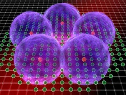
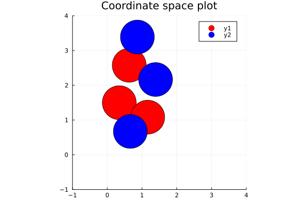
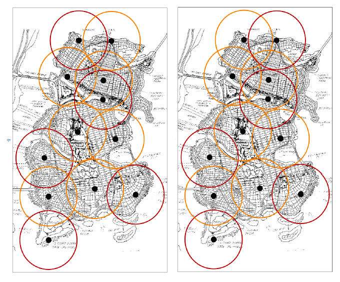

## Project 2: Optimization problems \& Rydberg atom arrays
Optimization is a crucial element used in solving problems across many different fields, 
from scientific to industrial applications, to generally boost performance and reduce risks.

Recent advances in both quantum hardware and algorithm development have made it possible to solve small problems on modern
quantum devices. In particular, quantum computing has potential to efficiently solve combinatorial optimization problems,
especially showing an advantage when dealing with NP-hard problems [1]. 

One of the quantum computing models which can solve combinatorial optimization problems
is the Adiabatic Quantum Optimization model (AQO). AQO refers to the use of the adiabatic 
theorem in quantum mechanics [2] to adiabatically (i.e. slowly) move towards the ground 
state of an interaction Hamiltonian onto which an optimization problem is mapped. 
As a result of the adiabatic theorem, the state of the system after the adiabatic evolution will be 
the ground state of the final Hamiltonian, i.e. the global minimum of the optimization problem mapped onto the 
final Hamiltonian.

In the following we address the solution of a well-known NP-hard problem, the Unit Disk Maximal Independent Set 
(UD-MIS). We first modified the provided Jupyter notebook for the solution of the problem with the classical 
simulated annealing. Further, we prepared two more notebooks: in the first we perform a quantum annealing 
simulation in Julia; the second provides a python implementation of quantum annealing which uses
the D-Wave Ocean SDK to compare the classical simulated annealing to the quantum simulator and finally 
perform the optimization on a real D-Wave quantum device.

## 1. The UD-MIS problem: 
In the MIS problem we consider a graph with a set of vertices, V, and a set of 
edges, E, G = (V,E), and we want to find out what is the maximal number of vertices 
which may be "colored" such that no two colored vertices are connected by an edge.

The UD-MIS is a special case of this problem in which we consider a graph in which
each vertex corresponds to the center of a unit circle and we connect these vertices
with an edge if and only if the corresponding circles intersect.

The problem of finding the MIS can be expressed as a quadratic unconstrained optimization problem,
which is also equivalent to an Ising hamiltonian

where the quadratic terms favours disjoint circles and the linear term makes sure
that we select as many circles as possible.

This problem can easily be mapped onto a Rydberg atom architecture as the hamiltonian
of this system is equivalent to the one shown in the UD-MIS problem.

In the following we present several solutions for the MIS problem, both from a
classical and a quantum standpoint.

### 1.1 Classical simulated annealing
The simulated (thermal) annealing is a heuristic optimization procedure which spans the solution 
space of a generic optimization problem by simulating the physical process of heating a material 
and then slowly lowering the temperature to decrease defects, thus minimizing the system energy.
Each transition in spanning the solution space is called anneal.

We compare two different classical algorithms implemented on Python, see [this notebook](../Week2_Rydberg_Atoms/Task1_python.ipynb) 
in which we simulate the transitions of the solution toward to ground state of the Hamiltonian.
In particular, we implemented the Metropolis-Hastings and Wolff algorithms. 

The following plot shows the solutions obtained for different number of iteration.

Clearly, this plot shows the convergence of the solutions for a larger number of iterations. 

We also investigated the convergence of the solutions when we start from a higher temperature. 
As expected, the convergence is slower due to the presence of larger thermal fluctuations. 
Thus, it takes more iterations to reach the actual ground state of the system.

In the following plot, we show the histogram of solutions obtained with the Metropolis-Hastings algorithm. 
We observe that some of the solutions appear with a similar frequency, meaning that we are in presence
of a degeneracy of the ground state, i.e. mutliple solutions correspond to the same energy level.

[comment]: <> (After increasing the value of N by a factor of 10:)

[comment]: <> (![t13]&#40;../Week2_Rydberg_Atoms/img/t13.png&#41;)

Finally, in the next plot we show the histogram of the solutions obtained with the Wolff algorithm, by using the same
number of iterations as in the Metropolis-Hasting algorithm:

We observe that the Wolff algorithm underperforms the Metropolis-Hasting algorithm since the
convergence of the solutions is slower, i.e. it requires a larger number of iterations.

[comment]: <> (Finally, a picture of the fully connected 6 node graph by using Networkx &#40;a python package&#41;:)

[comment]: <> (![t17]&#40;../Week2_Rydberg_Atoms/img/t17.png&#41;)

### 1.2 Quantum annealing

Quantum annealing has been introduced in the 80s as a variation of the simulated thermal annealing
for solving NP-hard optimization problems. The main difference is that besides the thermal
excitations used in simulated annealing to span the solution space, the quantum annealing 
incorporates quantum transitions (tunneling), making it more efficient in converging towards the 
ground state of the system. Later it was proposed to actually use a quantum system to
implement the quantum annealing algorithm. The company D-Wave Systems was the first to build a 
prototype QA processor and to start the commercialization of these devices, using then quantum annealing algorithms 
on quantum hardware.

Besides the D-Wave systems, different quantum architectures have been used to 
implement quantum annealing. Recent developments in the quantum hardware with trapped neutral atoms 
showed that the latter can be a useful tool to implement adiabatic quantum computation [3] [4]. 

Rydberg atoms are atoms with highly excited electrons, far away from the nucleus (i.e. large principal quantum number). 
Compared with ground state atoms, they exhibit a very large electric dipole moment which facilitates strong interactions 
with macroscopic external fields. Thus, this makes Rydberg atoms easy to control with static electric or magnetic, 
laser, or microwave fields which is then ideal for implementing controllable quantum many-body simulators.

In particular, the Rydberg hamiltonian has the same functional form as the QUBO hamiltonian
used to solve the UD-MIS problem. Where the linear term is responsible for the interaction of each atom with the external field,
and the quadratic term is the interaction between two Rydberg atoms.

The concept of quantum annealing can then be applied to such a system to find the ground
state of an optimization problem that can be mapped to the hamiltonian of the Rydberg atom system.

The analysis we performed is based on the extension of the provided 
[Julia code](../Week2_Rydberg_Atoms/legacy_run_quantum_annealing.jl).

The starting point is the same graph as provided in the previous section:

In this code, the quadratic and linear terms of the interaction hamiltonian are defined time-dependent functions 
such that at the beginning (t=0) one has a free hamiltonian, while by increasing time steps
the hamiltonian adiabatically changes into the final interaction hamiltonian which maps the 
problem that we want to solve. 

Based on the adiabatic theorem, if the transition to the final interaction hamiltonian is adiabatic,
the initial state will remain in the ground state across the whole adiabatic transformation.
The ground state of the final interaction represents thus the minimum of the optimization problem
mapped onto the system.

By simulating a measurement of the final ground state a large amount of time, we obtained a
distribution of the results which shows that there are basically three degenerate solutions.
This is in line with what observed in the simulated thermal annealing, however in this case we can see 
that the solution states are clearly much more distinguishable than what we saw in the simulated annealing histograms. 

We selected one of the three solutions and we mapped it to a graph. In the space of the coordinates, 
the solution found is given by the graph below, where the blue circles correspond to the independent set
of vertices:

Then, similarly to what done for the classical algorithm, we repeated the analysis of 
convergence of the solutions for the quantum algorithm. 
In the following plot, the histogram of the solutions is shown for different number 
of measurements:

Finally, we investigated how the speed of the quantum solution varies with the value of dt:

Obviously, a slower transition to the final Hamiltonian, leads to a larger computational time. 
However, the solutions obtained with a larger value of dt do not significantly differ from those
obtained with a smaller value of dt, showing then the stability of the quantum annealing approach.

### 1.3 Benchmarking classical to quantum annealing

A direct comparison of the simulated and quantum annealing by means of the previous exercise is not
straightforward. In fact, there are several parameters/conditions that make the comparison arbitrary:
- the simulated solution strongly depends on the annealing schedule
- the simulated and the quantum annealing codes are written in different languages
- the D-Wave simulator (see next section) performance depends both on parameters and embedding of the problem  
- the real device implementation (see next section) has latency issues to connect to the cloud and retrieve the solution. 

However, the theoretical improvement of quantum annealing w.r.t. simulated annealing has been 
proven for a class of problems (see [5], where they analyzed quantum annealing in a version incorporating a transverse 
field Ising model, and showed that QA converges to optimality faster than SA in some cases).

Also more recent researches [6][7][8] have shown the benefits of quantum annealing and demonstrated 
a scaling advantage for a quantum annealer over simulated annealing. 

In our case, we observed that the classical algorithms were faster than the quantum simulation.
This is probably due to the fact that the quantum algorithms were implemented in Julia and 
we only had access to one thread (computer core). [This link](https://towardsdatascience.com/the-great-csv-showdown-julia-vs-python-vs-r-aa77376fb96) shows 
how the speed of the Julia code compares to a similar implementation in Python when we make use of 
parallelization (see figure below). 

## 2. Ocean SDK: comparing simulation to a real quantum device

D-Wave Systems created a full-stack framework ([Leap2](https://www.dwavesys.com/take-leap)) to run quantum annealing algorithms on both simulators and real quantum devices. The access to their systems uses an API mechanism for which registration is required. As part of the CDL, all users should have got a license and can access the real quantum devices. 

For the simulation part, only requirement is the installation of the package [dwave-ocean-sdk](https://pypi.org/project/dwave-ocean-sdk/).
In [this notebook](./OceanSDK_implmentation.ipynb) we show how to build a graph for the UD-MIS problem and solve it by means of three different methods:
- simulated thermal annealing
- simulated quantum annealing
- quantum annealing on a real quantum device

The graph provided in the previous task is built with the [networkx package](https://networkx.org/). 
This is useful as the D-Wave library provides a wrapper to solve the MIS problem in this specific form.

The results from all implementation are equivalent. Note that also in this case we 
observed the problem intrinsic degeneracy, being the vertices 0, 3, and 5 equivalent (see figure below).

## 3. Gotham city and Bruce's stinginess

The City of Gotham is looking at putting in new cell phone towers. 
The possible locations of the cell phone towers are given in this figure:

The billionaire (but stingy) Bruce Wayne is funding the project, but he loves his money. 
Therefore, Gotham should only purchase the required number of cell phone towers such that:
1) The cell signals do not overlap. 
2) As much of Gotham city can be within cell signal range.

At first, we observed that this problem can be easily mapped to the UD-MIS  problem, which was discussed 
in the previous sections.

In fact, the mapping is straightforward if we consider each cell phone tower being a node V of a graph 
G(V,E), where the edges E are defined based on the condition that two nodes are closer than 1 (note that 
the provided Gotham's map is scaled such that the provided coordinates are normalized to the signal range). 

Thus, the condition that the two conditions of non-overlapping cell signal and maximization of coverage 
can be expressed as a MIS problem on the defined graph, i.e. we maximize the number of nodes 
(antennas) that are independent (non-overlapping signals). 

Similarly to the analysis performed in the previous sections, the UD-MIS problem can be solved for the Gotham's antennas graph by means of:
- simulated (thermal) annealing (see [Python notebook](../Week2_Rydberg_Atoms/Task3_python.ipynb))
- quantum annealing simulation (see [Julia notebook](../Week2_Rydberg_Atoms/Task_3_QAnnealing.ipynb))
- D-Wave quantum annealing solution (see [Python notebook](../Week2_Rydberg_Atoms/OceanSDK_implmentation_gotham.ipynb))

#### Classically Simulated (thermal) annealing

Using the Metropolis-Hastings algorithm, we obtained the solutions for the 12 node graph of the problem. 
The histogram for N = 10k and T_i = 10k is shown below:

#### Quantum simulated annealing
Next, we executed the run with the quantum annealing simulator (10000 measurements) 
and we obtain the following histogram:

As we observed in the previous sections, the solutions are represented by bitstrings, with each bit
corresponding to a node in the graph. For the Gotham city problem, a bit equal to 1 corresponds to an 
active antenna, whereas a bit equal to 0 represent an unnecessary antenna.

Thus, the most frequent bitstrings in the histogram correspond to the optimal solutions of the problem.
There is clearly a degeneracy of solutions which appear equally frequent in the histogram above.
Such solutions are shown in the figures below (the solution superimposed on a map of Gotham, NY):

By calculating the energy of these two solutions we can see that they are effectively degenerate,
with a hamiltonian eigenvalue of -5.

### 3.1 Answers to Task 3 Questions:

Q.1 Explain why this is a problem that can be easily mapped to the UD-MIS problem.

As explained in the previous section, we map the problem of the cell phone towers to a graph (V,E) where the set of vertices V corresponds 
to the location of the cellphone towers while the number of edges E corresponds the pair of vertices which are less than 1 unit of distance
from each other. 

The solution to the MIS problem on this graph gives us a set of vertices which corresponds to the maximum independent set of the graph. 
The quality of the coverage can be proxied with the density of the graph 
(in graph theory, the density of a graph is the ratio between the number of edges to the maximum number of edges; 
see [10]). See next sections for more details on the coverage problem. 

Q.2 Solve Gotham City’s problem.Using the methods provided in Tasks 1 and 2. Are there multiple solutions?

The solutions correspond to the graphs shown above; the associated notebooks [python](../Week2_Rydberg_Atoms/Task3_python.ipynb) and [Julia](../Week2_Rydberg_Atoms/Task_3_QAnnealing.ipynb) have more details. 

Q.3 Should Bruce pay for a few more cell phone towers to make sure that more ofGotham City has cell phone service?

There are multiple ways to solve this problem. 

#### Appraoch 1:  Density of Graph

Here we have plotted a fully connected graph of 12 nodes.

Then, we remove nodes, to arrive at (one of the solutions- due to the degeneracy) the solution given by the 
MCMC algorithm. 

We calculate the density of the above graphs and then we calculate the density of a new graph, 
formed by randomly adding another node/vertex to the graph of the solution.

What we find is this: the solution graph has a density that is 27% more than that of the original 12 node graph. 
By adding another node, the density of the new graph is 18.5% more dense than the original 12 cell phone tower graph. 
Obviously having more cell towers will increase the cell reception. But if Bruce Wayne wants to be efficient with 
his money (1. That's how the rich stay rich 2. He needs to save up if he wants to fight the Joker, Riddler, ect) 
than he should not buy any more cell towers. 

#### Appraoch 2: Extra Tower (12+1)

We additionally tested whether or not Bruce should buy extra towers, besides the locations imposed by the problem 
(see [pdf](../Week2_Rydberg_Atoms/Task3_extra_credit.pdf), [Julia](../Week2_Rydberg_Atoms/Task2-3-ext_Saesun.ipynb) 
and visualzation done in [Mathematica](../Week2_Rydberg_Atoms/Graphics.nb)).

We solved the MIS problem for a graph with 13 vertices (12 blue corresponding to the existing locations + 1 red extra location). 
The red location was chosen by adding a vertex around an existing one in four different configurations,
as shown in the figure below. Thus, we analyzed in total 48 different graphs.

Among all 192 possible solutions, we found 55 optimal locations which correspond to new (red) locations. 
Thus, this shows that one can obtain an increase of coverage of about **29%** by including new locations.

Last, among all possible locations (red + blue), we found **one location** that actually increase the number 
of the cell towers in the maximum independent set. Interestingly, the location is at the Arkham Island where 
Asylum for the criminally insane is located. Therefore, Bruce can safely ignore this location and minimize his 
costs. 

In conclusion, our investigation provides a new strategy for Bruce: he can set his towers in (possibly) cheaper 
areas (he has to check the cost of the ground in the red locations), while ensuring the same coverage!

## Business Applications
For more details, refer to the [Business Application found here](./Business_Application.md)

## References

[1] Andrew Lucas, Ising formulations of many NP problems (2014)

[2] Albert  Messiah, Quantum  mechanics (1966)

[3] Serret et al,. Solving optimization problems with Rydberg analog quantum computers: 
Realistic requirements for quantum advantage using noisy simulation and classical benchmarks (2020).

[4] Browaeys and Lahaye, Many-body physics with individually controlled Rydberg atoms (2020).

[5] Kadowaki and Nishimori, Quantum annealing in the transverse Ising model (1989)

[6] Albash and Lidar, Demonstration of a Scaling Advantage for a Quantum Annealer over Simulated Annealing (2018)

[7] Venturelli and Kondratyev, Reverse Quantum Annealing Approach to Portfolio Optimization Problems (2018)

[8] Mugel et al, Dynamic Portfolio Optimization with Real Datasets Using Quantum Processors and Quantum-Inspired Tensor Networks (2020)

[9] https://en.wikipedia.org/wiki/Wolff_algorithm

[10] https://en.wikipedia.org/wiki/Dense_graph

