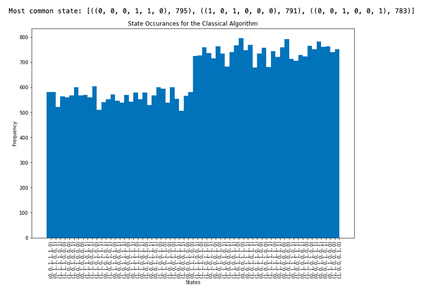
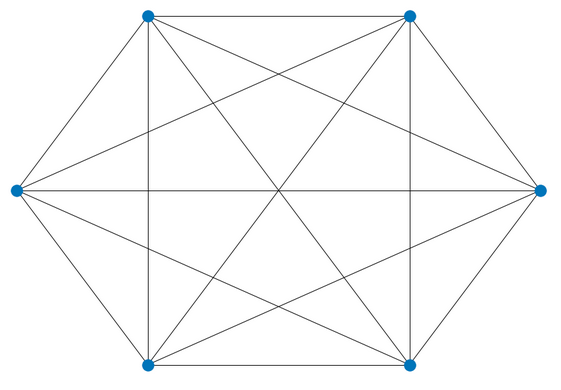
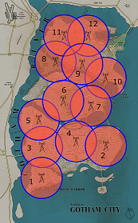
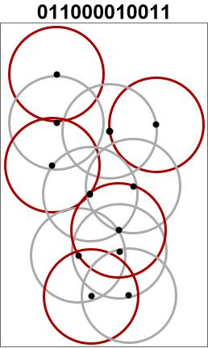
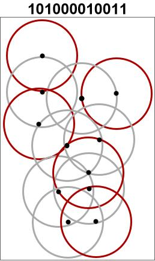

## Project 2: Optimization problems \& Rydberg atom arrays
Optimization is a crucial element used in solving problems across many different fields, 
from scientific to industrial applications, to generally boost performance and reduce risks.

Recent advances in both quantum hardware and algorithm development have made it possible to solve small problems on modern
quantum devices. In particular, quantum computing has potential to efficiently solve combinatorial optimization problems,
especially showing an advantage when dealing with NP-hard problems [1]. 

One of the quantum computing models which can solve combinatorial optimization problems
is the Adiabatic Quantum Optimization model (AQO). AQO refers to the use of the adiabatic 
theorem in quantum mechanics [2] to adiabatically (i.e. slowly) move towards the ground 
state of an interaction Hamiltonian onto which an optimization problem is mapped. 
As a result of the adiabatic theorem, the state of the system after the adiabatic evolution will be 
the ground state of the final Hamiltonian, i.e. the global minimum of the optimization problem mapped onto the 
final Hamiltonian.

In the following we address the solution of a well-known NP-hard problem, the Unit Disk Maximal Independent Set 
(UD-MIS). We first modified the provided Jupyter notebook for the solution of the problem with the classical 
simulated annealing. Further, we prepared two more notebooks: in the first we perform a quantum annealing 
simulation in Julia; the second provides a python implementation of quantum annealing which uses
the D-Wave Ocean SDK to compare the classical simulated annealing to the quantum simulator and finally 
perform the optimization on a real D-Wave quantum device.

## 1. The UD-MIS problem: 
In the MIS problem we consider a graph with a set of vertices, V, and a set of 
edges, E, G = (V,E), and we want to find out what is the maximal number of vertices 
which may be "colored" such that no two colored vertices are connected by an edge.

The UD-MIS is a special case of this problem in which we consider a graph in which
each vertex corresponds to the center of a unit circle and we connect these vertices
with an edge if and only if the corresponding circles intersect.

The problem of finding the MIS can be expressed as a quadratic unconstrained optimization problem,
which is also equivalent to an Ising hamiltonian

where the quadratic terms favours disjoint circles and the linear term makes sure
that we select as many circles as possible.

This problem can easily be mapped onto a Rydberg atom architecture as the hamiltonian
of this system is equivalent to the one shown in the UD-MIS problem.

In the following we present several solutions for the MIS problem, both from a
classical and a quantum standpoint.

### 1.1 Classical simulated annealing
The simulated (thermal) annealing is a heuristic optimization procedure which spans the solution 
space of a generic optimization problem by simulating the physical process of heating a material 
and then slowly lowering the temperature to decrease defects, thus minimizing the system energy.
Each transition in spanning the solution space is called anneal.

We compare two different classical algorithms implemented on Python - seen in ([this notebook](../Week2_Rydberg_Atoms/Task1_python.ipynb); in which we randomly simulate toward to ground state (solution) of the Hamiltonian. The random simulations are due to thermal fluctuations (compare to the quantum algorithm, in which the algorithm uses quantum fluctuations to determine randomly which 'spins' to flip in the Ising model). The two algorithms we implemented are the Metropolis-Hastings and Wolff algorithms. We also note that the classical algorithms were faster than the quantum algorithm- but that was more to do with the fact that the quantum algorithms were implemented in julia and we only had access to one thread (computer core). This [this link](https://towardsdatascience.com/the-great-csv-showdown-julia-vs-python-vs-r-aa77376fb96) shows how the speed of Julia compres to that of python when we make use of parellization (image below). 

For the classical algorithm, we first show a plot which explains our experimentation as N, the number of samples, increases. This obviously leads to a larger number of iterations. 

We compare these iterations to these, in which we begin with a larger inital temperature (by a factor of 10). As expected, this we require more iterations to reach the ground state. We can also see from the plot that by starting with a higher initial temperature, our MCMC algorithm traces out more of the sample space- which is expected since at a higher temperature we expect larger thermal fluctuations. 

We plot the results of the Metropolis-Hastings algorithms for different values of N. We notice that there is some degeneracy, which is why the solution (or most common state) is different for different values of N. 

After increasing the value of N by a factor of 10:

The results of the Wolff algorithm:

The wolff algorithm requires a larger number of iterations.

Finally, a picture of the fully connected 6 node graph by using Networkx (a python package):

### 1.2 Quantum annealing
Quantum annealing has been introduced in the 80s as a variation of the simulated thermal annealing
for solving NP-hard optimization problems. The main difference is that besides the thermal
excitations used in simulated annealing to span the solution space, the quantum annealing 
incorporates quantum transitions (tunneling), making it more efficient in converging towards the 
ground state of the system. Later it was proposed to actually use a quantum system to
implement the quantum annealing algorithm. The company D-Wave Systems was the first to build a 
prototype QA processor and to start the commercialization of these devices, using then quantum annealing algorithms 
on quantum hardware.

Besides the D-Wave systems, different quantum architectures have been used to 
implement quantum annealing. Recent developments in the quantum hardware with trapped neutral atoms 
showed that the latter can be a useful tool to implement adiabatic quantum computation [3] [4]. 

Rydberg atoms are atoms with highly excited electrons, far away from the nucleus (i.e. large principal quantum number). 
Compared with ground state atoms, they exhibit a very large electric dipole moment which facilitates strong interactions 
with macroscopic external fields. Thus, this makes Rydberg atoms easy to control with static electric or magnetic, 
laser, or microwave fields which is then ideal for implementing controllable quantum many-body simulators.

In particular, the Rydberg hamiltonian has the same functional form as the QUBO hamiltonian
used to solve the UD-MIS problem. Where the linear term is responsible for the interaction of each atom with the external field,
and the quadratic term is the interaction between two Rydberg atoms.

The concept of quantum annealing can then be applied to such a system to find the ground
state of an optimization problem that can be mapped to the hamiltonian of the Rydberg atom system.

The analysis we performed is based on the extension of the provided 
[Julia code](../Week2_Rydberg_Atoms/legacy_run_quantum_annealing.jl).

The starting point is the same graph as provided in the previous section:

In this code, the quadratic and linear terms of the interaction hamiltonian are defined time-dependent functions 
such that at the beginning (t=0) one has a free hamiltonian, while by increasing time steps
the hamiltonian adiabatically changes into the final interaction hamiltonian which maps the 
problem that we want to solve. 

Based on the adiabatic theorem, if the transition to the final interaction hamiltonian is adiabatic,
the initial state will remain in the ground state across the whole adiabatic transformation.
The ground state of the final interaction represents thus the minimum of the optimization problem
mapped onto the system.

By simulating a measurement of the final ground state a large amount of time, we obtained a
distribution of the results which shows that there are basically three degenerate solutions:

We selected one of the three solutions and we mapped it to a graph. In the space of the coordinates, 
the solution found is given by the graph below, where the blue circles correspond to the independent set
of vertices:

### 1.3 Benchmarking classical to quantum annealing

A direct comparison of the simulated and quantum annealing by means of the previous exercise is not
straightforward. In fact, there are several parameters/conditions that make the comparison arbitrary:
- the simulated solution strongly depends on the annealing schedule
- the simulated and the quantum annealing codes are written in different languages
- the D-Wave simulator (see next section) performance depends both on parameters and embedding of the problem  
- the real device implementation (see next section) has latency issues to connect to the cloud and retrieve the solution. 

However, the theoretical improvement of quantum annealing w.r.t. simulated annealing has been 
proven for a class of problems (see [5], where they analyzed quantum annealing in a version incorporating a transverse 
field Ising model, and showed that QA converges to optimality faster than SA in some cases).

Also more recent researches [6][7][8] have shown the benefits of quantum annealing and demonstrated 
a scaling advantage for a quantum annealer over simulated annealing. 

## 2. Ocean SDK: comparing simulation to a real quantum device
D-Wave Systems created a full-stack framework ([Leap2](https://www.dwavesys.com/take-leap)) to run quantum annealing algorithms on both simulators and real quantum devices. The access to their systems uses an API mechanism for which registration is required. As part of the CDL, all users should have got a license and can access the real quantum devices. 

For the simulation part, only requirement is the installation of the package [dwave-ocean-sdk](https://pypi.org/project/dwave-ocean-sdk/).
In [this notebook](./OceanSDK_implmentation.ipynb) we show how to build a graph for the UD-MIS problem and solve it by means of three different methods:
- simulated thermal annealing
- simulated quantum annealing
- quantum annealing on a real quantum device

The graph provided in the previous task is built with the [networkx package](https://networkx.org/). 
This is useful as the D-Wave library provides a wrapper to solve the MIS problem in this specific form.

The results from all implementation are equivalent. Note that also in this case we 
observed the problem intrinsic degeneracy, being the vertices 0, 3, and 5 equivalent (see figure below).

## 3. Gotham city and Bruce's stinginess

The City of Gotham is looking at putting in new cell phone towers. 
The possible locations of the cell phone towers are given in this figure:

The billionaire (but stingy) Bruce Wayne is funding the project, but he loves his money. 
Therefore, Gotham should only purchase the required number of cell phone towers such that:
1) The cell signals do not overlap. 
2) As much of Gotham city can be within cell signal range.

At first, we observed that this problem can be easily mapped to the UD-MIS  problem, which was discussed 
in the previous sections.

In fact, the mapping is straightforward if we consider each cell phone tower being a node V of a graph 
G(V,E), where the edges E are defined based on the condition that two nodes are closer than 1 (note that 
the provided Gotham's map is scaled such that the provided coordinates are normalized to the signal range). 

Thus, the condition that the two conditions of non-overlapping cell signal and maximization of coverage 
can be expressed as a MIS problem on the defined graph, i.e. we maximize the number of nodes 
(antennas) that are independent (non-overlapping signals). 

Similarly to the analysis performed in the previous sections, the UD-MIS problem can be solved for the Gotham's antennas graph by means of:
- simulated (thermal) annealing (see [Python notebook](../Week2_Rydberg_Atoms/Task3_python.ipynb))
- quantum annealing simulation (see [Julia notebook](../Week2_Rydberg_Atoms/Task_3_QAnnealing.ipynb))
- D-Wave quantum annealing solution (see [Python notebook](../Week2_Rydberg_Atoms/OceanSDK_implmentation_gotham.ipynb))

#### Simulated (thermal) annealing
# ELI/SAESUN: to fill in

#### Quantum simulated annealing
After running the quantum annealing simulator (10000 measurements) we obtain the following histogram:

As we observed in the previous sections, the solutions are represented by bitstrings, with each bit
corresponding to a node in the graph. For the Gotham city problem, a bit equal to 1 corresponds to an 
active antenna, whereas a bit equal to 0 represent an unnecessary antenna.

Thus, the most frequent bitstrings in the histogram correspond to the optimal solutions of the problem.
There is clearly a degeneracy of solutions which appear equally frequent in the histogram above.
Such solutions are shown in the figures below:
### WRONG FIGURES: PLACE THOSE WITH RADIUS=0.5

By calculating the energy of these two solutions we can see that they are effectively degenerate,
with a hamiltonian eigenvalue of -5.

We also wondered whether it is worth to pay for a few towers more to get a better coverage of Gotham city.
### I DO NOT THINK THAT THE PART BELOW CORRECTLY ANSWERS THE QUESTION. I SEE THAT ELI PERFORMED A COST-BENEFIT ANALYSIS OF THE PROBLEM IN PYTHON BY PROXYING THE SERVICE COVERAGE AREA WITH THE DENSITY OF THE GRAPH. WE SHOULD INCLUDE THIS. 

Since one of the conditions for solving the problem was that the tower signals should not overlap, 
Bruce Wayne should pay for a few towers more if he wants to make sure more of Gotham city has cell 
coverage. If he takes out the overlapping restriction then he may not need extra cell phone towers 
apart from the 12 towers but that is not an efficient case precisely because there is overlapping 
of signals. 

# DID ANYONE LOOK AT THE "FURTHER CHALLENGES"??
## Further Challenges:
* Comparing the methods used to solve the UD-MIS problem.
* Benchmarking other quantum and classical optimization methods to solve your UD-MIS problems.

## Business Applications
For more details refer to the [Business Application found here](./Business_Application.md)

## References

[1] Andrew Lucas, Ising formulations of many NP problems (2014)

[2] Albert  Messiah, Quantum  mechanics (1966)

[3] Serret et al,. Solving optimization problems with Rydberg analog quantum computers: 
Realistic requirements for quantum advantage using noisy simulation and classical benchmarks (2020).

[4] Browaeys and Lahaye, Many-body physics with individually controlled Rydberg atoms (2020).

[5] Kadowaki and Nishimori, Quantum annealing in the transverse Ising model (1989)

[6] Albash and Lidar, Demonstration of a Scaling Advantage for a Quantum Annealer over Simulated Annealing (2018)

[7] Venturelli and Kondratyev, Reverse Quantum Annealing Approach to Portfolio Optimization Problems (2018)

[8] Mugel et al, Dynamic Portfolio Optimization with Real Datasets Using Quantum Processors and Quantum-Inspired Tensor Networks (2020)

[9] https://en.wikipedia.org/wiki/Wolff_algorithm

[10] https://en.wikipedia.org/wiki/Dense_graph

