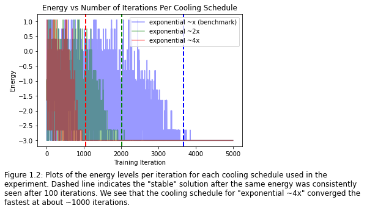

## Project 2: Optimization problems \& Rydberg atom arrays

In this project we are going to demonstrate the amazing power of classical and quantum annealers. Throughout a series of tasks we will demonstrate the existing annealing techniques to solving a variety of problems. Crucially, we will show a solution to the unit-disk maximum independent set (UD-MIS) problem using both a simulated classical annealer with different schedules and a quantum annealer. For the third task, we have also solved the Gotham City Cell Tower problem using both classical annealer and quantum annealer. Finally, we have mapped a real-world protein redundancy problem to the UD-MIS problem and found very promising results that will serve as a founding block for our business proposal. 

### Table of Contents  
1. [Simulating the unit-disk maximum independent set (UD-MIS) problem using classical simulated annealing](#toc1)
2. [Finding a better annealing schedule to arrive at solutions to the problem quicker](#toc2)
3. [Simulating the same problem but using quantum annealing](#toc3)
4. [Comparing the classical and quantum methods](#toc4)
5. [Solving a real-world problem involving cell phone tower placement in Gotham City](#toc5)
6. [Comparing the methods used to solve the UD-MIS problem]($toc6)

### Resources
- [Notebook for task 1](./Task1.ipynb)
- [Notebook for task 2](./Task%202.ipynb)
- [Notebook for task 3 (Gotham city) running on real quantum hardware](./Task%203,%20Additional-Challenges%20b,%20d-ak.ipynb)
- [Notebook for extra challenge: Finding the least redundant set of protein sequences](./real_world_protein_redundancy.ipynb)

## Simulating the unit-disk maximum independent set (UD-MIS) problem using classical simulated annealing

Please view [this notebook](./Task1.ipynb) for the code used to solve this section. 

We simulate the UD-MIS using classical simulated annealing for the following abstract graph (truncated to 2 decimal places):

| X Coordinate   | Y Coordinate |
| :------------- | :----------: |
|  0.35 | 1.50   |
| 0.63  | 2.58 |
| 1.39  | 2.16 |
| 0.66  | 0.67 |
| 0.87  | 3.39 |
| 1.16  | 1.08 |

We construct the graph by creating an edge whenever a node is closer than a unit distance of 1. This graph can be visualized like this:

Next we simulate annealing to solve the ground state of the following Hamiltonian:

$$
H = -\sum_{i \in V} n_i + u \sum_{i,j \in E} n_i n_j
$$

With the following annealing schedule: 
$T_i * (T_f/T_i)^(t/N)$

We find a ground state energy level of `-3` after about 4000 iterations. We plot in the following corresponding occupations in green which yield the ground state:

## Finding a better annealing schedule to arrive at solutions to the problem quicker

Please view [this notebook](./Task1.ipynb) for the code used to solve this section. 

We test 3 different annealing temperatures summarized by the following table: 

| Annealing Schedule   | Name |
| :------------- | :----------: |
| T_i * (T_f/T_i)^(t/N) | exponential ~x (benchmark)   |
| T_i * (T_f/T_i)^(2*t/N)  | exponential ~2x |
| T_i * (T_f/T_i)^(4*t/N)  | exponential ~4x |

Here is a visualization of the annealing schedules:

To test the speed of convergence, we consider a "stable" solution one where the energy has not changed after 100 iterations. After simulating the annealing for each schedule, we plot the energy versus the number iterations in the following table:

We see clearly that the `exponential ~4x` schedule converges the fastest, and is more than 3x faster than the benchmark provided in the sample code. These results are further summarized in the following table:

| Annealing Schedule   | Iterations to Stable Solution | Time to Stable Solution (seconds) | 
| :------------- | :----------: | :----------: |
| exponential ~x (benchmark) | 3676 | 0.61 |
| exponential ~2x  | 2007 | 0.34 |
| exponential ~4x  | 1044 | 0.17 |

## Simulating the same problem but using quantum annealing

## Comparing the classical and quantum methods

## Solving a real-world problem involving cell phone tower placement in Gotham City

## Comparing the methods used to solve the UD-MIS problem

       

Open up [instructions.pdf](https://github.com/CDL-Quantum/CohortProject_2021/tree/main/Week2_Rydberg_Atoms/instructions.pdf) to begin learning about your tasks for this week!

**Please edit this markdown file directly with links to your completed tasks and challenges.**

## Tasks include:
* (QUEUE) Simulating the unit-disk maximum independent set (UD-MIS) problem using classical simulated annealing.
* (QUEUE) Finding a better annealing schedule to arrive at solutions to the problem quicker.
* (QUEUE) Simulating the same problem but using quantum annealing.
* (QUEUE) Comparing the classical and quantum methods.
* (QUEUE) Solving a real-world problem involving cell phone tower placement in Gotham City.

## Further Challenges:
* (QUEUE) Comparing the methods used to solve the UD-MIS problem.
* Benchmarking other quantum and classical optimization methods to solve your UD-MIS problems.
* Demonstrating how other problems can be mapped to UD-MIS and solving said problems.
* Solving the problem with real quantum hardware.

## Business Application
For each week, your team is asked to complete a Business Application. Questions you will be asked are:

* Explain to a layperson the technical problem you solved in this exercise.
* Explain or provide examples of the types of real-world problems this solution can solve.
* Identify at least one potential customer for this solution - ie: a business who has this problem and would consider paying to have this problem solved.
* Prepare a 90 second video explaining the value proposition of your innovation to this potential customer in non-technical language.

For more details refer to the [Business Application found here](./Business_Application.md)
