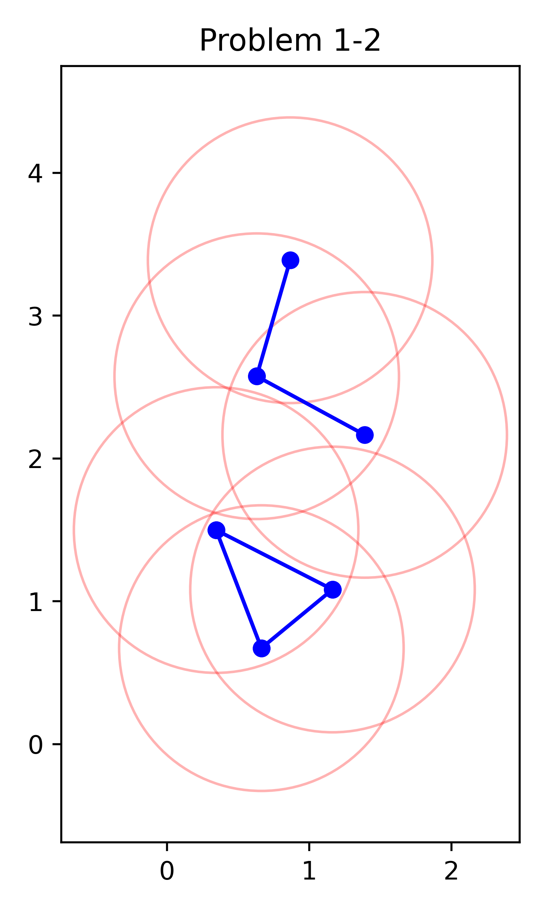
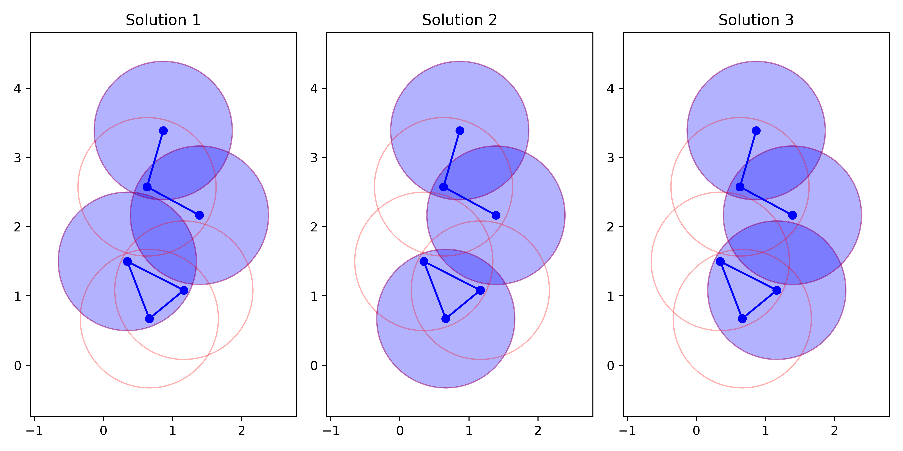
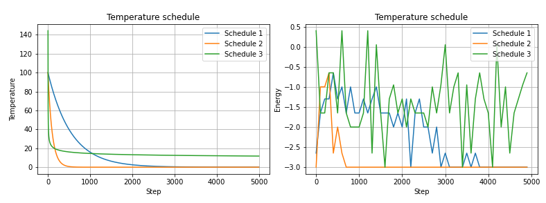
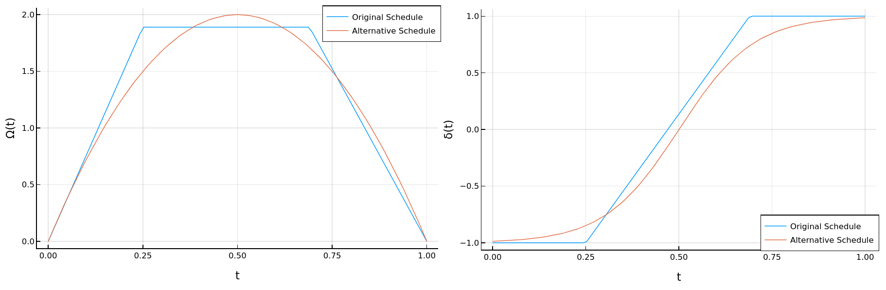
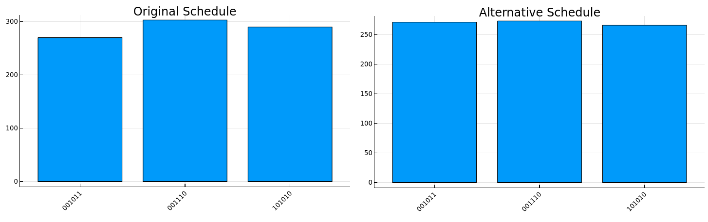
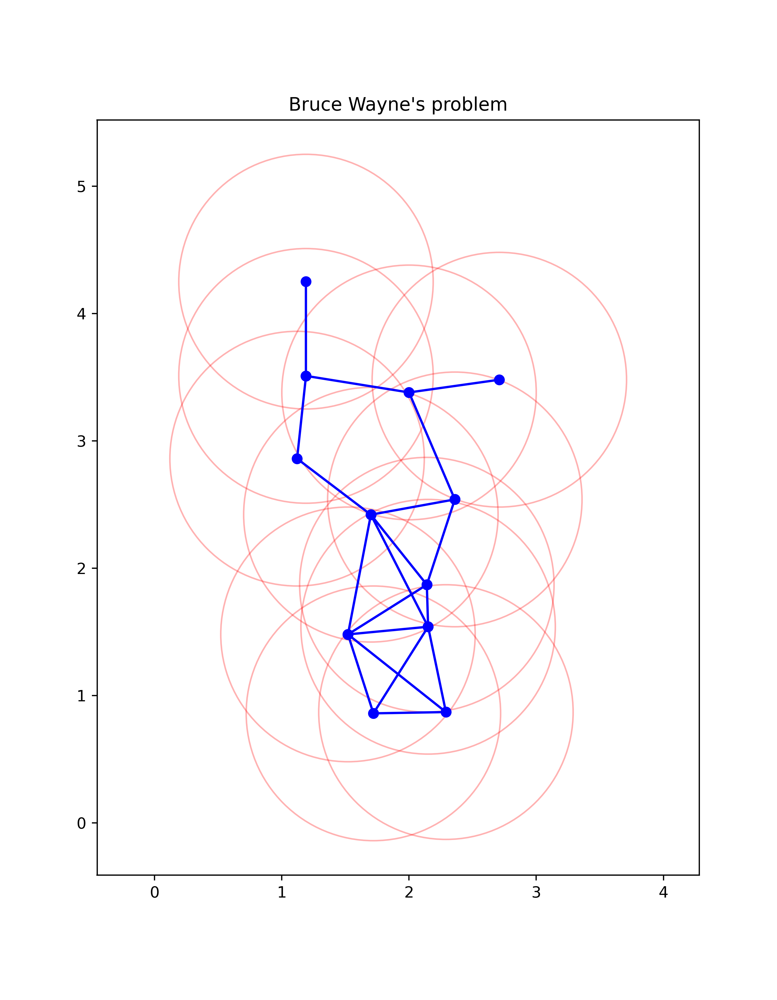
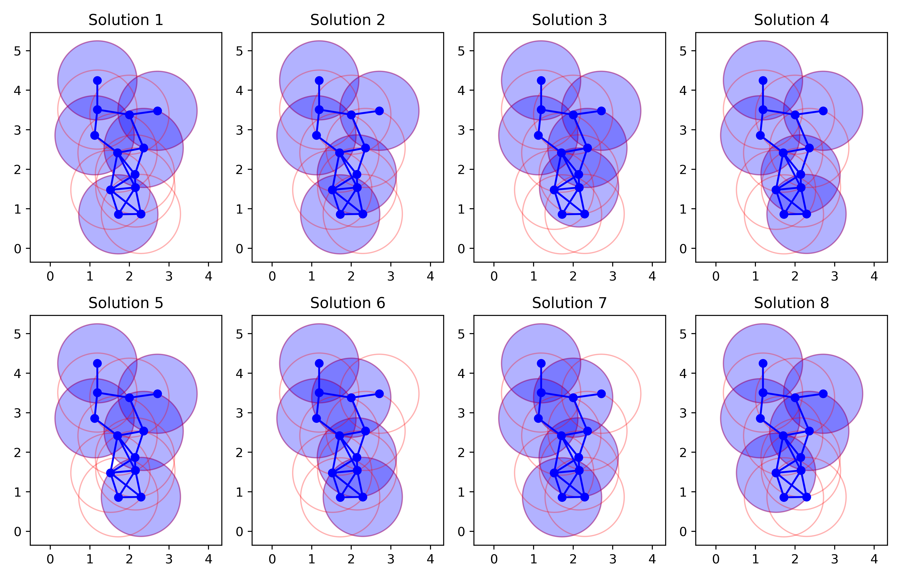
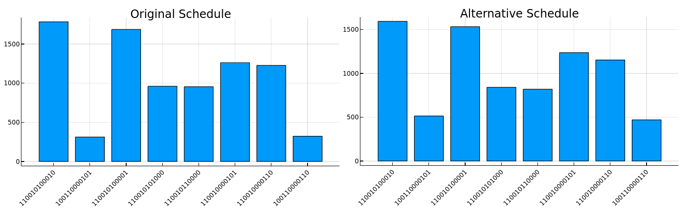

## Project 2: Optimization problems \& Rydberg atom arrays

## Solving  the Problems 1-2 using Classical and Quantum Brute Force

The graph corresponding to the unit-disk maximum independent set (UD-MIS) for this problem is:

Given its small size, we begin by solving the problem using classical and quantum brute-force ([UD-MIS_Problem-Brute_force.ipynb](Team_6/UD-MIS_Problem-Brute_force.ipynb)). For the classical case, we have computed all possible outcomes and evaluated the cost function. Then, the solutions are the configurations with the lower cost.   
For the quantum version, we built the Hamiltonian asossiated to the 
cost function, and calculated its eigenvalues and eigenvectors. The solutions are codified in the eigenvectors of the ground state eigenspace. In order to extract the solutions, we computed , were $k$ is the degeneracy index.

The quantum and classical sets of solutions are the same and, if one is looking for the least overlaping disks solution, the second is the winner!  

### Simulating Annealing

We have tested three annealing schedules ([ej1.py](ej1.py)) and compared their computational costs of convergence.

In this case, the second annealing scheme yields the best results. 

### Quantum Annealing
For the quantum annealing, we proposed smoother time dependent controls ([run_quantum_annealing.ipynb](Team_6/run_quantum_annealing.ipynb)) and tested their performance.

We ran 1000 samples for both sets of controls, and contructed the histogram dropping out the 
configurations with less than $counts=samples/10$

In this case, the number of samples chosen was enough to obtain all the solutions.

### Solving  Bruce Wayne's problem

In this problem we begun by plotting the graph

Given its size, we use the same sequence of techniques to solve it.
First, the brute force solutions ([UD-MIS_Problem-Brute_force.ipynb](Team_6/UD-MIS_Problem-Brute_force.ipynb)):

We repeated the different schedules for the classical annealing ([ej3.py](ej3.py)) and the best results were obtained with the second scheme. 

For the quantum annealing, we tried by runing 10000 samples for each scheme ([run_quantum_annealing.ipynb](Team_6/run_quantum_annealing.ipynb)), and the new controls  for the annealing show an advantange with regard to the previous version. We contructed the histograms  by dropping out the configurations with less than $counts=samples/40$. From the histograms, its clear that the smoothed versions of the controls increase the number of counts for the right configurations. 

From the data obtained we can conclude that in cases were it is not possible to apply brute force methods, it is easier to  find all the problem's solutions using quantum annealing than Montecarlo simulations. For all cases, we found that it is crucial to evaluate the cost function in order to validate its performance.
