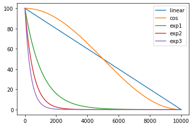
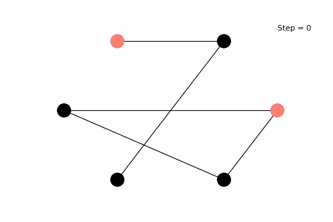
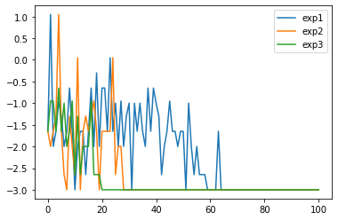
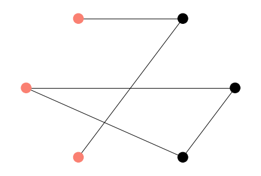
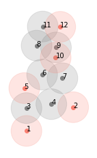
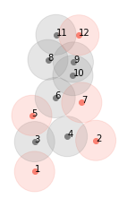

# Project 2: Optimization problems & Rydberg atom arrays

## Task 1:

The code used to solve this task can be found in [this](../src/Task1.ipynb) Jupyter notebook.

The goal of this task is through simualted annealing solve an instance of a UD-MIS problem. For this we: 

  * Generate and evaluate different interpolation functions for the annealing schedule. 
  * Simulate the annealing for those interpolations.
  * Output the animation of the annealing to show the convergence to the right solution.
  * Output the convergence to the minimal energy for three different interpolation methods.
 
Results:

**Interpolation functions**

**Animation of the annealing convergence for exponential interpolation and 10000 steps**

**Convergence to the minimal energy for three different exponential interpolation funcitons**

## Task 2:

The code used to solve this task can be found in [this](../src/Task2.ipynb) Jupyter notebook.

The goal of this task is to execute the previous exercise now with the simulation of a quantum annealing process.

  * We run the quantum annealing simulation by executing the Julia program.
  * Read the sampled output strings and find the most frequent one.
  * Reverse the string and plot it on top of our previous graph.

Result:

**Quantum annealing solution**

## Task 3: 

The code used to solve this task can be found in [this](../src/Task3.ipynb) Jupyter notebook.

### 3.1 Explain why this problem can be easily mapped to the UD-MIS problem. 

If we look at the towers as nodes of a graph and their overlap as an edge between nodes we can easily map this problem to the UD-MIS one. We want to use the maximum number of towers such that they don't overlap, and therefore this translates into finding the maximum indepdendent set of this graph.

### 3.2 Solve the problem with the two previous methods

In order to do this task we update the graph with our new coordinates, run the simulation and plot the result:

**Simulated annealing**

**Quantum annealing**

We observe that there are multiple solutions with the activation of 5 towers.

### 3.3 Should Bruce pay for a few more cell phones towers to make sure that more of Gotham City has cell phone service?

Using the current location of the possible towers it won't be possible to purchase an extra tower without causing some signal overlap. The only way for Bruce to provide some extra signal would be to change the location of the towers to a more efficient map.
