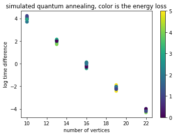
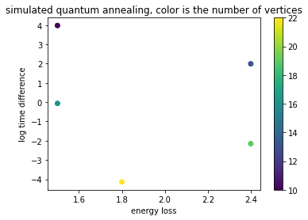

The implementation of a single graph for quantum annealing on dwave for both simulated and on real hardware can be found on the following notebook

The benchmarking notebook can be found here

The MIS problem was implemented to run on D-wave libraries, including Dwave simulation and Dwave hardware. The two were compared against the brute force solver in terms of energy loss (e.g. the difference between the optimal number of towers found by the brute force algorithm and the number of tower found by the implementation to be benchmarked). The space of performance was explored as a function of the number of vertices on a sample of random graphs following the distribution of random unit disk graph of density 1 (see above for definition of distribution).

While the MIS problem was solved for tiy graphs on dwave hardware, the lack of budget on Dwave forbid us to run the benchmark on the hardware, but the section can just get uncommented to start benchmarking on it. Therefore the below on benchmarks the quantum annealing simulator.

The below plots shows the log time difference as a function of the number of vertices, the color is the energy loss. It is a scatter plot for all samples.

The below plots shows the average log time difference as a function of the average energy loss, the color is the number of vertices. It is averaged over all samples

Overall we saw an exponential decrease of the time gain against brute force wrt the number of vertices, while the average energy loss stays between 1 and 2. **Overall Quantum shows an advantage for finding quickly good suboptimal solutions.**