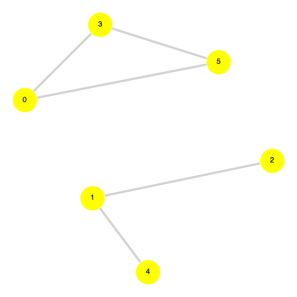
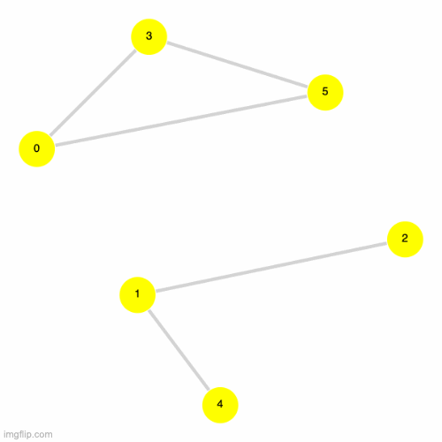
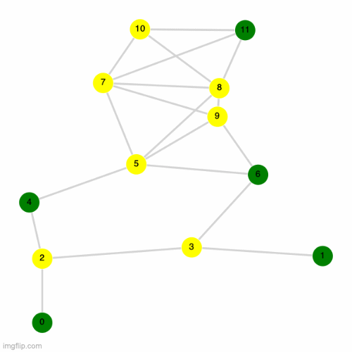

# Simulating the same problem but using quantum annealing

Please view [this notebook](./Task%202.ipynb) for the code used to solve this section. 

We simulate the UD-MIS using simulated quantum annealing for the following abstract graph (truncated to 2 decimal places). Edges are created whenever a node is closer than a unit distance of 1.This graph will look a bit different from the one used in the previous section because we are using a different programming language ([Julia](https://julialang.org/)) and because we use a different plotting package([GraphPlots.jl](https://juliagraphs.org/GraphPlot.jl/)).

|Table Representation of Graph | Visual Representation of Graph|
| :--------------: | :---------: 
| <table>   <thead>   <tr> <th>X Coordinate</th>  <th>Y Coordinate</th>  </tr>   </thead>   <tbody>   <tr>  <td>0.35</td>  <td>1.50</td> </tr> <tr>  <td>0.63</td>  <td>2.58</td> </tr> <tr>  <td>1.39</td>  <td>2.16</td> </tr> <tr>  <td>0.66</td>  <td>0.67</td> </tr> <tr>  <td>0.87</td>  <td>3.39</td> </tr> <tr>  <td>1.16</td>  <td>1.08</td> </tr> </tbody> </table> | 

In the instructions we were tasked with applying quantum annealing to solve the UD-MIS problem. Our approach will be different from the classical annealing as we will be considering a time-dependent Hamiltonian:

Mathematically and algorithmically, Quantum Annealing looks like the following
$\ket{\psi(t)} =& U(t) U(t - \delta t) \cdots U(t_0 + \delta t) U(t_0) \ket{\psi (t = t_0)}$
where $U(t)$ is the time-evolution operator
$U(t) =& \exp(-\frac{i}{\hbar} \delta t \hat{H}(t))$

We can see the top five solutions and their frequency on the following graph. Additonally you can look at the [file with all the available solutions](./task2_data.dat)

|Solutions | Solutions on the Graph|
| :--------------: | :---------: 
| <table>   <thead>   <tr> <th>Solution</th>  <th>Frequency</th>  </tr>   </thead>   <tbody>   <tr>  <td>010101</td>  <td>28581</td> </tr> <tr>  <td>011100</td>  <td>28457</td> </tr> <tr>  <td>110100</td>  <td>28204</td> </tr> <tr>  <td>111100</td>  <td>3052</td> </tr> <tr>  <td>011101</td>  <td>2953</td> </tr> </tbody> </table> | 

