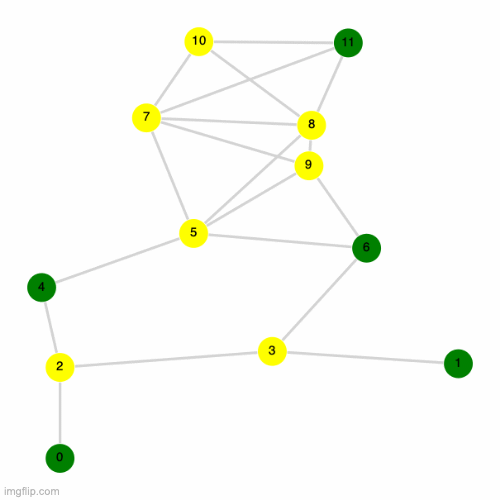

# Simulating the same problem but using quantum annealing

Please view [this notebook](./Task%202.ipynb) for the code used to solve this section. 

We simulate the UD-MIS using simulated quantum annealing for the following abstract graph (truncated to 2 decimal places). Edges are created whenever a node is closer than a unit distance of 1.This graph will look a bit different from the one used in the previous section because we are using a different programming language ([Julia](https://julialang.org/)) and because we use a different plotting package([GraphPlots.jl](https://juliagraphs.org/GraphPlot.jl/)).

|Table Representation of Graph | Visual Representation of Graph|
| :--------------: | :---------: 
| <table>   <thead>   <tr> <th>X Coordinate</th>  <th>Y Coordinate</th>  </tr>   </thead>   <tbody>   <tr>  <td>0.35</td>  <td>1.50</td> </tr> <tr>  <td>0.63</td>  <td>2.58</td> </tr> <tr>  <td>1.39</td>  <td>2.16</td> </tr> <tr>  <td>0.66</td>  <td>0.67</td> </tr> <tr>  <td>0.87</td>  <td>3.39</td> </tr> <tr>  <td>1.16</td>  <td>1.08</td> </tr> </tbody> </table> | 

