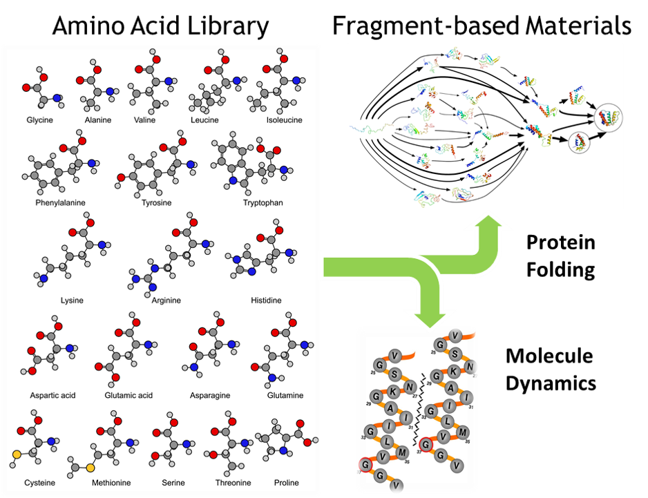
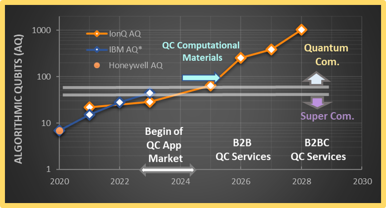
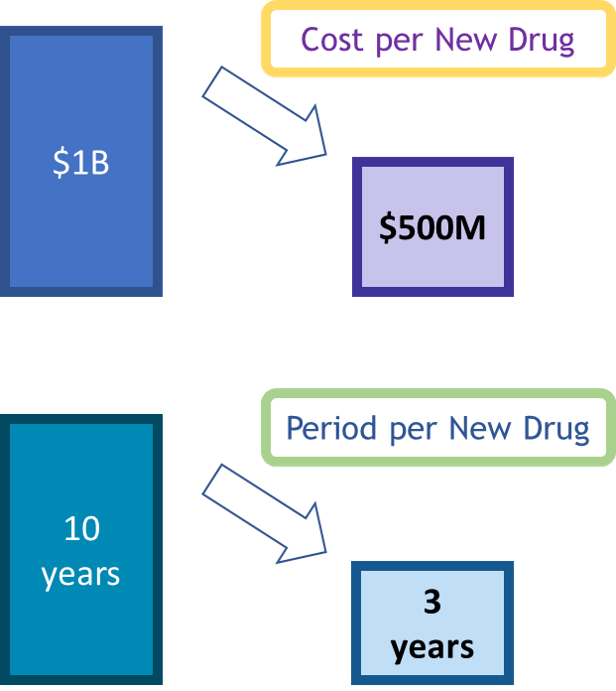

# Quantum Cohort Project Business Application

For each weekly project, your team is asked to complete the below business application exercise.
To complement the technical tasks, please consdier the four questions below.
You are free to format your response to these four questions as you wish (with the final question done as a short recorded video), and to include
the content (or links to the content) on your forked repository.

A brief example for each question is included for the 
[Traveling Salesman Problem.](https://en.wikipedia.org/wiki/Travelling_salesman_problem)

## Technical problem in Material and Drug Design

Finding electronic structure of a molecule requires a huge computing resource that scales up exponentially with the size of the molecule, as electron-electron coupling is effective even with non-occupied virtual orbital states. 

With the current computing capacity of supercomputers, it is known that accurate analysis of molecule by ab-initio with full quantum modeling is limited to the molecule size of caffein and benzene which requires about 30 orbitals to model. 

For larger modulecules, or excited state molecule, accurate electronic structure analysis is not attainable with current super computing. 

In drug design and discovery, strands of protein, RNA, and DNA are much bigger than the size of modelcules that can be accurately understood. 

## Examples of the types of real-world problems with Drug Design

In biochemistry, bio-molecules are modeled to understood the molecule dynamics such as material stability, adsoprtion, docking, folding, and so on. In order to achieve such modeling,one has to have information about the electronic structure of molecule. These problems are often challenged with DFT (density funcation theory) which approximates the model with no electron-electron interaction of the seond quatization, or by FCI (full interaction configuration) which can exactly solve the electronic structure but requiring too large computation capacity.  

Modeling a long strand of protein or RNA may not be attained to understand the dynamics with full quantum interaction, requiring effective approximation that still includes the quantum nature of the interation within molecule. A good approach can be the fragment-based modeling where amino acids are used like Lego blocks to form a larger molecule. Here we can model the Lego block - amino acids - with high precision with quantum simulation modeling called variational quantum eigensolver (VQE). The molecule dynamics can be found by the meta level informatics of bio materials, such as with lignad based modeling.    

The library of amino acids for fragment-based modeling for drug design, or for the FBDD (fragment-based drug design), can be accurately evaluated in a not-so-far future, as predicted by qubit technology roadmaps disclosed by the major quantum computer makers such as IBM and Ion Q as shown below:

 

## Potential customer for this solution 

Potential customers can be quite broadly identified in the pharmaceutical industry, such as AstraZeneca, Pfizer, Hanmi, and so on. Their potential cost savings can be as large as $170M a year as we presentedin the attached video clip. 

## Video explaining the value proposition of your innovation to this potential customer in non-technical language

**Please store your video externally to the repo, and provide a link e.g. to Google Drive**
