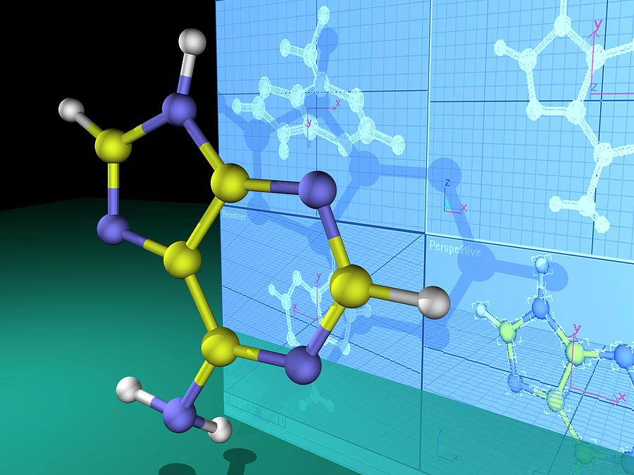
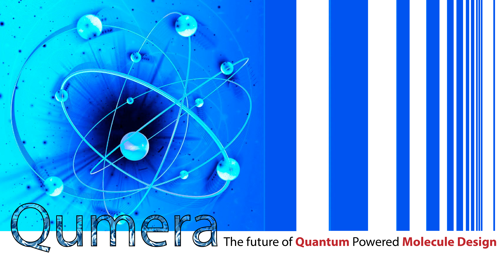
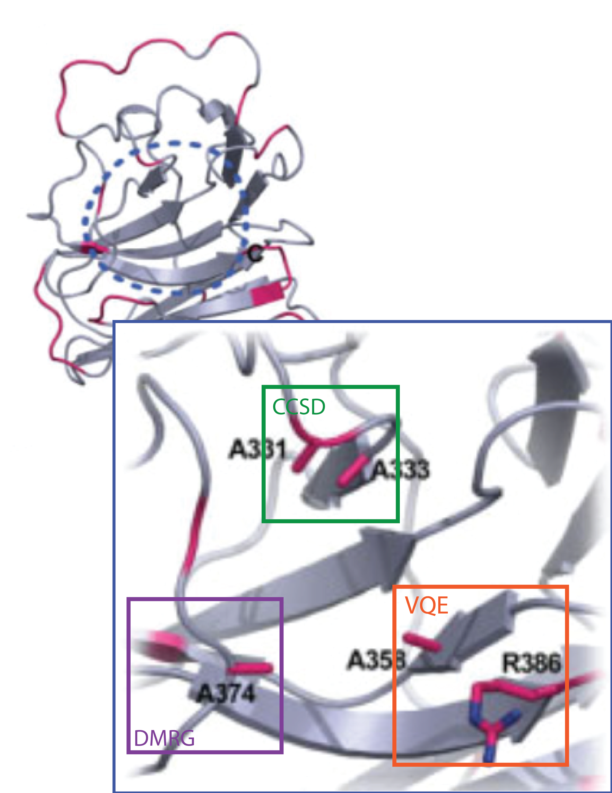
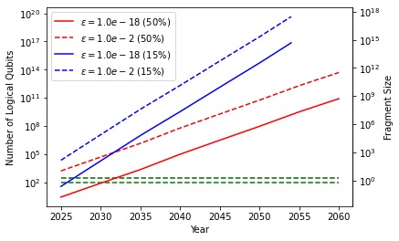
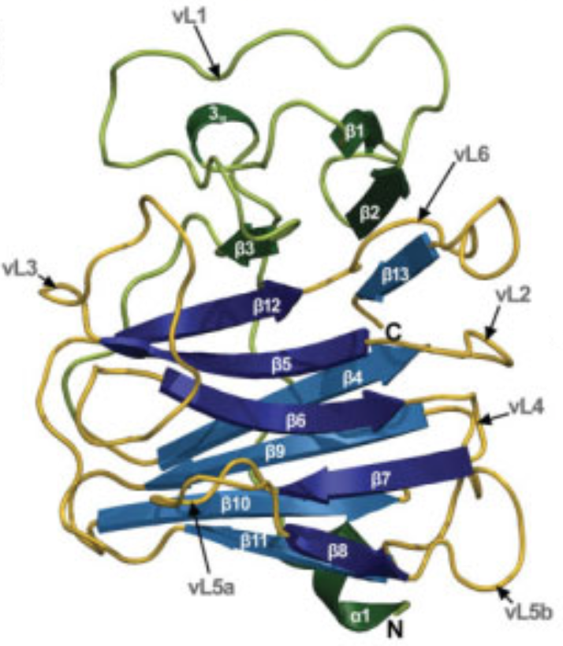
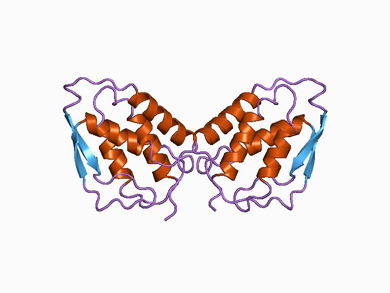
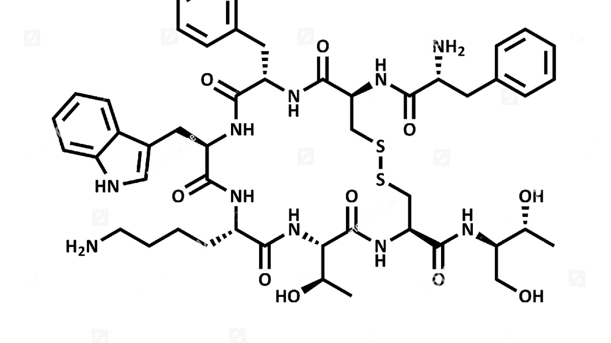

# Quantum Cohort Project Business Application - Protein Molecule Design & Simulation 

# Preamble
<table  align="center">
    <tr>
        <td>
            
        </td>
        <td>
            
        </td>
    </tr>
</table>
 
Computer simulation has been routinely used to accelerate the materials-design process and innovation. Accurately predicting the chemical properties of a molecule at the quantum level is important for new materials design. Classical hardware is computationally intensive to obtain this information due to the exponential scale of resources required with the size of the problem. Accurate materials simulation has been limited to relatively small molecules. The goal of computational chemistry is to scale materials simulation to the size of molecules relevant to industry without compromising accuracy [1].

(Ab initio) Electronic structure calculations aim to numerically solve the Schrodinger equation for a system with only the basic description as the fundamental input and without requiring any adjustable parameters. Some popular electronic structure methods such as Density Function Theory (DFT), Hartree–Fock (HF), Quantum Monte Carlo, coupled cluster, multireference configuration interaction, DMRG, etc. have been remarkably successful in analysing molecules and materials of interest. Typically these methods can be organized into categories of accuracy and cost. Depending on the property of concern and the accuracy/cost tradeoff a method may be chosen [2]. For most cutting edge applications in industry such as drug discvery or material design, accuracy is of keen interest. However, traditional methods inadvertently run into a resource roadblock of an exponential scale that even the most powerful classical supercomputers cannot hope to surmount.

Quantum computers are expected to simulate the quantum mechanical correlations of subatomic particles and accurately solve the electronic structure calculation problem using exponentially fewer resources than traditional methods. More efficient representations of the underlying physics is expected due to the shared quantum nature of programmable qubits and the systems being simulated. Performing electronic structure calculations is one of the most promising applications for near-term quantum computing devices. Hybrid classical-quantum algorithms have been developed such as the variational quantum eigenslover (VQE) and quantum machine learning techniques for electronic structure calculations. Many experiments have been conducted on quantum computers to show that electronic structure calculations of simple molecules are possible on current Noisy Intermediate-Scale Quantum (NISQ) devices [3].

**Molecular properties that can be obtained using VQE for the purpose of rational material and drug design are:** calculations of molecular spectral properties like photodissociation rates and absorption bands that rely on knowledge of the excited state energies of the molecule of interest. Protocols based on the variational quantum eigensolver (VQE) are promising candidates to calculate such energies on NISQ computers [4]. VQE, in its initial conception, allows one to simulate the ground state energy of a given molecule. It has since been extended to simulate many other molecular properties on a quantum computer, including thermal properties, excited state energies and transition amplitudes [5]. Accurately predicting the response properties of molecules, such as dynamic polarizability and hyperpolarizability, using quantum mechanics has been a long-standing challenge with widespread applications in material and drug design [6]. 

**Systems which are challenging for classical computing and whose modelling is valuable are:** performing quantum chemistry calculations for transition metals, organic molecules and exploring bond-breaking/formation are the ultimate goals of quantum chemistry and material science. The expectation is that the use of quantum computers will solve the huge computational cost hindering progress. 

**Businesses that can benefit from more accurate electronic structure calculations are:** computer-aided design in materials and life sciences of molecules and solids such as crystals. These are extremely important for a sustainable future based on accurate prediction of chemical reactions, such as the catalytic reaction of organometallic compounds in advanced materials innovation, enzymatic reactions in life sciences, and the electrochemical reactions implemented in next-generation batteries [7]. Electronic structure simulations are valuable to:

* cut development time for chemicals: the global chemicals market is expected to grow from $3340.32 billion in 2020 to $3728.43 billion in 2021 at a compound annual growth rate (CAGR) of 11.6% [8].

* cut development time for pharmaceuticals: the global pharmaceuticals market reached a value of nearly $1,217.1 billion in 2019, having increased at a compound annual growth rate (CAGR) of 6.7% since 2015. The market is expected to reach $2,050.9 billion in 2025, and $3,206.3 billion in 2030 [9].

* develop new materials for the renewable energy sector: the global renewable energy market was valued at $928.0 Billion in 2017, and is expected to reach $1,512.3 Billion by 2025 [10]. Researchers are in the hunt for more energy-efficient materials in batteries or solar panels [11]. Proton Exchange Membrane or PEM Fuel Cells are considered to be the most versatile type of fuel cells. Current electronic structure calculations focus on developing novel acidic groups and ionomer backbones for the next generation of PEM fuel cells, which should help guide synthetic investigations. As computational power increases, the systems studied via electronic structure calculations become more realistic and innovative, and even provide greater insight into the mechanisms of proton dissociation and transport in PEM systems [12]. 

* to personalized medicine: the global medicine personalized market is expected to grow by a CAGR of 11% between 2020 and 2025 and worth USD 717 billion by 2026 [13]. There are applications in personalized medicine predicting how pharmaceuticals would affect individuals based on their genetic makeup. The long-term vision is the ability to design a drug for a particular individual to maximize treatment and minimize side effects [14].

* cut fertilizer cost: the global fertilizer market was valued at US$155.8 billion in 2019, and it is expected to register a CAGR of 3.8% during the forecast period (2019-2024). About two percent of the world’s energy supply goes toward fertilizer production, which is known to be grossly inefficient and could be improved by sophisticated chemical analysis [15].

* others: the interaction of molecules with surfaces is of great technological and fundamental relevance for e.g. heterogeneous catalysis, growth of semiconductor devices, corrosion, and wear protection [16]. Innovations in quantum computing technology is expected open doors to novel types of materials such as high temperature superconductors, topolgical materials etc. set to revolutionize the world. 

# Business Pitch

**Introduction:** 
Computational chemistry has a rich and long tradition in providing insights into properties of molecules. Classical simulations have been hugely successful in this regard and a host of methods have been developed to address problems of varying scales with different accuracies. Indeed, accuracy is the watchword for most industrial applications as it means that experimental studies can be limited to only a smaller range of studies of enumerations (structural or otherwise). This inadvertenly leads to reduced costs and development time. Tackling problems of the future, therefore, requires novel strategies that can overcome the resource hurdles needed for convential methods that scale poorly with system sizes or accuracy requirements. Quantum computing is set to address this problem at an unprecedented scale. 

**The problem:** It is almost impossible for today’s computers to simulate molecules that are industrially relevant with sufficient accuracy. Scientists are therefore required to actually create the molecules in question (using synthetic chemistry) to physically measure their properties. Unfortunately, molecule synthesis is mostly trial and error and is, thus, fraught with difficulties. Each optimization cycle is expensive and time-consuming. This is one reason why developing new drugs and chemicals is such a lengthy process [17]. The mean average drug development time is 6.7 and median 5.6 years [18]. After accounting for the costs of failed trials, the median capitalized research and development investment to bring a new drug to market was estimated at $985.3 million (95% CI, $683.6 million-$1228.9 million), and the mean investment was estimated at $1335.9 million (95% CI, $1042.5 million-$1637.5 million). Median estimates by therapeutic area (for areas with ≥5 drugs) ranged from $765.9 million (95% CI, $323.0 million-$1473.5 million) for nervous system agents to $2771.6 million (95% CI, $2051.8 million-$5366.2 million) for antineoplastic and immunomodulating agents [19]. 

**The solution:** Qumera’s platform enables the pharma industry to respond to the increased pressure from patients, governments and regulators to lower drug prices and implement drug performance based remuneration mechanisms [20, 21]. There are 20 naturally-occurring amino acids, which can be linked in any order and can fold into an astronomical number of potential structures [22]. Qumera’s platform evaluates possible structures and calculates their relevant properties that are of practical significance. By simulating and designing protein molecules we cut development costs and increase profit margin for the industry. In the clean energy sector our protein based catalyst molecules could increase performance of solar cells that would help achieve climate change targets by lowering CO2 emissions.

At Qumera we know that the best performance in a domain like protein molecule design can be attained through fundamental machine learning research and the development of novel domain-specific algorithms. We use a variety of propreitory deep learning technologies to augment our computations and data library. Our exceptional performance is driven by approaches leveraging quantum computing inspired algorithms such as tensor networks and topological data analysis (TDA) both of which have a proven track record in pharma and material design. In the near-term we employ advanced embedding strategies that use hybrid quantum-classical approaches such as the variational quantum eigensolver (VQE) to accelerate our computation and obtain bleeding-edge accuracies. Our pipelines are designed for turn-key transition into powerful full-quantum architectures as industrial advancements continue in this emerging field. 

**The current state:** The state-of-the-art computations with hybrid solvers use embedding frameworks (EFs) like DMET to augment computations. These strategies have been used to study bond-breaking and bond-forming in molecular systems and have demonstrated significant reduction in qubit requirements. EFs essentially split the problem into constituent manageable fragments. Each fragment is solved using powerful high accuracy methods while treating the remaining environment at a low accuracy but computationally inexpensive way. The entire system is then solved self-consistently using some convergence criteria (for e.g. in DMET the single-particle density matrix is used). These strategies have been used to study large industrially relevant systems such as octane, decane and dodecane, and have demonstrated a 70% reduction in qubit requirement [23]. 
Simulation of a 12-electron problem of a chain of 12 hydrogen atoms using 12 qubits sets the record in terms of the largest number of qubits used for a chemistry simulation. In this study Hartree–Fock was used which considers electron correlation only at the mean field level. Over 2000 qubits are needed for the quantum simulation of a typical, industrially relevant organometallic material [23]. For smaller molecules like BeH2, HF, H2O, NH3, and CH4, 38 to 68 qubits are needed for the cc-pVDZ basis set. Whereas the exact amount of required resources is algorithm and application dependent, current research has shown a factor of 10 reduction in resources while still maintaing the requisite accuracy [24]. As far as we know, protein molecules using quantum hardware have not yet been simulated.

Fig. 1  Embedding Framework for chemistry simulation [23].

**Business Model:** We develop novel hybrid algorithms and methods for the design and testing of protein molecules on our hybrid computing powered platform. We license our algorithms and methods on performance royalty basis - we get a premium when our protein molecules deliver more benefits to clients and get a license fee discount when the molecule performance is lower than agreed benchmark. 

**Verticals:** At Qumera we focus on applications in pharma and clean energy: 

<table  align="center">
    <tr>
        <td>
            
        </td>
        <td>
            
        </td>
    </tr>
</table>

* **Pharma - new peptide drugs:** Most approved drugs are either bulky proteins or small molecules. Naturally occurring peptides, that are constrained or stabilized so that they precisely complement their biological target, are intermediate in size. They are are among the most potent pharmacological compounds and have the advantages of both proteins and small molecule drugs. Our protein designs aim at small and stable proteins that bind strongly to pathogenic proteins or serve as test probes in working out the detailed molecular chemistry of the immune system.

* **Pharma - personalized targeted therapeutic delivery:** We design at the atomic level protein nanoparticles that self-assemble from one or two synthetic protein building blocks. They are designed to carry a drug or other therapeutic on their surface. Our protein designs enable improved targeting of drugs and other therapies and an improved ability to bond therapeutic packages tightly to a target cell wall. Our designs allow for a personalized therapeutic delivery as they take into account the genetic makeup of individuals.

* **Pharma - vaccines for viral diseases:** In addition to drug delivery, self-assembling synthetic protein nanoparticles are used as vaccines. Our designs have improved thermal stability and eliminate the need for complicated cold chain storage systems, increasing access to life saving vaccines. The ability to design with atomic level accuracy enables a systematic study of how immune systems recognize and defend against pathogens.

* **Pharma and clean energy - catalysts:** Protein enzymes are the most efficient catalysts, far more so than any synthesized by inorganic chemists. Applications include: enzymes converting carbon dioxide from the atmosphere into organic molecules, such as fuels, more efficiently than any inorganic catalyst, enabling a carbon-neutral source of fuels. Synthetic proteins neutralize toxic amyloids found in Alzheimer’s disease. 

* **Clean energy - new super strong materials:** A potentially very useful new class of materials is that formed by hybrids of organic and inorganic matter. One naturally occurring example is abalone shell, which is made up of a combination of calcium carbonate bonded with proteins that results in a uniquely tough material. Other protein designs create an interlocking pattern to form a surface only one molecule thick for new anti-corrosion films or novel organic solar cells.

# Global molecular modelling market 

Molecular modelling encompasses all methods, theoretical and computational, used to model or mimic the behaviour of molecules. The methods are used in the fields of computational chemistry, drug design, computational biology and materials science to study molecular systems ranging from small chemical systems to large biological molecules and material assemblies [25]. Molecular modelling methods are now used routinely to investigate the structure, dynamics, surface properties, and thermodynamics of inorganic, biological, and polymeric systems. The types of biological activity that have been investigated using molecular modelling include protein folding, enzyme catalysis, protein stability, conformational changes associated with biomolecular function, and molecular recognition of proteins, DNA, and membrane complexes. The molecular modelling market is expected to witness market growth at a rate of 14.43% in the forecast period of 2021 to 2028 and is expected to reach USD 7,2 billion by 2028 [26].

# Product Roadmap and Platform Strategy

At Qumera we focus on simulation/design of recombinant protein drugs with high selectivity and low toxicity, reduction of protein design complexity and discovery of novel protein features. We target some of the most common death causes worldwide - ischaemic heart disease, chronic obstructive pulmonary disease and lung cancer, and leverage direct insulin manufacturing and corporate management experience for our design of the third product. 
                                 
The global recombinant therapeutic antibodies and proteins market size was valued at US$ 91.2 billion in 2017, and is expected to witness a robust CAGR of 12.2% over the forecast period (2018 – 2026) [27]. Recombinant protein, a genetic engineering and cell engineering technology, has become one of the most important areas of biotechnology inspired production. Generalized recombinant protein drugs can be divided into: recombinant protein, recombinant monoclonal antibody, and recombinant vaccine. Recombinant protein drugs (RPDs) are subject to higher pricing due to higher technical and financial barriers. The recombinant protein is more difficult to replicate than small molecule chemicals. Unlike small molecule chemicals, even if the same gene is expressed in the same cell and uses a similar processing method, it is stil very difficult to guarantee the replication of the original recombinant drug, potentially creating a wider moat for the product. 
         
The area of applicability of RPDs are vast, targeted at major diseases areas, such as cancer, viral diseases, cardiovascular diseases and endocrine diseases. Additionally, the RPD market has a large extension space and relatively few approved competitive drugs are difficult to substitute in their respective therapeutic areas. The vast majority of RPDs are human proteins or their mutants to compensate for some of the functional proteins in vivo defects or increase the body’s protein function. Thus, RPDs have significantly greater safety than small molecules and lead to a higher approval rate. At the same time, their clinical trial period is shorter than their small molecule counterparts and patent protection is relatively extended, which gives the pharmaceutical company longer exclusive sales time. These characteristics have become an important motion for the development of recombinant protein drugs [28].
                                 
Our platform is designed to address the challenges posed by the the inherent complexity associated with these molecules and takes into consideration the restrictions imposed by current classical and quantum hardware. The pipeline we follow aims to leverage the best of classical, quantum inspired, and (eventually) fully quantum algorithms and hardware to obtain state-of-the-art computations that can be refined as hardware restrictions are alleviated. This is achieved by considering molecular design as a combination of fragement problems similar to the idea used in embedding theories like DMET. By identifying key components of the the molecule in question we can solve relavant pieces with high accuracy while "freezing" out degrees of freedom that are less relevant. As the state of quantum hardware improves we can tackle fragement pieces of larger sizes enabling computations of ever increasing accuracy. As we have discussed, the mantra of industrial drug design is: accuracy implies efficiency, which, in turn, implies reduced costs. 

<table align="center">
<tr>
    <td  align="center">
         
    </td>
    <td  align="center">
        
    </td>
</tr>
<tr>
    <td align="center"> (a) </td>
    <td align="center"> (b) </td>
</tr>
<tr>
    <td colspan = 2>
    Fig. 2: (a) TRIM 72 and zoomed cluster known to be relevant for protein-protein interaction. The cluster can be partitioned into fragments, each of which can be simulated with powerful methods that address different requirements. (b) Projected number of logical qubits at different confidence range with different error thresholds for underlying physical qubits. Also shown is the size of fragments using transitional metals as a baseline of complexity at the ccpv5z level. (See text.)
    </td>
</tr>
</table>

As an example, consider our first product involving the human TRIM 72 or MG 53 protein which a spectacular candidate to address ischaemic heart disease, which, according to the WHO [29], is the world’s biggest killer, responsible for 16% of the world’s total deaths. Since 2000, the largest increase in deaths has been due to this disease, rising by more than 2 million to 8.9 million deaths in 2019. It is worth noting that the next two products that we focus on address chronic obstructive pulmonary disease and lung cancer that are the 3rd and 6th leading causes of death. Diabetes is placed 9th. As shown in the Fig. 2a we exploit clusters that are known to be of relevance to protein-protein interactions. For a particular type of functionality, we treat everything outside of the cluster as frozen. Inside a cluster we can split the problem into fragments and utilize different tools to compute the quantities of interest such as charge density, ground state energy. Embedding frameworks like DMET allow approximate but accurate ways of aggregating quantities from different fragments. For instance particularly challenging fragments could be computed using VQE, whereas easier fragments could use Coupled Cluster or DMRG. The latter being useful for situations where strong correlation effects become important. 

Fig. 2b has been constructed using data from [30][https://arxiv.org/abs/2009.05045], where we essentially plot the expected number of qubits as a function of time at the 50% and 15% confidence range for qubit error thresholds of 0.01 (essentially no error correction) and 1.0e-18 (fully error corrected). Also shown in green dashes is number of qubits needed to compute the properties of a transition metal atom using ccpvdz (lower dashes) and ccpv5z (upper dashes) basis sets. 

Transition metal complexes are an approximate way to guess the size of computationally challenging fragments. To get an approximate size of fragments we use transition metals as a baseline at the ccpv5z level and "guess-timate" the associated timeline. This is at best a lower bound estimate since for multi-atom fragments the details of the two-body interaction terms will become relevant and will dictate the depth of the ciruit. Together with gate fidelity we can then get a full sense of the actual timeline of the size of fragments that can be accessed via quantum hardware.

## Products
With our first three products we target the number one, three, six and nine death causes worldwide and leverage human insulin production and corporate management expertise to save people's lives:

<table align="center">
    <tr >
        <td> <b>Product</b> </td>
        <td> <b>Target disease</b> </td>
        <td> <b>Current therapy</b></td>
        <td> <b>Molecule</b></td>
    </tr>
    <tr>
        <td>P1</td>
        <td>Ischaemic heart disease</td>
        <td>MG53 [31, 32] (tripartite motif, TRIM72)*</td>
        <td></td>
    </tr>
    <tr>
        <td>P2</td>
        <td>Chronic Obstructive Pulmonary Disease; Cancer or cancer chemotherapy-induced infection prevention and treatment</td>        
        <td>Granulocyte/monocyte colony stimulating factor GM-CSF elicits antitumor immunity [33, 34, 35, 36]</td>
        <td></td>
    </tr>
    <tr>
        <td>P3</td>
        <td>Diabetes</td>        
        <td>Human insulin</td>
        <td></td>
    </tr>    
</table>

# Competitors and competitive advantage

**Key players**

<table align="center">
    <tr >
        <td> <b>Company name</b> </td>
        <td> <b>Headquarter</b> </td>
        <td> <b>Profit in USD</b></td>
    </tr>
    <tr>
        <td>Thermo Fisher Scientific Company</td>
        <td>USA</td>
        <td>32 billion</td>
    </tr>
    <tr>
        <td>Certara</td>
        <td>USA</td>        
        <td>243 million</td>
    </tr>
    <tr>
        <td>Schrodinger</td>
        <td>USA</td>        
        <td>85 million</td>
     </tr>    
    </tr>
    <tr>
        <td>1QBit</td>
        <td>Canada</td>        
        <td>N/A</td>
     </tr>          
</table>

**The market:** people and governments expect the pharma industry to reduce prices, increase price transparency and efficacy of drugs. Although Qumera is a hybrid computing powered platform for molecule design of recombinant proteins our clients operate in attractive markets such as the personalized medicine market, valued at USD 717 billion that offers new opportunities in meeting clients needs with targeted and individualized treatment with low side effects provided, and the recombinant therapeutic antibodies and proteins market valued at US$ 91.2 billion in 2017. Hence, the demand side for our molecule designs is strong and they are highly needed. Our vision is to become the R&D partner for pharma and clean energy molecule design solutions.

**Value proposition:** our platform shortens discovery time, increases efficacy of protein molecules across verticals such as pharma and clean energy with a combined market size of USD 2.3 trillion. Our innovative business model based on performance reflects end user’s needs and guarantees efficacy of molecules. 

**Our advantage:** agile, scalable platform focused solely on molecule simulation and design of recombinant proteins using hybrid machine learning and topological data analysis algorithms and methods across relevant verticals. Qumera’s biggest strength is its highly skilled team of PhDs, cleantech, (quantum) machine learning engineers and architecture design experts with combined academia, pharma corporate management, climate change/cleantech and corporate consulting experience of 30 years.

# Potential customers

<table align="center">
    <tr >
        <td> <b>Company Name</b> </td>
        <td> <b>Revenue in USD billions</b> </td>
        <td> <b>Country</b></td>
    </tr>
    <tr>
        <td>Johnson & Johnson</td>
        <td>82.06</td>
        <td>USA</td>
    </tr>
    <tr>
        <td>Hoffmann-La Roche</td>
        <td>63.85</td>        
        <td>Switzerland</td>
    </tr>
    <tr>
        <td>Pfizer</td>
        <td>51.75</td>        
        <td>USA</td>
    </tr>    
</table>

# Conclusion
Qumera purports to leverage current NISQ devices to deploy VQE in embedding frameworks together with quantum inspired algorithms and machine learning to calculate industry-relevant properties of recombinant protein molecules. These techniques have already been applied successfully to small molecules such as hydrogen, water and others, with a clear path forward in terms of scaling up as hardware resources become available. We shorten discovery time, increase efficacy of protein molecules across verticals such as pharma and clean energy with a combined market value of USD 2.3 trillion. Our innovative business model based on performance reflects end user’s needs and guarantees efficacy of molecules with a flexible licensing and usage scenarios. Our advantage lies in agile and scalable platform highly tuned to address recombinant proteins using novel cutting edge techniques. Our world-leading team combines expertise from over 30 years in HPC, academia and corporate management in pharama and cleantech. We envision ourselves as the ideal R&D partner for pharma and clean energy players.

**Video presentation can be found [here](https://drive.google.com/file/d/1qslnaYl8sLPVOlai8Xm5geItKLJX9dKy/view?usp=sharing)**

# References
[1] [Microsoft and 1QBit Collaborate to Disrupt Materials Innovation with the 1QBit OpenQEMIST Platform and the Microsoft Quantum Development Kit](https://1qbit.com/news/microsoft-1qbit-collaborate-disrupt-materials-innovation-1qbit-openqemist-platform-microsoft-quantum-development-kit/). Accessed July 23, 2021.

[2] [Electronic Structure Calculation - an overview | ScienceDirect Topics](https://1qbit.com/news/microsoft-1qbit-collaborate-disrupt-materials-innovation-1qbit-openqemist-platform-microsoft-quantum-development-kit/). Accessed July 23, 2021.

[3] [Rongxin Xia, 2020. Quantum Computation For Electronic Structure Calculations, PhD thesis](https://hammer.purdue.edu/articles/thesis/Quantum_Computation_For_Electronic_Structure_Calculations/13302965). 

[4] [Yordan S. Yordanov det al, 2021. Molecular excited state VQE simulations with iteratively constructed qubit-excitation-based ansätze. Quantum Physics (quant-ph)](https://arxiv.org/abs/2106.06296). 

[5] [Nathan D Earnest, 2021, ACS Spring 2021, IBM. Simulating molecular properties on noisy quantum processors](https://research.ibm.com/publications/simulating-molecular-properties-on-noisy-quantum-processors). IBM Research Publications

[6] [Xiaoxia Cai et al, 2020. Quantum computation of molecular response properties](https://journals.aps.org/prresearch/pdf/10.1103/PhysRevResearch.2.033324) 

[7] [Yukio Kawashima et al. 2021. Efficient and Accurate Electronic Structure Simulation Demonstrated on a Trapped-Ion Quantum Computer](https://15ghc9mhpvs48me3o4drqanw-wpengine.netdna-ssl.com/wp-content/uploads/2021/02/1QBit-Research-Paper-Efficient-and-Accurate-Electronic-Structure-Simulation-Demonstrated-on-a-Trapped-Ion-Quantum-Computer.pdf). 

[8] [Global Chemicals Market Report 2021](https://markets.businessinsider.com/news/stocks/global-chemicals-market-report-2021-long-term-forecast-to-2025-and-2030-featuring-sinopec-basf-bayer-dow-chemical-lyondellbasell-industries-1030390439#:~:text=Major%20companies%20in%20the%20chemicals%20market%20include%20China,a%20compound%20annual%20growth%20rate%20%28CAGR%29%20of%2011.6%25). Accessed July 22, 2021.

[9] [Global Pharmaceuticals Market Report](https://www.thebusinessresearchcompany.com/press-release/global-pharmaceuticals-market-opportunities). Accessed July 22, 2021.

[10] [Renewable Energy Market](https://www.alliedmarketresearch.com/renewable-energy-market). Accessed July 22, 2021.

[11] [How Quantum Computing is Enabling Breakthroughs in Chemistry](https://singularityhub.com/2018/11/15/how-quantum-computing-is-enabling-breakthroughs-in-chemistry/). Accessed July 22, 2021.

[12] [Electronic Structure Calculation - an overview | ScienceDirect Topics](https://www.sciencedirect.com/topics/materials-science/electronic-structure-calculation). Accessed July 22, 2021.

[13] [Personalized Medicine Market](https://www.marketdataforecast.com/market-reports/personalized-medicine-market). Accessed July 22, 2021.

[14] [How Quantum Computing is Enabling Breakthroughs in Chemistry](https://singularityhub.com/2018/11/15/how-quantum-computing-is-enabling-breakthroughs-in-chemistry/). Accessed July 22, 2021.

[15] [The worldwide fertilizer market](https://www.worldfertilizer.com/environment/21032019/the-worldwide-fertilizer-market-to-2024/). Accessed July 22, 2021.

[16] [Sergei Manzhos 1, Tucker Carrington Jr. 2020. Neural Network Potential Energy Surfaces for Small Molecules and Reactions](https://pubmed.ncbi.nlm.nih.gov/33021368/)

[17] [A game plan for quantum computing | McKinsey. 2020](https://www.mckinsey.com/business-functions/mckinsey-digital/our-insights/a-game-plan-for-quantum-computing#). Accessed July 21 2021.

[18] [DEVELOPMENT TIMELINES - Drug Development Times, What it Takes - Part 1](https://drug-dev.com/development-timelines-drug-development-times-what-it-takes-part-1/). Accessed July 21 2021.

[19] [Olivier J. Wouters, et al. 2020. Estimated Research and Development Investment Needed to Bring a New Medicine to Market, 2009-2018](https://jamanetwork.com/journals/jama/article-abstract/2762311). Accesed July 22, 2021.

[20] [The Biggest Pain Points in Pharmaceuticals and How to Treat Them](https://info.dicksondata.com/blog/the-biggest-pain-points-of-modern-medicine-and-how-to-treat-them), Accessed July 21 2021.

[21] [Pharma outlook 2030: From evolution to revolution. KPMG. 2017](https://assets.kpmg/content/dam/kpmg/xx/pdf/2017/02/pharma-outlook-2030-from-evolution-to-revolution.pdf)

[22] [Unleashing the Power of Synthetic Proteins — The Future Postponed](http://www.futurepostponed.org/blog/syntheticproteins). Accessed July 21 2021.

[23] [Takeshi Y. et al, 2021. Towards the Practical Application of Near-Term Quantum Computers in Quantum Chemistry Simulations: A Problem Decomposition Approach](https://export.arxiv.org/pdf/1806.01305v1).

[24] [Kawashima, Y.et al, 2021. Efficient and Accurate Electronic Structure Simulation Demonstrated on a Trapped-Ion Quantum Computer](https://15ghc9mhpvs48me3o4drqanw-wpengine.netdna-ssl.com/wp-content/uploads/2021/02/1QBit-Research-Paper-Efficient-and-Accurate-Electronic-Structure-Simulation-Demonstrated-on-a-Trapped-Ion-Quantum-Computer.pdf)

[25] [Global Molecular Modelling Market](https://www.marketwatch.com/press-release/global-molecular-modelling-market-share-2025-segmentation-size-and-analysis-by-latest-trends-business-development-growth-prospects-and-forecast-to-2025-2021-07-19). Accessed July 21 2021.

[26] [Molecular Modelling Market](https://www.databridgemarketresearch.com/reports/global-molecular-modelling-market/) Accessed July 21 2021.

[27] [Recombinant Therapeutic Antibodies and Proteins Market](https://www.coherentmarketinsights.com/market-insight/recombinant-therapeutic-antibodies-and-proteins-market-1981). Accessed July 23 2021.

[28] [Market and R&D Analysis of Recombinant Protein Drugs – Creative Biomart Blog](https://www.creativebiomart.net/blog/market-and-rd-analysis-of-recombinant-protein-drugs/). Accessed July 23 2021.

[29] [The top 10 causes of death](https://www.who.int/news-room/fact-sheets/detail/the-top-10-causes-of-death). Accessed July 2,1 2021.[Market and R&D Analysis of Recombinant Protein Drugs](https://www.creativebiomart.net/blog/market-and-rd-analysis-of-recombinant-protein-drugs/). Accessed July 23 2021.

[30]  [Sevilla, C. J,,  Riedel, J, 2020. Forecasting timelines of quantum computing](https://arxiv.org/abs/2009.05045)

[31] [Liu, J. et al. 2015 Cardioprotection of recombinant human MG53 protein in a porcine model of ischemia and reperfusion injury](https://pubmed.ncbi.nlm.nih.gov/25533937/)

[32] [Zhang, Y. et al. Molecular Pharmacology September 2017, 92 (3) 211-218; DOI: MG53: Biological Function and Potential as a Therapeutic Target](https://molpharm.aspetjournals.org/content/92/3/211)

[33] [Wan-Lun Yan et al. 2017. Recent progress in GM-CSF-based cancer immunotherapy](https://pubmed.ncbi.nlm.nih.gov/28303764/)

[34] [Ohashi, K., et al. 2012. Direct evidence that GM-CSF inhalation improves lung clearance in pulmonary alveolar proteinosis](https://pubmed.ncbi.nlm.nih.gov/22112784/)

[35] [Qiu, Y., et al. 2020. Efficacy of early combination of local radiotherapy and GM-CSF for advanced non-small cell lung cancer treated with icotinib](https://pubmed.ncbi.nlm.nih.gov/31797203/)

[36] [Mitra, A. et al. 2018. Association of Elevated Serum GM-CSF, IFN- γ, IL-4, and TNF- α Concentration with Tobacco Smoke Induced Chronic Obstructive Pulmonary Disease in a South Indian Population](https://pubmed.ncbi.nlm.nih.gov/30155241/)

