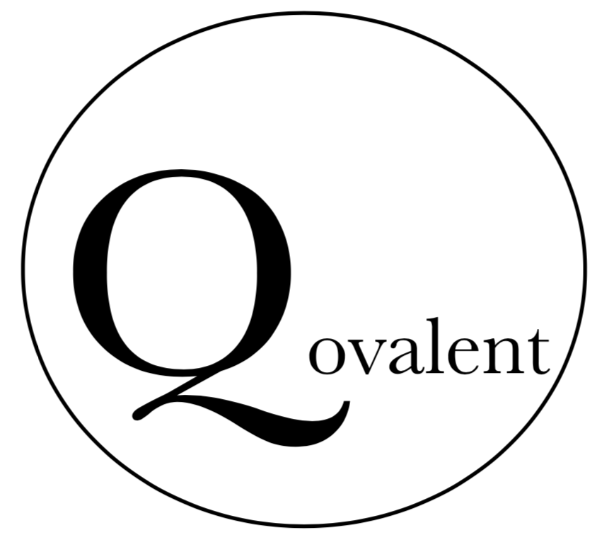
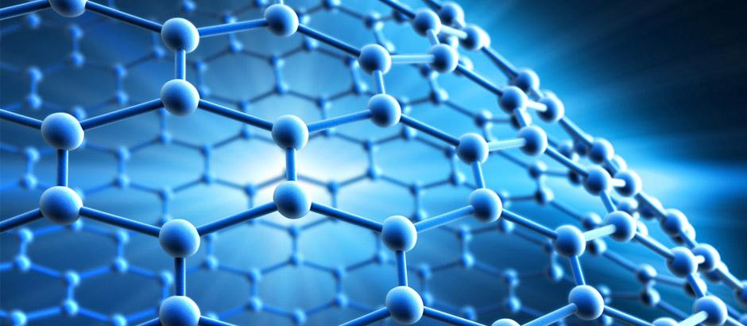
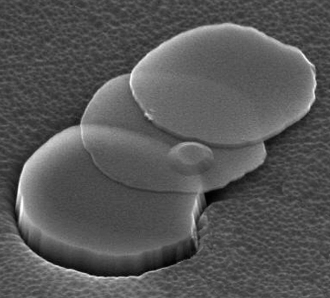
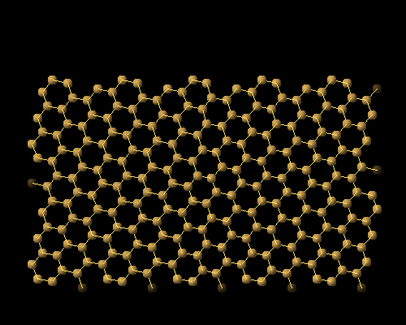
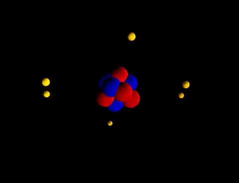

# Business Application: Nanomaterials and Variational Quantum Eigensolver

  
 

  
# Introduction to Qovalent
Qovalent specializes in obtaining potential energy surface (PESs) for small molecules. Predicting electronic structure has become a vital component of modern materials and chemical science research and development portfolios. Electronic structure simulation can greatly accelerate the identification, characterization, and optimization of materials. We are able to simulate the electronic structure using Variational Quantum Eigensolver (VQE) explore the properties of structures composed of atoms. Unlike classical methods, we are able to solve electronic structure problem for several chemical bonds between atoms or molecules such as N2 and C6. Our technology is able to treat strongly correlated system with chemical accuracy. 

  
 

 <a href="https://www.leonardocompany.com/en/news-and-stories-detail/-/detail/grafene-revolution">Source</a>
  

## Preamble
Nano-sized particles exist in nature and can be created from a variety of products such as carbon or minerals like silver. Invisible particles that fight cancer cells, faster microprocessors that consume less energy, batteries that last 10 times longer or solar panels that yield twice as much energy. These are just some of the many applications of nanomaterials, a discipline with all the ingredients to turn into the next industrial revolution. [[2]](<https://www.iberdrola.com/innovation/nanotechnology-applications>)

Among various nanomaterials research, study of chemically modified graphene has become a new step in the developing field of 2D carbon nanomaterials. Graphite is basically graphene layered upon itself, waiting for someone to separate it out. This is where it gets tricky. (Illustration below shows flakes of graphite in a scanning electron micrograph, may measure only 10 nanometers in thickness and yet contain multiple layers of graphene*). Graphene actually is one-atom-thick carbon material. It is created from a single element, carbon, formed by just one type of bond. In graphene, each carbon atom is covalently bonded to three other carbon atoms [[3]](<https://www.graphene-info.com/graphene-structure-and-shape>)

  
  <a href="https://www.americanscientist.org/article/mass-producing-graphene">*Source</a>
 
 

Conventional methods such as coupled cluster can achieve chemical accuracy if there is a single chemical bond or there are two electrons with one nucleus. However, if the system has more than a single bond or there are a large number of electrons, coupled cluster method cannot achieve chemical accuracy. For such a strong correlated system, our technique which is based on VQE is able to tackle the problem. 

  
  <a href="https://www.americanscientist.org/article/mass-producing-graphene">Source</a>
 
 

There are many different types of graphene, and all of them are good in their own way—some of the higher-layered numbers (but less than 10) are cheaper and are better as an additive, whilst single-layer graphene is more useful for electronics [[6]](<https://nano-magazine.com/news/2019/4/13/why-are-there-challenges-with-graphene-manufacturing>). Currently, we are far away from the mass production and commercialization of single layer graphene [[7]](<https://www.azonano.com/article.aspx?ArticleID=5613>). 

## Challenges with graphene manufacturing

There are two main methods to produce the graphene commercially [[8]](<https://www.frontiersin.org/articles/10.3389/fnsys.2019.00026/full>):
1. Exfoliation Methods: This is often seen as a lower-quality type of graphene; however, it is much cheaper, can be produced in much greater quantities and is still suitable as an additive in various types of composites/products. (sheets <10 μm)
2. Chemical Vapour Deposition (CVD): This method creates a single layer of graphene on a substrate. Whilst this is arguably the ‘highest-quality’ graphene because it is a single-layer, it is also generally more expensive and can (currently) only be produced in smaller amounts. 

To overcome the manufacturing challenges, we need to find a catalyst that can be used to produce graphene faster, cheaper, more efficient and in higher quality. A catalyst which leads to flawless graphene sheet. To this end, we should have comprehensive understanding of chaotic and brief event of molecular interactions happening during the formation of graphene. Classical methods do not always allow researcher to observe the ultra-fast reactions that facilitate the correct changes to a material’s atomic structure. Finding exact solutions to such problems numerically has a computational cost that scales exponentially with the size of the system. These limitations of classical computational methods have made solving even few-atom electronic-structure problems interesting for implementation using medium-sized quantum computers. Our technology overcomes difficulties by using quantum computing methods based on VQE. Our technique is able to obtain and illustrate potential energy surface for systems with more than two chemical bonds and a large number of electrons while it can achieve chemical accuracy for all points of PES. 

  
  <a href="https://www.youtube.com/watch?v=c9rj5rEXSMw">Source</a>
 
 

## Business pitch

Nanotechnologies are being spoken of as the driving force behind a new industrial revolution. Global Nanotechnology market is expected to reach US$ 290.93 billion by the year 2028 at the steady CAGR of 18.3% [[10]](<https://www.globenewswire.com/en/news-release/2021/05/18/2231845/0/en/Nanotechnology-Market-Size-to-Reach-USD-290-93-Billion-in-2028-Advancements-in-Technology-and-Rising-Investment-in-Research-Development-by-Market-Players-is-Driving-Industry-Growth.html>). Nanomaterials is projected to grow at a 13% CAGR to reach US$107.4 billion by the end of 2027 [[11]](<https://www.globenewswire.com/news-release/2020/07/16/2062964/0/en/Global-Nanotechnology-Industry.html>). Qovalent helps its business partners to significantly reduce manufacturing costs and time by providing accurate electronic structure using VQE. Qovalent paves the way for its business partners to commercialize the graphene across several industries. Our technology could speed up searches for PES of a system of 1500 atoms from 1 month (43,200 minutes by using 2500 cores and classical methods) to as little as 43 minutes [[12]](<https://www.technologyreview.com/2017/01/24/154396/can-a-powerful-new-quantum-computer-convince-the-skeptics/>). Although graphene has substantial impact on several sectors such as biomedical, composite and coating, electronic, energy and sensors, we only focus on the impact of graphene on electronic industry. 

## Graphene and Electronic Industry Overview

Graphene has the potential to create the next-generation of electronics currently limited to science fiction. Faster transistors; semiconductors; bendable phones and other electronics [[13]](<https://www.graphene.manchester.ac.uk/learn/applications/electronics/>). It can be used to make the circuitry for our computers, making them incredibly faster.

Moreover, graphene's unique properties of thinness and conductivity have led to global research into its applications as a semiconductor. At just one atom thick and with the ability to conduct electricity at room temperature, graphene semiconductors could replace existing technology for computer chips. 

  
  <a href="https://www.graphene.manchester.ac.uk/learn/applications/electronics/">Source</a>
 
 

Research has already shown that graphene chips are much faster than existing ones made from silicon [[15]](<https://www.graphene.manchester.ac.uk/learn/applications/electronics/>). Although silicon is the primary material used in the semiconductor industry, however, performance improvements are raising the cost of silicon technology, as are slowing performance improvements, while miniaturization is reaching the limits of this material [[16]](<https://www.graphenea.com/blogs/graphene-news/mckinsey-estimates-a-70-billion-market-for-graphene-semiconductors-in-2030>). (McKinsey estimates a $70 billion market for graphene semiconductors in – Graphenea). In contrast, graphene as a 2D material, has several potentials for future generation of electronics beyond silicon. A most tricking advantage is its thickness of just one atom or one molecule which in itself provides advantages over silicon. Studies show that market size for graphene semiconductors could reach $70 billion by 2030. 

The graphene industry is flourishing. Global funding for graphene research and development has reached $ 2.4 billion [[17]](<https://www.physics.manchester.ac.uk/research/impact/graphene-first-wonder-material-products-hit-the-market/>).Public graphene companies reach almost $2 billion in market value. Market research shows that the only graphene composite market was valued at $ 13.1 million in 2019 and is projected to reach $ 109.4 million by 2027 growing at a CAGR of 37.5% from 2020 to 2027[[18]](<https://www.businesswire.com/news/home/20210615005910/en/13.1-Million-Graphene-Composites-Global-Market-to-2027---Opportunity-Analysis-and-Industry-Forecasts---ResearchAndMarkets.com>).

## Graphene Demand
Graphene demand is driven by several factors, and market studies show that its applications in electronics industry is the main driven factor. High mechanical strength, superior thermal conductivity and high electron mobility are some of the properties of graphene that are driving the demand for graphene in the electronics end-use industry [[19]](<https://www.acsmaterial.com/blog-detail/graphene-and-its-application-in-electronics.html>). For instance, graphene can be used as a coating to improve current touch screen for phones and tablets. It can be used to make transparent flexible memory that could one day be used in bendable smartphones, wearable medical diagnostic devices and television screen [[20]](<https://www.businesswire.com/news/home/20210330005652/en/Global-Graphene-Market-2020-to-2025---Increasing-Demand-for-Graphene-from-Energy-Storage-Applications-in-China---ResearchAndMarkets.com>). Additionally, rising demand for printed electronics is likely to boost the market demand [[21]](<https://www.mordorintelligence.com/industry-reports/graphene-market>). It can be used to make incredibly faster circuitry for our computers. 

  
  <a href="https://www.acsmaterial.com/blog-detail/graphene-and-its-application-in-electronics.html/">Source</a>
 
 

Moreover, graphene-based polymer composites, lithium-ion battery materials, water filtration system and oilfield chemicals are the applications that will drive demand in this market. Furthermore, graphene offers a dramatic improvement to the performance of solar photovoltaic panels. 

## Market Segmentation

Market research shows that US will remain the leading global market for graphene through 2035, bolstered by growing adoption of the material in high-performance composites and energy storage devices, as well as by rising R&D spending in advanced electronics fields (such as optoelectronics and spintronics). The Asia/Pacific region (APAC) will remain the top regional consumer of graphene, driven by the advanced electronics and energy storage industries of Japan, China, and South Korea. Like the US, these countries will remain at the forefront of graphene R&D, funding nanotechnology projects to further explore graphene’s potential [[23]](<https://www.freedoniagroup.com/industry-study/world-graphene-3402.htm>).

## Competitors

Several top players are aimed at launching cutting-edge production process of graphene to gain unique competitive edge over their rivals in the global graphene market. Some prominent companies are investing in their R&D departments to find a better-quality graphene at cheaper price. Top players operating in this market include The Chemours Company, Ingevity, The Sixth Element, Luxfer Holdings PLC, Saint Jean Carbon Inc.

|Company name|Country|* R&D budget ↑ |* Profit|* Market cap|
|------------|-------|----------|------|----------|
|The Sixth Element|China|$ 1.0 billion|NA|NA|
|The Chemours Company |US| $ 20.0 million|$ 4.96 billion| $ 5.279 billion|
|Ingevity| US| $ 5.16 million| $ 1.325 billion|$ 3.126 billion|
|Luxfer Holdings PLC |UK|NA|$ 324.8 million|NA| $ 576.264|

**All in USD*

## Company’s position in industry
It is important to define and identify company’s relative position within its industry. It reflects choices a company makes about the kind of value it will create and how that value will be crated differently compared with the rivals. To this end, following steps should be taken [[24]](<https://www.isc.hbs.edu/strategy/business-strategy/Pages/strategic-positioning.aspx>):
1. **Define the market**  
A growing number of scientists aims to make this extraordinary material, graphene, a mainstay technological material by the end of the first half of the 21st century. As the overall volume from new production methods and the quality of the resulting graphene have both increased over time, we are starting to finally see graphene’s true benefits [[25]](<https://www.americanscientist.org/article/mass-producing-graphene>). Graphene and other 2D materials hold obvious potential for the future of electronics industry [[26]](<https://www.graphenea.com/blogs/graphene-news/mckinsey-estimates-a-70-billion-market-for-graphene-semiconductors-in-2030>). However, for the remarkable wonder of graphene to be realized, it must be produced in massive amount cheaply.
2. **Determine the primary benefit**  
A most tricking advantage is their thickness of just one atom or one molecule which in itself provide advantages over silicon. However, concentrated efforts are being made by researchers at various R&D institutes all over the world to develop new methods for large scale production of low-cost and high-quality graphene. The primary benefits of our technique would be the accuracy of solution for the electronic structure problem using VQE and shorten the duration of catalyst discovery process significantly. Our technique could achieve chemical accuracy for all points of PES even if there are more than one chemical bond. This will be our core competency that distinguishes us from the competitors in the market.
3. **Plot position**  
Among the competitors, Ingevity is one of the leading companies in this market. SWOT analysis shows that this company has good return on capital expenditure, high level of customer satisfaction and strong brand portfolio [[27]](<http://fernfortuniversity.com/term-papers/swot/nyse/316-ingevity-corporation.php>). However, there are some areas where Ingevity can make improvement such as limited success outside core business, investment in research and development is below the fastest growing players in the industry [[28]](<http://fernfortuniversity.com/term-papers/swot/nyse/316-ingevity-corporation.php>). Based on the SWOT analysis and market research, it can be inferred that as a startup company, Qovalent might be threatened by the competitor’s strengths such as strong brand portfolio. However, there are several business opportunities to benefit. For instance, strong technical team and effective technique to solve electronic structure problem will dramatically reduce the duration of catalyst discovery phase. This could create massive value to our business partners. Moreover, Qovalent strongly believe to invest in research and development section where innovative techniques and methods could help the company to get more market share. 

## Potential Customers (end-user)
|Company name|Country|* R&D budget  ↑ |* Profit|* Market cap|
|------------|-------|----------|------|----------|
|Apple Inc| US| $ 18.75 billion| $ 57.0 billion| $ 2.45 trillion|
|Intel|US| $ 13.56 billion|$ 75.5 billion|$ 256.1 billion|
|Qualcomm|US| $ 6.0 billion| $ 23.5 billion| $ 160.672 billion|
|Taiwan Semiconductor Manufacturing Company|Taiwan/China| $ 3.72 billion| $ 45.51 billion| $ 604.48 billion|

**All in USD*

## Presentation
## The value proposition of our innovation to the potential customers:

## References
1. Graphene revolution -picture. 
2. Nanotechnology Applications, examples and advantages.
3. Graphene structure and shape.
4. Mass-Producing Graphene - American Scientist.
5. Graphene structure. 
6. Graphene manufacturing challenges. 
7. The Current and Future Production of Graphene.
8. Methods to produce the graphene commercially.
9. Atomic Carbon Bohr model simulation.
10. Nanotechnology Market Size.
11. Global Nanotechnology Industry.
12. MIT Technology Review.
13. Electronics - Graphene - The University of Manchester.
14. Photo - Electronics - Graphene - The University of Manchester.
15. Electronics - Graphene - The University of Manchester.
16. McKinsey-Graphene semiconductors.
17. Wonder material- The University of Manchester.
18. Graphene Composites Global Market - ResearchAndMarkets.
19. Graphene and its application.
20. Global Graphene Market.
21. Application fo graphene in electronics industry. 
22. Graphene market - mordorintelligence.
23. Freedoniagroup.
24. Hbs-business-strategy.
25. Mass-Producing Graphene-American Scientist.
26. McKinsey. graphene semiconductors market.
27. Fern fort university.
28. Fern fort university - SWOT.
