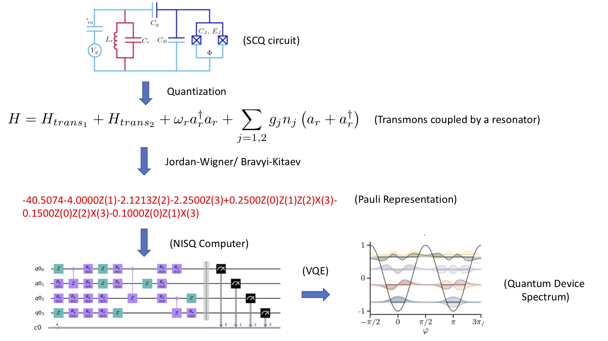

# Quantum Cohort Project Business Application

## Variational Qubit Characterization

Characterization of a new superconducting qubit (SCQ) device design is critical for understanding the performance of a new device.  In particular, a SCQ designer needs to know the operating points of the qubits (frequencies) and their spacing with respect to excited states.  A poorly designed device may exhibit frequency crowding, crosstalk, leakage and other decoherence processes.  Given a device Hamiltonian, derived, for example, through intuition or first principles, the SCQ designer can determine the spectrum by obtaining a matrix representation and numerically solving an eigenvalue problem.  However, the designer must truncate the operators with a small number of levels and make other approximations to reduce the size of the matrix Hamiltonian.  This can be done for a single transmon (or similar), however, as the industry scales up designs, characterizing multiple qubit devices will require new methods for characterization that can scale with the size of the underlying Hilbert space.

Variational Qubit Characterization (VQC) fights Hilbert space with Hilbert space!   

Here's how it works:

## Step 2: Explain or provide examples of the types of real-world problems this solution can solve

Example: A courier has to deliver parcels to several locations and is looking to minimize its travel time. (e.g., “the travelling salesman problem”).

## Step 3: Identify at least one potential customer for this solution - ie: a business who has this problem and would consider paying to have this problem solved

Examples:
- Federal Express
- Canada Post

## Step 4: Prepare a 90 second video explaining the value proposition of your innovation to this potential customer in non-technical language

Example: By travelling to all destinations via the shortest route, a courier can generate the same revenue that it would have generated following any other route, but will minimize travel costs (e.g., fuel costs). By minimizing travel costs, the courier will be more profitable than it would have been had it travelled through any other route.

**Please store your video externally to the repo, and provide a link e.g. to Google Drive**
