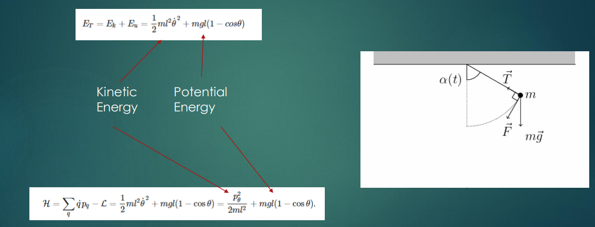
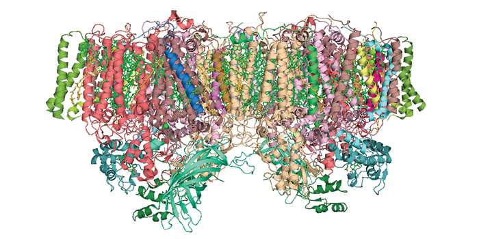

# Quantum Chemistry and VQE Basics for the Layperson

We first explain the basics of the VQE method for someone that does not have familiarity with quantum chemistry.

At the quantum level behavior of particles can be described by the Schrodinger's equation. 

  

This equation describes the evolution of a quantum state. 
One can think of this as energy functions we are familiar with that include kinetic energy and potential energy.

We are familiar with the dynamics at the macro level of a pendulum through laws of motion. However, the pendulum can also be represented as an energy function with Kinetic and Potential energy terms ensuring conservation of energy.

  

A particle can be represented as bounded in a well. This particle according to Schrodinger's equations will have solutions that represent the probabilities of where the particle is found. There are solutions which are also the eigenvalues are shown below.

  

In order to solve the Hamiltonian H that has components H1,H2 that do not commute (i.e. a x b != b x a), we take incremental steps based on the Lie formula. This process called Trotterization is used later. 

  

Charged particles create potential energy based on Coulomb's law.

  

The same is the case for particles where the proton is positively charged and the electron is negatively charged.

  

<a href="https://www.southampton.ac.uk/assets/centresresearch/documents/compchem/DFT_L2.pdf" target="_blank">Source</a>

Below is a simple representation of the Hamiltonian of the Helium atom which has an atomic number of 2. The kinetic and potential terms are shown. Various approximations may be made (for example the Born-Oppenheimer approximation that the nucleus is stationary relative to the electrons). 

  

We will see that this energy equation is then converted into Pauli rotations for quantum gates in Step #2 using Jordan-Wigner (jw) or Bravyi-Kitaev (bk) methods.

  

<a href="https://journals.aps.org/prx/abstract/10.1103/PhysRevX.6.031007" target="_blank">Source</a>

Further simplifications based on Hamiltonian symmetries are used to produce even simpler set of gates that can be implemented on our NISQ hardware.

We next look at the actual implementation of Unitaries on quantum computers. in Step #3. The figure below shows a high level of steps from classical preparation to solving functions on both annealing and gate quantum computers. Annealing requires conversion to a Binary Quadratic Model (BQM), while gate computers require the use of an initial starting energy function or Ansatz along with hybrid classical-quantum algorithms called Phase Estimation Algorithm (PEA) or Variational Quantum EigenSolver (VQE).

  

<a href="https://journals.aps.org/prx/abstract/10.1103/PhysRevX.6.031007" target="_blank">Source</a>

In VQE we start with a set of parameters (values of angles) that we will first calculate in Step #3. Then we will prepare the initial state and measure the expectation value of the Hamiltonian in the desired basis (for example stog3) in step #4. 

  

The figure below shows a summary of the steps taken in VQE. The Hamiltonian is created on the left of the figure and then parametrized into the quantum circuit. Note the Ansatz is derived using the Hamiltonian, the distance and Basis. The quantum computer is then used to determine the expectation value.

  

<a href="https://arxiv.org/abs/1512.06860" target="_blank">Source</a>

<a href="https://iopscience.iop.org/article/10.1088/1367-2630/18/2/023023/meta0" target="_blank">Additional Reference</a>

Below we will use this basic concepts to show actual run of H2 and LiH using the Tequila library

# Technical Problems Solved

We used the Tequila library to calculate the ground state energy using the Full Configuration Interaction (FCI), Hartree-Fock (HF) and Coupled cluster singles/doubles (CCSD) methods. 

Directory for both H2 and LiH execution.
- Code execution using Tequila for H2 is in [here](./Ritaban%20Code/H2).
- Code execution using Tequila for LiH is in [here](./Ritaban%20Code/LiH).

## Classical Methods for LiH

FCI and HF methods are Variational while CCID is not.  It is being assumed that the FCI gives the most accurate results and the others are compared to this method.  Here it can be seen that HF did not give the lowest ground state energies at the different distances (R) of separation, while CCSD was more accurate. 

  

The lowest energy for LiH was found to be -7.88(FCI), -7.86(HF) and -7.88 (CCSD) 

## Generating Qubit Hamiltonians for LiH

In Step #2 we generate the qubit Hamiltonians first using the Jordan-Wigner method then Bravyi-Kitaev and use the sto3g basis. The initial Hamiltonian is quite large  and is then further reduced. The eigenvalues in the effective Hamiltonian are -1.10115031  and 0.03904763

## Determining the Unitary Ansatz

The Unitary Ansatz is determined using the Unitary Cooupled Cluster (UCC) method. Using 1 trotter step, sto-3g basis we get 14 UCCSD amplitudes. This method gives us a UCCSD energy of -7.879.

With the Qubit Coupled Cluster (QCC) method we are able to specify the hardware limitations. We perform the entangler screening protocol for LiH in minimal sto-3g basis, and obtain one grouping of entanglers with non-zero energy gradient. We then select one of them to be used in the QCC VQE simulation. In the end we obtained QCC energy with 1 entangler of -6.25839.

## Measurment

To optain the expectation value of the qubit Hamiltonian we have to reduce the number of Hamiltonians to a minimal number of groups. We obtain measurable parts of LiH by partitioning its terms into mutually commuting fragments. 

## Use of Quantum Hardware

In the final step the parameters are developed for LiH.  The execution was not completed on IBM-Q quantum hardware but was checked using tq.simulate to be -7.863.

## Conclusion

We were able to run both the H2 and LiH molecules using both classical and Quantum methods. Since these molecules are simple and well known, their Ansatz are also now defined. It is easy to use tools like Tequila and Pennylane to simulate these.  The challenge will come with larger molecules and it will be exciting to see how solutions on real quantum computer hardware perform.

We did not look at the method of converting to a BQM and trying on D-Wave or other QUBO solvers. This would have been another interesting area to investigate.

References
[[1]](https://arxiv.org/abs/1808.10402)

# Quantum Cohort Project Business Application

## Introduction

We are LightQ. We build beautiful and efficient, organic light-emitting diodes (OLED) accross North America. Our secret-sauce is the use of the variational quantum eigensolvers to determine the ground and excited energy states of industrially relavent molecules such as Tris(8-hydroxyquinolinato)aluminium[[1]](https://en.wikipedia.org/wiki/OLED). This allows us to create thermally activated delayed fluorescence (TADF) emitters suitable for OLED application with potentially 100% quantum efficiency [[2]](https://www.nature.com/articles/s41524-021-00540-6).

## OLED Industry Overview

OLED technology is used to create digital displays in all kinds of devices. These devices range from television screens, computer monitors, smartphones and even handheld game consoles [[1]](https://en.wikipedia.org/wiki/OLED). Since more people are working from home than ever, this industry is absolutely booming [[3]](https://www.oled-info.com/dscc-increases-its-oled-market-forecasts-it-sees-increased-adoption-phones). According to Display Supply Chain Consultants (DSCC), the expected 2021 revenue for the OLED market is at $42.5 billion dollars but is growing fast to $60.6 billion in 2025  [[3]](https://www.oled-info.com/dscc-increases-its-oled-market-forecasts-it-sees-increased-adoption-phones).

  <a href="https://www.velocitas.com/industry-news/dominating-the-lead-gen-game-landing-pages_new/" target="_blank">Source</a>

 

The laptop market is absolutely huge, and is something that LightQ will tap into. Since we build leading OLED displays, deals with huge venders like Apple, Lenovo, HP and Dell are currently underway. DSCC has already seen 5 million OLED laptop displays shipped in 2021 [[3]](https://www.oled-info.com/dscc-increases-its-oled-market-forecasts-it-sees-increased-adoption-phones). Furthermore, the anticipate serious growth in the upcomming years, predicting 8 million in 2022, and over 11 million in 2025. Total revenues will reach over $1 billion in 2023 [[3]](https://www.oled-info.com/dscc-increases-its-oled-market-forecasts-it-sees-increased-adoption-phones). We summarize these results in the following table.

| Year | Laptop OLED Displays in Production|
| :--------------: | :---------: 
| 2021 | 5 million |
| 2022 | 8 million |
| 2025 | 11 million |

DSCC is also anticipating that Apple will introduce their first OLED tablet in 2023. This year alone, DSCC has seen 4.5 million tablet OLED displays in production. They are forcasting that this unmber will grow to 16 million in 2025. This mean that tablet OLED shipment growth will be approximately 37% CAGR. Additionally, they estimate that revenues will grow at 34% CACR [[3]](https://www.oled-info.com/dscc-increases-its-oled-market-forecasts-it-sees-increased-adoption-phones). These amazing results are summarized in the table below.

| Year | Tablet OLED Displays in Production|
| :--------------: | :---------: 
| 2021 | 4.5 million |
| 2022 | 5.7 million |
| 2024 | 14 million |
| 2025 | 15 million |

As a leading manufacturer in OLED, LightQ is starting early talks with Apple and other leading tablet and laptop manufacturers to produce the best displays for the growing tablet market. 

  
  <a href="https://www.oled-info.com/dscc-increases-its-oled-market-forecasts-it-sees-increased-adoption-phones" target="_blank">Source</a>

 

## How does VQE help in our process

 The molecule properties in lattice or crystaline structure has a calculable macro effect. By using quantum chemistry and removing an atom or adding an atom the property of the molecule can be figured out, thus the macro level effect can then also be calculated. Thus Quantum VQE methods help us to simulate many molecules and their potential properties to find the ideal macro level effect we are looking for and then manufacture those ideal molecule candidates.

 

  
  <a href="https://www.pnas.org/content/114/29/7555" target="_blank">Source</a>

The figure shows a sample process flow of a computational reaction mechanism elucidation. The quantum computer provides the full configuration interaction energy. Once the structure of the molecule has been determined, structures of potential intermediates can be found and optimized. 

# Real World Problems a Quantum Variational Eigensolver can Solve

We outline a few real world problems the quantum variational eigensolver can potentially solve that are not strictly related to LightQ's business pitch.

- Producer of efficient organic light-emitting diodes (OLED). OLEDs are used to create digital displays in devices such as televisions, smartphones, computer monitors etc. We use the methods outlined in this repository (VQEs etc) to determine ground and excited state energies of industrially relevant molecules. This allows the thermally activated delayed fluorescence (TADF) emitters suitable for OLED application to potentially perform with 100% quantum efficiency [[4]](https://www.nature.com/articles/s41524-021-00540-6).

  

- Efficient producer of fertilizer. We model the biological nitrogen fixation by the enzyme nitrogenase which we can use to create fertilizer. This method is much preffered over the traditional Harber-Bosch method because the latter requires high temperature and pressure and is therefore very energy-intensive [[5]](https://www.pnas.org/content/114/29/7555). We use the methods in this repository to elucidate the reaction mechanism of biological nitrogen fixation in notrogenase [[5]](https://www.pnas.org/content/114/29/7555) which is crucial in using it to create fertilizer. 

- Creating next-generation lithium-sulfur batteries. We are able to simulate the next-generation of battery technology using the techniques in this repository. Lithium-sulfu batteries are theoretically much stronger and more efficient than traditional batteries, however, the reaction mechanism for the sulfur reduction in the battery environment is in much debate in the scientific field [[6]](https://arxiv.org/pdf/2001.01120.pdf). We use the the methods outlined in this repository to model the electon-cloud density distribution of molecules and in particular their dipole moment (which are very important to understand the feasibility of these batteries)[[6]](https://arxiv.org/pdf/2001.01120.pdf) to eventually create the next generation of batteries!

  

- Artificial photosynthesis would give us a way to reduce carbon dioxide from the atmosphere, provide an efficient mechanism of producing energy, generate hydrogen and produce hydrocarbon fuels. The large enzymatic complex absorbs photons to oxidize water and arvest electrons. Future quantum computers could allow us to design such artificial catalysts for photosynthesis [[7]](https://cen.acs.org/articles/95/i43/Chemistry-quantum-computings-killer-app.html).

  

- High temperature superconductors are needed. The ultimate goal is to have superconductors that work at room temperature[[7]](https://cen.acs.org/articles/95/i43/Chemistry-quantum-computings-killer-app.html). 

  

- Solar cell materials are constantly being improved for durability, efficiency, higher performance, low cost and flexibility. Improvements could be simulated and better understanding of the electron transport could be derived through quantum computers. Some research involves organic molecules and others with iron[[8]](https://sciencenordic.com/chemistry-energy-sweden/iron-could-help-make-cheaper-solar-panels/1424372)

  

- In addition there are many other chemical processes including reduction of emmission gases and surfactants to improve subsurface recovery that depend on catalysts. Some of these are in limited supply or a scarce resource. [[9]](https://www.ibm.com/downloads/cas/BDGQRXOZ) [[10]](https://link.springer.com/article/10.1007/s41050-020-00023-5)

## Potential Customers

We have done an in depth analysis of some potential customers for LightQ's OLED technology. They are summarized in the below table.

|Company name|Country|R&D budget-2020↑|Profit-2020|
|----|----|----|----|
| Apple Inc. | USA | $18.75 billion | $59.7 billion |
| Dell | USA | $4.4 billion | $92.15 billion |
| Lenovo | China | $1.43 billion | $50 billion |
| HP | USA | $1.48 billion | $56.6 billion |

## Business Pitch

If the above video does not work, find it in [google drive](https://drive.google.com/file/d/1EHxNry_KGci-1Ssjv0kMTpVQdF3DyLml/view?usp=sharing).

## References

1. https://en.wikipedia.org/wiki/OLED
2. https://www.nature.com/articles/s41524-021-00540-6
3. https://www.oled-info.com/dscc-increases-its-oled-market-forecasts-it-sees-increased-adoption-phones
4. https://www.nature.com/articles/s41524-021-00540-6
5. https://www.pnas.org/content/114/29/7555
6. https://arxiv.org/pdf/2001.01120.pdf
7. https://cen.acs.org/articles/95/i43/Chemistry-quantum-computings-killer-app.html
8. https://sciencenordic.com/chemistry-energy-sweden/iron-could-help-make-cheaper-solar-panels/1424372
9. https://www.ibm.com/downloads/cas/BDGQRXOZ
10. https://link.springer.com/article/10.1007/s41050-020-00023-5
