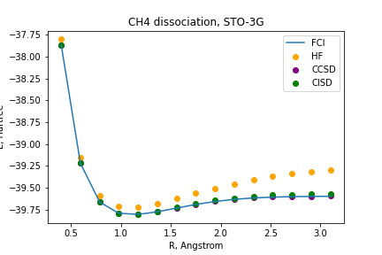

# Using Vibrational Excitations to Separate Molecules

<p align="center">
  
 </p> 


## Introduction

Q is specializing in using quantum technology for modelling vibrational excitations in the molecules. Our technology can have tremendous effect on variety of fields such as optics, ecology and drug design. For the purposes of this presentation we will focus on how knowing molecular vibrations is going to help separate  molecule of methane CH<sub>4</sub> molecule into methyl radical CH<sub>3</sub>. We use classical methods to find the energy minimum of the ground state of a molecule and Variational Quantum Eigensolver to find the energy of an excited state at the ground state minimum. The difference between these variables is proportional to the amount of light required to separate single hydrogen molecule from the remaining CH<sub>3</sub> molecule. 

## Technical Description

We will be using classical computer to find out the lowest energy level of the ground state of the methane molecule. We are then going to use a quantum computer find the lowest energy level of the excited state of the methane molecule. Crucially, coordiantes of the 3 hydrogen molecules and one carbon molecule will be fixed, while we perform energy measurements of the molecule at different bond lengths of the "top" hydrogen molecule. 

Our idea starts by putting the CH<sub>4</sub> molecule in the fixed and symmetric position, that puts the hydrogen molecule on the Z-axis. This will enable us to continuosly pull it across one axis until we find the lowest energy level. We have used Hartree-Fock, CCSD, CISD and FCI methods to plot the energy levels at different bond lengths to identify that minimum, which occurs at the bond length of roughly `1.09`.

 </img>

In principle, our methods can be applied to any molecule, but we are limited by the number of qubits for some systems. In the case of a CH<sub>4</sub> molecule, we have run the following [PennyLane](https://pennylane.ai/) code using that produces the Hamiltonian of the molecule and the amount of qubits required for the VQE.

```py
symbols = ["C", "H", "H", "H", "H"]
coordinates = np.array([0.0, 0.0, 0.0, 
                        0.0, 0.0, 1.089, # the Z coordinate for the top hydrogen molecule determined from classical methods
                        1.026719, 0, -0.363, 
                        -0.51336, -0.889165, -0.363, 
                        -0.51336, 0.889165, -0.363])

H, qubits = qchem.molecular_hamiltonian(symbols, coordinates) 
print(f"Number of qubits = {qubits}\n")
print(f"H = {H}")
```

Unfortunately, we do not have access to the Quantum Computer with 18 qubits, however if we had an access to some commercial backends such as `ibmq_montreal` we would be able to run the eigensolver and get the energy level of the excited state. Once we found the energy level of the excited state we can also compute other important components such as: Normal modes of the ground electronic state/excited electronic state, Atomic coordinates of the ground electronic state/excited electronic state, and Vibrational frequencies of the ground electronic state/excited electronic state. We can do it by finding out a Hessian of the Hamiltonian.

@Rodrgio: add stuff about Hessians

However, we can also utilize a faster approach. We can use VQE to calculate the lowest energy level of the excited electronic state of the CH<sub>4</sub> molecule and simply subtract it from the lowest energy level of it's ground electronic state. The difference will be proportional to the amount of light that needs to be applied to break the bond between the top hydrogen molecule and the rest of the CH<sub>4</sub> molecular structure.

## Business Pitch
We have found a revolutionary way of severing chemical bonds in the methane molecule. For example, our innovative idea enables us to transform a gasous methane molecule into the radical CH<sub>3</sub> molecule. Our method gives an exact amount of light necessary to break down the methane molecule. This is particularly useful, because of the explosive nature of methane, breaking it down to an unstable methyl radical CH<sub>3</sub> will eliminate the potential harm of CH<sub>4</sub>. Methyl radical is a strong oxidant and reductant agent, that is quite corrosive for metals, but it is not particuraly useful. However, we aimed only to show a proof of concept. 

We believe that breaking down molecules in this cost efficient manner can be used in wide range of commercial applications. More importantly, we believe that finding out vibrational excitations of molecules has important applications in the field of resource finding. For example, we can apply this method to find underground water reservoirs, which will be a crucial tool in combating water shortage. Looking into the future, this technology will enable a scan of asteroids that might carry water within their shell. Theoretically, the only limit this technology has is the number of qubits, so with a sufficiently powerful quantum device we can also apply it to find even more complex materials like petroleum. This can be a game changer for the energy companies, who are always looking for new oil sources to develop.  
