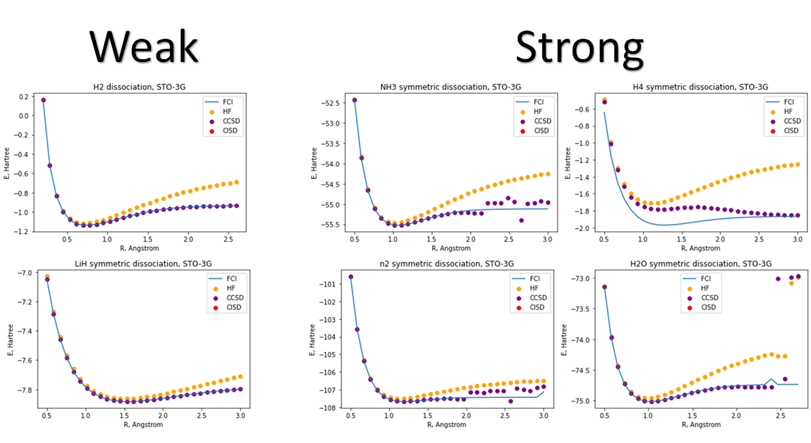
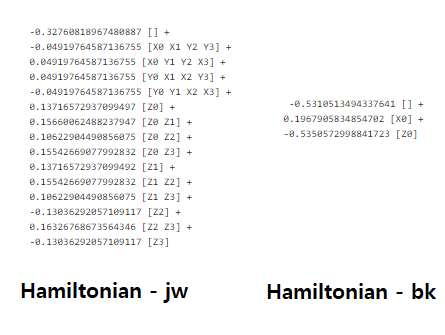

## Project 3: VQE: Constructing potential energy surfaces for small molecules

This project will guide you through the state-of-the-art techniques for solving electronic structure problems on NISQ computers.

Open up [instructions.pdf](https://github.com/CDL-Quantum/CohortProject_2021/tree/main/Week3_VQE/Instructions.pdf) to begin learning about your tasks for this week!

**Please edit this markdown file directly with links to your completed tasks and challenges.**

# [Task 1: Classical Methods](./notebooks/1_classical_methods.ipynb)

For Task 1, we first simulate the system with the classical algorithm. 
We repeat the example process of H2 and H2O molecules and generate more results for other 
molecules with four different methods: Hartree-Fock (HF), Configuration Interaction Singles and Doubles (CISD), 
Coupled-Cluster Singles and Doubles (CCSD), and Full Configuration Interaction (FCI). 
Using these methods, we obtain the ground state PES of the molecules both on a classical computer using classical 
methods and the VQE simulator. 

From the figure above, we show two different results: weakly correlated systems (H2, LiH) and strongly 
correlated systems (H4, H2O, N2).

Since the classical algorithms can make a good approximation to the weakly correlated systems, we do not see 
any big diverging behavior throughout the inter-atomic distance. 
However, for the strongly correlated systems, we can see diverging behaviors, and we are often quite off from our 
exact solution (FCI). 

This effect is more noticeable with the case of H4, none of the points except the faraway distance shows 
correct energy estimation. 
This is because the H4 system has more contribution from four hydrogens being correlated. 
On the other hand, the LiH system shows good converging behavior because of the stable system which does not perturb 
the system.

Unfortunately, we are not able to converge CISD method in our simulations.

### Among classical methods, there are techniques based on the variational approach and those that are not. Identify variational methods among those that were used and explain advantages of the variational approach. Are there any arguments for using non-variational techniques?

FCI method provides the exact answer because it scales exponentially with the number of basis functions; it models all
electron-electron interactions.
This is unlike the variational methods (HF, CISD, and CCSD) which consider an approximated version. 
HF is based on a simpler, non-interacting model. CISD and CCSD assume single and double excitation events.
Since it is not variational method, it fails when electron-electron correlations dominate.

### Check separability of HF, CISD, and CCSD by taking 2 H2 fragments at a large distance from each other and comparing the total energy with 2 energies of one H2 molecule. Explain your results.

| System\Method | FCI | HF | CCSD | CISD |
| --- | --- | --- | --- | --- |
| H2+H2 |  -1.86 | -1.09 |  -1.86 | x |
| H4 | -1.86 |  -1.09 | -1.86 | x |
| dif | 0 | 0 | 0 | x |

In the table above we show the energy of the H4 and two seperate H2 molecule, and show the 
difference between them. 
This shows that all methods (except CISD) have great separability. 
If the distance between H inside of H2 or H4 becomes very large, we can safely assume that it will 
become single H system. 

### Q3 Convergences along the second coordinate requires the basis set extension from STO3G to a series like cc-pVDZ, cc-pVTZ, cc-pVQZ, cc-pV5Z. Explore for a small system like H2 both convergences. Which energies should be expected to be closer to experimentally measured ones?

| Basis\Method | HF | CCSD | CISD |
| --- | --- | --- | --- |
| sto3g |  12.92 | 2.35E-6 | x |
| ccpdz | 9.35 |  1.30E-6 | x |
| ccpvtz | 19.13 | 2.33E-5 | x |
| ccpvqz | 45.74 | 2.66E-6 | x |
| ccpv5z | x | x | x |

We also have tried with other basis such as cc-pVDZ, cc-pVTZ, cc-pVQZ, cc-pV5Z. 
Unfortunately, ccpv5z takes too much time, so we could not converge the result. 
The table above shows =the energy difference between each method and FCI. 
We calculate the difference and calculate the mean value of the error. 
CCSD shows quite good accuracy, but HF failed to converge to right solution. 
In particular method with ccpvqz, accuracy is drop to 54%. 
The ccpdz basis with CCSD method shows the best accuracy. 
However, we suspect that ccpv5z will show better accuracy if we give enough time to calculate the solution.

# [Task 2: Generating Hamiltonians](./notebooks/2_generating_hamiltonians.ipynb)

In this task, we want to simulate the molecular system in a quantum computer. 
To do that, we need to find the way to simulate the Hamiltonian in quantum computer. 
This can be done by generating Hamiltonian in the second quantized form and mapping from fermionic operators to qubit 
operators. As illustrated in the instruction,

1. To proceed to VQE one needs to generate the qubit Hamiltonian, the easiest path is via first
generating the electronic Hamiltonian in the second quantized form and then transform it into the
qubit form using one of the fermion-to-qubit transformations: Jordan-Wigner or Bravyi-Kitaev.

2. Next, some qubit operators can be substituted by numbers (±1) because their states are stationary
for the specific electronic state (e.g. ground state).

### What are the cons and pros of the Bravyi-Kitaev transformation compared to the Jordan-Wigner transformations?

The Bravyi-Kitaev Hamiltonian has far fewer terms.
By only considering the effective Hamiltonian, we can reduce the complexity of the problem which will greatly increase 
the accuracy of the calculation in quantum computer. 
As we are limiting hamiltonian, this will not describe whole system, but we can get exact modeling of the system, but it was not found any significant advatage of using jw or bk.

### What are the requirements for a function of qubit operators to be a valid mapping for the fermionic operators?

In the BK transformation, it is beneficial to have symmetry in particle number conservation, which can reduce the number
of qubits.

# [Task 3: Unitary Ansatz](./notebooks/3_unitary_ansatz.ipynb)

# [Task 4: Measurement](./notebooks/4_measurement.ipynb)

# [Task 5: Quantum Circuits](./notebooks/5_quantum_circuits.ipynb)

# [Business Application](business_application.md)
