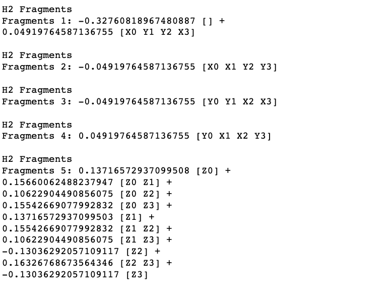

## Project 3: VQE: Constructing potential energy surfaces for small molecules

## Tasks include:

### Part 1: Generating PES using classical methods.
**Analysis:**

**Qestion**: Among Classical methods, there are techniques based on the variational approach and those that are not. Identify variational methods among those that were sued and explain advantages of the variational approach. Are there any arguments for using non-variational techniques?
 
**Answer**:

**Question**: There is another division between classical methods, it is based on so-called separability or size-consistency. Simply speaking, if one investigates, two molecular fragments (A and B) at large distance from each other (~ 100 A), then the total electronic energy should be equal to the sum EA+B = EA + EB, where the energy of each fargment (EA or EB) can be obtained in a calculation that does not involve the other fragment. If this condition is satisfied for a particular method, this method is separable or size-consistent. Check separability of HF, CISD, and CCSD by taking 2 H2 fragments at a large distance from each other and comparing the total energy with 2 energies of one H2 molecule. Explain your results.
 
**Answer**:

**Question**: If one is interested in converging to the exact non-relativistic electronic energires, there are two independent coordinates: 1) accuracy of accounting for many-body effects beyond the Hartree-Fock method (electronic correlation) and 2) accuracy of representation of one-electron states or convergence with respect tot the one-electron basis size. Convergence along the first coordinate can be illustrated by monitoring reduction of the energy deviations from the Full CI answer in a particular basis set for a series of increasingly accurate approaches, ie. HF, CCSD, CCSD(t), CCSDT. Convergences along the second coordinate requries the basis set extension from STO3G to a series like cc-pVDZ, co-pVTZ, co-pVQZ, cc-pV5Z. Explore for a small system like H2 both convergences. Which energies should be expected to be closer to experimentally measured ones?
 
**Answer**:

### Part 2: Generating the qubit Hamiltonian.
**Analysis:** In this section, we were able to generate the qubit hamiltonian for the following molecules: H2, H4, LiH, H20, and N2. Due to the size of each hamiltonian, we wont directly write them (but they are generated in the netebook S2_Hamiltonian_gen.ipynb. For reference of how computationally difficult they are, we have listed the number of qubits required to specify each molecule.

### H2 Ground state analysis
We found the following information for H2:

### H4 Ground state analysis
We found the following information for H4 (we omitted some eigenvalues for ease of reading):

### LiH Ground state analysis
We found the following infromation for LiH:

**Question**: What are the requirements for a function of qubit operators to be a valid mapping for the fermionic operators?
 
**Answer**: The requirements for a function of qubit operators to be a valid mapping is the following:
(1) The function must preserve the anti-commutativity nature of the fermion (Typically seen with the spin).

**Question**: The electronic Hamiltonian is real (due to time-reversal symmetry), what consequences does that have on the terms in the qubit Hamiltonian after the Jordan-Wigner transformation?
 
**Answer**: 

**Question**: What are the cons and pros of the Bravyi-Kitaev transformation compared to the Jordan-Wigner transfomrations?
 
**Answer**:

### Part 3: Unitary transformations.
**Analysis:**

**Question**: Standard Hamiltonian symmetries are i) number of electrons Ne = sigmak atkak, ii) electron spin S2, iii) electron spin project SZz iv) time-reversal symmetry and v) point-group symmetry for symmetric molecules. Which of these symmetries are conserved in a) UCC and b) QCC?
 
**Answer**:
  
**Question**: Why symmetries are helpful for constructing a unitary operator which rotates the initial state |0> to the eigenstate |psi>?
 
**Answer:**

**Question**: What are the ways to restore symmetries if your unitary transformation break them?
 
**Answer**:

### Part 4: Hamiltonian measurements.
**Analysis:** For this task, we were able partition the qubit hamiltonian into framents for all 5 molecules (H2, H4, LiH, H20, and N2). We found the following framents for H2:

### Part 5: Use of quantum hardware.
**Analysis:**

## Further Challenges:
### How to obtain excited electronic states of the same or different symmetry?
**Analysis:**
### Partitioning in the fermionic operator space.
**Analysis:**
### Applying unitary transformations on the Hamiltonian.
**Analysis:**
### Compress larger basis sets into smaller number of qubits.
**Analysis:**
### Business-related questions in the context of quantum entrepreneurship
**What other molecular properties one can obtain using VQE for the purpose of rational material
and drug design?**  

**What are the systems (molecules / materials) which are challenging for classical computing
and whose modelling is valuable ?**  

Using today’s supper computing technology it is possible to simulate the interaction of molecules that contain a few hundred atoms.  In applications for biology, the molecular system routinely contains an aqueous solvent requiring that water, ions and co-solvents become part of the computational solution.  The modelling of these systems can require 50,000 to 1 M atoms to be simulated.  If the researcher was interested in modeling the interaction of molecules for a cytoplasm of a bacteria cell then this may require the simulation of 100 M atoms or more.  These are the types of molecular simulations required during drug discovery applications where the goal is to find a molecular structure that provides a favorable interaction with a given biological target.  

**What businesses can benefit from more accurate electronic structure calculations ?**  

The business benefits of more detailed material simulations are wide ranging.  Catalytic reactions are fundamental element of many industrial processed.  These range from fuel production to drug development.  Advanced quantum simulations targeting these specific chemical processes have applications in energy production, pharmaceutical synthesis and the transition to a more sustainable economy.
Recently, quantum simulations have been used by Daimler AG to model the dipole moment of three lithium-containing molecules in an effort to drive the development of new lithium sulfur (Li-S) batteries that would be more powerful, last longer and cost less than those available today.  This advance could impact not only the automotive industry but adjacent technologies such as smart phone, remote sensors and other wireless devices.

## Business Application

For more details refer to the [Business Application found here](./Business_Application.md)
