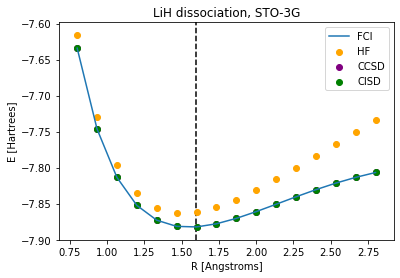
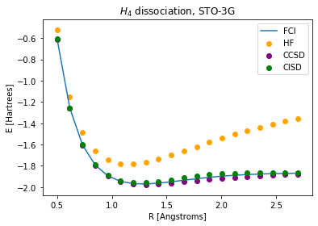
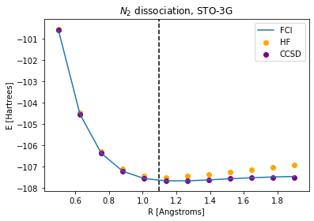

## Project 3: VQE: Constructing potential energy surfaces for small molecules

This project will guide you through the state-of-the-art techniques for solving electronic structure problems on NISQ computers.

Open up [instructions.pdf](https://github.com/CDL-Quantum/CohortProject_2021/tree/main/Week3_VQE/Instructions.pdf) to begin learning about your tasks for this week!

### Generating PES using classical methods
We used Hartree-Fock (HF), Configuration Interaction Singles and Doubles (CISD) and Coupled Cluster Singles and Doubles (CCSD) methods for different molecules in the STO-3G basis. You can find our results in this [Python notebook](./S1_Classical_Methods.ipynb).

All of these methods consist of choosing a "trial wavefunction" depending on one or more parameters, and finding the values of these parameters for which the expectation value of the energy is the lowest possible. However, the CCSD method is the only one of them that can obtain energies below the ground state, which makes it non-variational. 

We present below the PESs generated with each classical method for LiH, H4 and N2. Dashed vertical lines indicate the experimental bond length for the diatomic molecules according to [NIST database](https://cccbdb.nist.gov/diatomicexpbondx.asp).

  

The system PES is harder to calculate accurately as the number of bonds increases. These graphs are ordered by number of molecular bonds from left to right.

In the LiH case, despite the HF minimum energy is notably different from that of the Full Configuration Interaction (FCI) exact solution, both plots have its minimum at the same bond length.

*Advantages:*

- Variational methods provide a simple way to place an upper bound on the ground state energy of any quantum system.
- These methods can be used to calculate excited states in certain situations, adding a penalty term to the expectation value of the Hamiltonian and then minimizing this sum.

### Generating the qubit Hamiltonian

To proceed to VQE one needs to generate the qubit Hamiltonian. The easiest path is via first generating the electronic Hamiltonian in the second quantized form and then transform it into a qubit-form Hamiltonian using a fermion-qubit mapping.

Fermion-qubit mapping schemes can be broken into two pieces: first, to map occupation number basis vectors to states of qubits; and second, to represent the fermionic creation and annihilation operators in terms of operations on qubits in a way that preserves the fermionic anti-commutation relations. By doing so, we can ensure that a qubit operator (which represents certain fermionic operator) acting on a qubit (i.e, encoded fermionic state) reproduces the action of the associated fermionic operator on the fermionic state.

If the electronic Hamiltonian is real (due to time-reversal symmetry) and we apply the Jordan-Wigner transformations given by

the qubit Hamiltonian does not neccesarily have time-reversal symmetry. Since spin operators are odd under time reversal, a *j*-th qubit-equivalent fermionic operator is odd under time reversal if *j* is odd, and hence some terms of the qubit Hamiltonian may vary.

### Unitary transformations
### Hamiltonian measurements
### Use of quantum hardware

### Business Application

For more details refer to our [Business Application found here](./Business_Application.md)

## References

https://cccbdb.nist.gov/diatomicexpbondx.asp
Romero et al. *Strategies for quantum computing molecular energies using the unitary coupled cluster ansatz* (2018). arXiv:1701.02691
