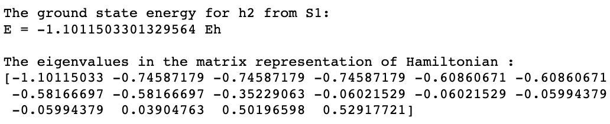
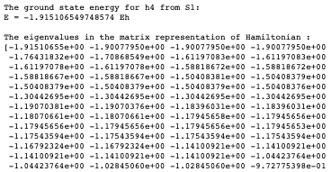
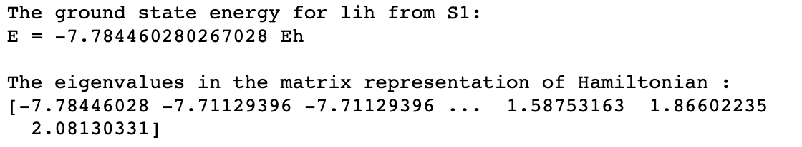

## Project 3: VQE: Constructing potential energy surfaces for small molecules

This project will guide you through the state-of-the-art techniques for solving electronic structure problems on NISQ computers.

Open up [instructions.pdf](https://github.com/CDL-Quantum/CohortProject_2021/tree/main/Week3_VQE/Instructions.pdf) to begin learning about your tasks for this week!

**Please edit this markdown file directly with links to your completed tasks and challenges.**

## Tasks include:
### Part 1: Generating PES using classical methods.
**Analysis:**

### Part 2: Generating the qubit Hamiltonian.
**Analysis:** In this section, we were able to generate the qubit hamiltonian for the following molecules: H2, H4, LiH, H20, and N2. Due to the size of each hamiltonian, we wont directly write them (but they are generated in the netebook S2_Hamiltonian_gen.ipynb. For reference of how computationally difficult they are, we have listed the number of qubits required to specify each molecule.

### H2 Ground state analysis
We found the following information for H2:

### H4 Ground state analysis
We found the following information for H4 (we omitted some eigenvalues for ease of reading):

### LiH Ground state analysis
We found the following infromation for LiH:

**Question**: What are the requirements for a function of qubit operators to be a valid mapping for the fermionic operators?
**Answer**:

**Question**: The electronic Hamiltonian is real (due to time-reversal symmetry), what consequences does that have on the terms in the qubit Hamiltonian after the Jordan-Wigner transformation?
**Answer**: 

**Question**: What are the cons and pros of the Bravyi-Kitaev transformation compared to the Jordan-Wigner transfomrations?
**Answer**:

### Part 3: Unitary transformations.
**Analysis:**

### Part 4: Hamiltonian measurements.
**Analysis:**

### Part 5: Use of quantum hardware.
**Analysis:**

## Further Challenges:
### How to obtain excited electronic states of the same or different symmetry?
**Analysis:**
### Partitioning in the fermionic operator space.
**Analysis:**
### Applying unitary transformations on the Hamiltonian.
**Analysis:**
### Compress larger basis sets into smaller number of qubits.
**Analysis:**

## Business Application

For more details refer to the [Business Application found here](./Business_Application.md)
