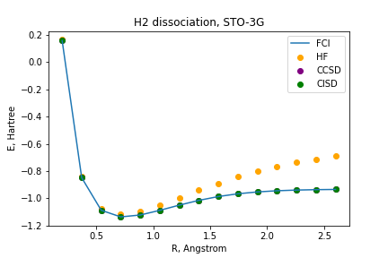
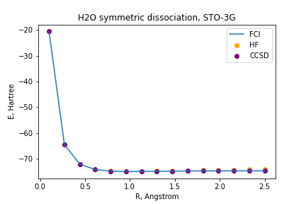
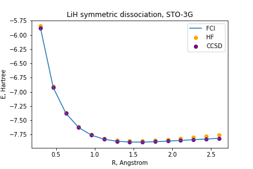
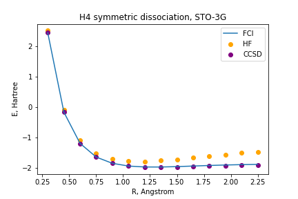

# Questions 

1. Step #1: Generating PES using classical methods
## 1) Among classical methods, there are techniques based on the variational approach and thosethat are not.  Identify variational methods among those that were used and explain advantages ofthe variational approach.  Are there any arguments for using non-variational techniques?


```math
a^2+b^2=c^2
```

|  |  | 
| :---------: | :---------: |
|   |  |
|  |  |
